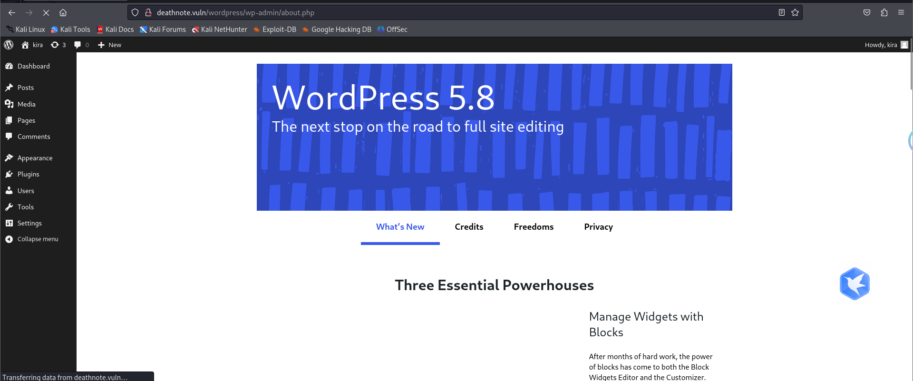

## 复盘*

## 靶机地址

[Deathnote: 1 ~ VulnHub](https://www.vulnhub.com/entry/deathnote-1,739/)


## 信息收集

### 主机探活

```
arp-scan -l
```


确定目标主机ip

192.168.6.20


### nmap扫描目标主机开放端口

```
nmap -Pn -sS -p- -sV 192.168.6.20
```


开放了：

- 80 http
- 22 ssh


### 80端口

#### 访问192.168.6.20

发现会自动跳转


#### 添加本地hosts解析

```
192.168.6.20 deathnote.vuln
```


成功访问

发现一条关键信息：


```
my fav line is iamjustic3
我最爱的一句台词是  iamjustic3
```

可能是用户密码


点击hint


```
Find a notes.txt file on server
or 
SEE the L comment

找到一个notes.txt的文件
或者
看L的评论
```

L的评论应该就是


#### dirsearch 扫描目标网站

```
dirsearch -u 192.168.6.20
```


存在：

- robots.txt

- wordpress CMS

  

#### 访问robots.txt文件


存在important.jpg文件

访问


报错


#### 利用curl访问并查看内容

```
curl  http://192.168.6.20/important.jpg | cat   
```


 

提示用户名为user.txt


#### dirsearch扫描wordpress目录

```
dirsearch -u 192.168.6.20/wordpress
```


存在登录页面


尝试登录


 

提示用户不存在


#### 利用wp-scan工具爆破出用户

```
wpscan --url http://deathnote.vuln/wordpress/  -e u   
```


 

爆破出user:kira

 

#### 成功登录后台



 

#### media中发现了note.txt


指向了一个链接


一个密码字典


#### 下载字典

```
curl http://deathnote.vuln/wordpress/wp-content/uploads/2021/07/notes.txt >notes.txt
```


#### 查看uploads的其他内容


还有一个字典


#### 下载另一个字典

```
curl http://deathnote.vuln/wordpress/wp-content/uploads/2021/07/user.txt >notes.txt
```


### 22 端口

 

#### 尝试利用这两个字典爆破22端口的ssh服务

```
hydra -P notes.txt -L user.txt ssh://192.168.6.20  
```


成功

```
l
death4me
```


#### 登录ssh

```
ssh l@192.168.6.20
```


## 提权

#### 查看当前目录内容

```
ls
cat user.txt
```


存在user.txt


brainfuck加密


### 搜索含有kira的文件

```
find / -name "*kira*" 2>/dev/null
```


查看kira.txt

提示权限不足


 

### 查看 /opt/L/kira-case内容

```
 cat /opt/L/kira-case
```


提示查看fake-notebook-rule

```
cd /opt/L/fake-notebook-rule
```


 

存在两个文件


提示使用cyberchef解密

十六进制数据


得到base64

Base 64 解码得到


得到一个密码kiraisevil

### 查看当前系统有哪些用户


### 尝试登录kira


成功登录

 

访问当前用户下的目录信息